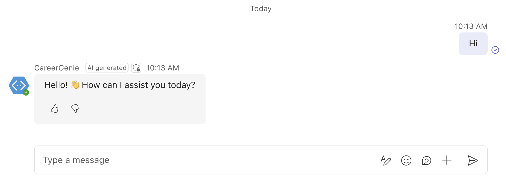
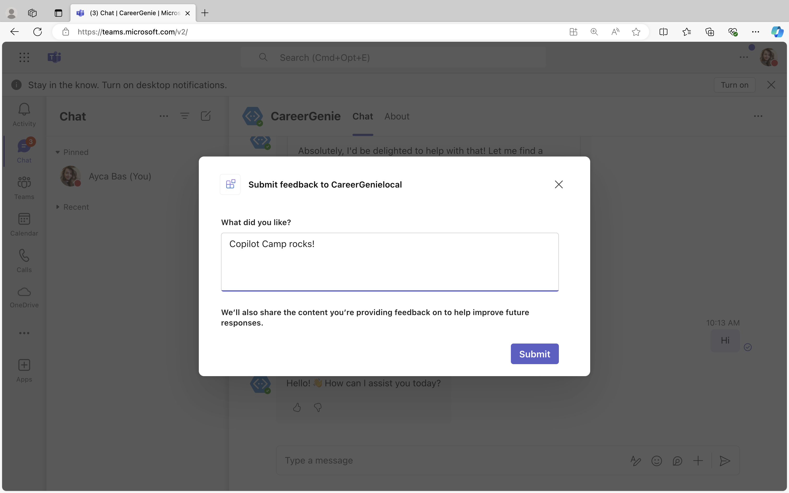
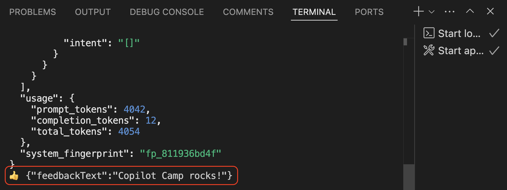
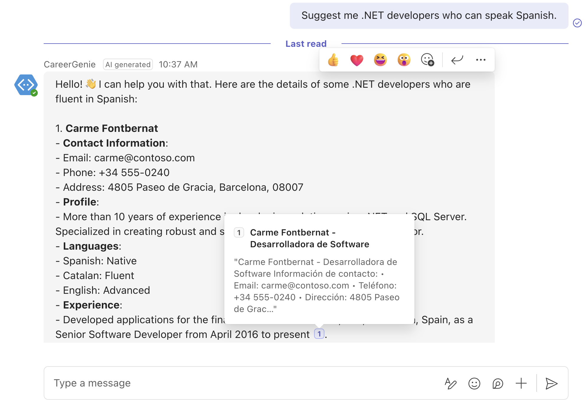
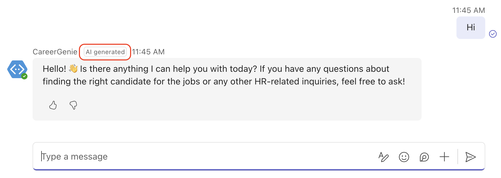
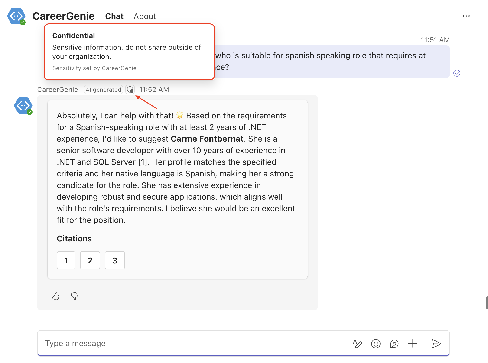

# B3 - Enhance User Experience with the Powered by AI kit

In this lab you will learn about the Powered by AI, a set of features Teams AI library provides and utilize them in your custom engine copilot to enhance the user experience.

???+ info "Navigating the Building your own copilot labs (B Path)"
    - [Lab B0 - Prerequisites](/copilot-camp/pages/custom-engine/00-prerequisites)
    - [Lab B1 - Build a custom engine copilot using Azure OpenAI and Teams Toolkit](/copilot-camp/pages/custom-engine/01-custom-engine-copilot)
    - [Lab B2 - Index your data in Azure AI Search and bring it into your custom engine copilot](/copilot-camp/pages/custom-engine/02-rag)
    - [Lab B3 - Enhance user experience with the Powered by AI kit](/copilot-camp/pages/custom-engine/03-powered-by-ai) (📍 You are here)
    - [Lab B4 - Add actions to handle complex tasks](/copilot-camp/pages/custom-engine/04-actions)
    - [Lab B5 - Secure your solution using authentication](/copilot-camp/pages/custom-engine/05-authentication)

In this lab you will:

- Learn what are the Powered by AI features
- Enable Feedback Loop to collect user feedback
- Customize citations with Adaptive Cards
- Enable Generated by AI label
- Enable Sensitivity Label

## Introduction

???+ info "What is Powered by AI?"
    Powered by AI is a set of features provided by the Teams AI library that enhances interactions with custom engine copilots, making them more engaging and user-friendly. These features include:

    * **Feedback Loop:** Users can rate AI responses with a thumbs up or down. This feedback helps refine the AI's accuracy and usefulness over time.

    * **Citations:** The AI provides references to the sources of information, ensuring transparency and credibility.
    
    * **Generated by AI:** Messages created by the AI system are labeled as "AI generated," so users can distinguish between AI and human responses.
    
    * **Sensitivity Information:** If the information shared is sensitive, a sensitivity label will appear, advising whether it can be shared outside your organization.

In the previous exercise, you explored Retrieval-Augmented Generation (RAG) and its integration into your custom engine copilot. In this exercise, you'll enhance the user experience by leveraging "Powered by AI" features. Follow these steps:

- Implement the Feedback Loop
- Customize Citations
- Label AI-Generated messages
- Display Sensitivity information

By incorporating these "Powered by AI" features, you'll make your custom engine copilot more transparent, reliable, and user-friendly, which will enhance the overall user experience.

## Exercise 1: Enable Feedback Loop

In this exercise, you can continue using the same source code you developed in the previous lab.

### Step 1: Integrate Feedback Loop in your app

1. In your project, open `src/app/app.ts`, locate your application instance and add `enable_feedback_loop: true` inside the **ai** property brackets. The updated application instance will look like the following:

```javascript
const app = new Application({
  storage,
  ai: {
    planner,
    //feedback loop is enabled
    enable_feedback_loop: true
  },
});
```

1. To handle the feedback responses, add the following code snippet in the `src/app/app.ts`:

```javascript
app.feedbackLoop(async (_context, _state, feedbackLoopData) => {
  if (feedbackLoopData.actionValue.reaction === 'like') {
      console.log('👍' + ' ' + feedbackLoopData.actionValue.feedback!);
  } else {
      console.log('👎' + ' ' + feedbackLoopData.actionValue.feedback!);
  }
});
```

### Step 2: Test the Feedback Loop feature

Let's test Career Genie with the Feedback Loop feature. Start debugging your app by selecting **Run and Debug** tab on Visual Studio Code and **Debug in Teams (Edge)** or **Debug in Teams (Chrome)**. This will open Microsoft Teams in your browser. When your app details appear in Teams, select **Add** to start chatting with your app.

Before testing the Feedback Loop, type "Hi" or ask a question similar to "Suggest me .NET developers who can speak Spanish." You'll notice that the response from your custom engine copilot includes thumbs up and down buttons at the bottom left corner.



Now, let's test the feedback loop. Click on either the thumbs up or down button. A feedback card will immediately pop up. Provide your feedback in the text field on the card and click **Submit**.



To verify that your feedback was recorded, return to Visual Studio Code and check your terminal. You'll see the feedback you provided, including whether you gave a thumbs up or down and your comment.



!!! Tip "Dive deeper into the Feedback Loop by debugging"
    Debugging the code is an excellent way to understand how it works. To delve deeper into how the Feedback Loop handler functions, set a breakpoint at `app.feedbackLoop`. Run the app and test the Feedback Loop by clicking thumbs up or down. You'll observe that `feedbackLoopData.actionValue.reaction` captures the reaction, while `feedbackLoopData.actionValue.feedback` captures the text feedback you provide.

## Exercise 2: Customize citations with Adaptive Cards

When you define a data source in a custom engine copilot, the Teams AI library dynamically enables citations to reference related documents. Recognize the current experience in your custom engine copilot, ask a question similar to "Suggest me .NET developers who can speak Spanish.". You will realize that you can hover over the citation to see the beginning of the document.



In this exercise, you'll tailor this citation experience further and use Adaptive Cards to customize the way citations are presented.

### Step 1: Create an Adaptive Card for citations

Go to `src/app/` folder and create a new file named **card.ts**. Add the following code snippet inside the `card.ts` file:

```javascript
import { AdaptiveCard, Message, Utilities } from '@microsoft/teams-ai';
/**
 * Create an adaptive card from a prompt response.
 * @param {Message<string>} response The prompt response to create the card from.
 * @returns {AdaptiveCard} The response card.
 */

//Adaptive card to display the response and citations
export function createResponseCard(response: Message<string>): AdaptiveCard {
    const citationCards = response.context?.citations.map((citation, i) => ({
            type: 'Action.ShowCard',
            title: `${i+1}`,
            card: {
                type: 'AdaptiveCard',
                body: [
                    {
                        type: 'TextBlock',
                        text: citation.title,
                        fontType: 'Default',
                        weight: 'Bolder'
                    },
                    {
                        type: 'TextBlock',
                        text: citation.content,
                        wrap: true
                    }
                ]
            }
        }));
    
    const text = Utilities.formatCitationsResponse(response.content!);
    return {
        type: 'AdaptiveCard',
        body: [
            {
                type: 'TextBlock',
                text: text,
                wrap: true
            },
            {
                type: 'TextBlock',
                text: 'Citations',
                wrap: true,
                fontType: 'Default',
                weight: 'Bolder'
            },
            {
                type: 'ActionSet',
                actions: citationCards
            }
        ],
        $schema: 'http://adaptivecards.io/schemas/adaptive-card.json',
        version: '1.5'
    };
}
```

This Adaptive Card allows you to list citations as `Action.ShowCard` buttons which show more details when clicked. It also displays the main content of the response alongside the citation buttons. If a user wants to learn more about a citation, they can click the button to read the entire document.

### Step 2: Use PredictedSayCommand to customize the citation experience

??? info "What does `PredictedSayCommand` do?"
    A **PredictedSayCommand** is a response directive that the AI system executes. By customizing PredictedSayCommand, you gain granular control over integrating Powered by AI features like citations, feedback loops into the custom engine copilot's activities. This allows you to precisely tailor the AI responses to meet your application needs.

1. Go to `src/app/app.ts` and add the following snippet on top of your code to import your adaptive card:

```javascript
import { createResponseCard } from './card';
```

1. Add `CardFactory` and `MessageFactory` inside the "botbuilder" import,  the updated version of the import will look like the following:

```javascript
import { CardFactory, MemoryStorage, MessageFactory } from "botbuilder";
```

1. Add `AI` and `PredictedSayCommand` inside the "@microsoft/teams-ai" import, the updated version of the import will look like the following:

```javascript
import { Application, ActionPlanner, OpenAIModel, PromptManager, AI, PredictedSayCommand} from "@microsoft/teams-ai";
```

1. Add the following PredictedSayCommand action in the `src/app/app.ts` to customize the citation:

```javascript
app.ai.action<PredictedSayCommand>(AI.SayCommandActionName, async (context, state, data, action) => {
  let activity;
  if (data.response.context && data.response.context.citations.length > 0 ) {
      const attachment = CardFactory.adaptiveCard(createResponseCard(data.response));
      activity = MessageFactory.attachment(attachment);
  }
  else {
      activity = MessageFactory.text(data.response.content);
  }

  activity.entities = [
    {
        type: "https://schema.org/Message",
        "@type": "Message",
        "@context": "https://schema.org",
        "@id": ""
    }
  ];
  activity.channelData = {
    feedbackLoopEnabled: true
  };

  await context.sendActivity(activity);

  return "success";
 
});

export default app;
```

### Step 3: Test the customized citation experience

Let's test Career Genie with the customized citation experience. Start debugging your app by selecting **Run and Debug** tab on Visual Studio Code and **Debug in Teams (Edge)** or **Debug in Teams (Chrome)**. Microsoft Teams will pop up on your browser. This will open Microsoft Teams in your browser. When your app details appear in Teams, select **Add** to start chatting with your app.

To test the new citation experience, start by greeting Career Genie with "Hi" or "Hello". Then, try to ask questions similar to "Can you suggest any candidates for a senior developer position with 7+ year experience that requires Japanese speaking?"


Now, recognize that the customized citation experience with Adaptive Cards provides a button for each citation. Click on citation buttons to extend the document view and review the resume details for each candidate.

## Exercise 3: Enable the Generated by AI label

In this exercise, you will continue customizing the user experience of your custom engine copilot using `PredictedSayCommand`. To help users differentiate between AI and human responses, you'll enable the "AI generated" label that appears on top of the messages created by the AI system.

### Step 1: Use PredictedSayCommand to enable the Generated by AI label

Go to `src/app/app.ts` and locate your `PredictedSayCommand` action. Add the following code snippet inside `activity.entities`:

```javascript
// Generated by AI label
additionalType: ["AIGeneratedContent"]
```

The update `activity.entities` will look like the following:

```javascript
activity.entities = [
    {
        type: "https://schema.org/Message",
        "@type": "Message",
        "@context": "https://schema.org",
        "@id": "",
        // Generated by AI label
        additionalType: ["AIGeneratedContent"],
    },
    
];
```

### Step 2: Test the Generated by AI label

Let's test Career Genie with the "Generated by AI" label. Start debugging your app by selecting **Run and Debug** tab on Visual Studio Code and **Debug in Teams (Edge)** or **Debug in Teams (Chrome)**. This will open Microsoft Teams in your browser. When your app details appear in Teams, select **Add** to start chatting with your app.

To test the "Generated by AI" label, simply greet Career Genie. The first message you receive will have a small "AI generated" label on top.



## Exercise 4: Enable the Sensitivity label

In this final exercise, you will continue utilizing `PredictedSayCommand` to enable the sensitivity label. Remember, Career Genie is an expert in Human Resources tasks that often require sharing confidential information within your organization. For scenarios like Career Genie, where the information shared is sensitive, a sensitivity label will appear on top of the AI-generated messages, advising whether it can be shared outside your organization.

### Step 1: Use PredictedSayCommand to enable the Sensitivity label

Go to `src/app/app.ts` and locate your `PredictedSayCommand` action. Add the following code snippet inside `activity.entities`:

```javascript
// Sensitivity label
usageInfo: {
    "@type": "CreativeWork",
    name: "Confidential",
    description: "Sensitive information, do not share outside of your organization.",
}
```
The update `activity.entities` will look like the following:

```javascript
activity.entities = [
    {
        type: "https://schema.org/Message",
        "@type": "Message",
        "@context": "https://schema.org",
        "@id": "",
        // Generated by AI label
        additionalType: ["AIGeneratedContent"],
        // Sensitivity label
        usageInfo: {
          "@type": "CreativeWork",
          name: "Confidential",
          description: "Sensitive information, do not share outside of your organization.",
        }
    },
    
  ];
```

### Step 2: Test the Sensitivity label

Let's test Career Genie with the Sensitivity label. Start debugging your app by selecting **Run and Debug** tab on Visual Studio Code and **Debug in Teams (Edge)** or **Debug in Teams (Chrome)**. Microsoft Teams will pop up on your browser. Once your app details show up on Teams, select **Add** and start chatting with your app.

To test the Sensitivity label, greet Career Genie or try to ask questions similar to "Can you suggest a candidate who is suitable for spanish speaking role that requires at least 2 years of .NET experience?".



Notice that the sensitivity label appears right next to the "AI Generated" label in Career Genie's message. Hover over the sensitivity label to read the guidance specific to your organization.

## CONGRATULATIONS

You have completed Lab B3 - Enhance User Experience with the Powered by AI kit!
You are now ready to proceed to [Lab A4 - Add actions to handle complex tasks](/copilot-camp/pages/custom-engine/04-actions).