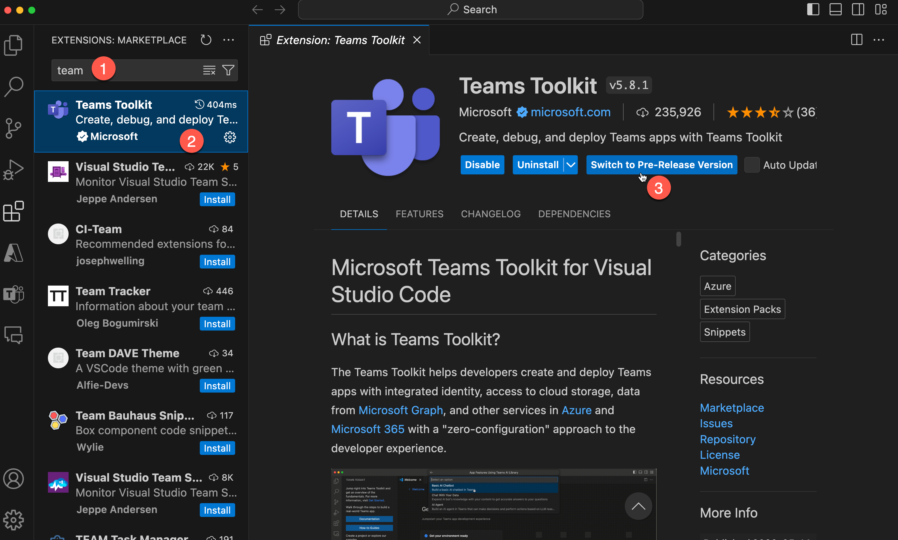
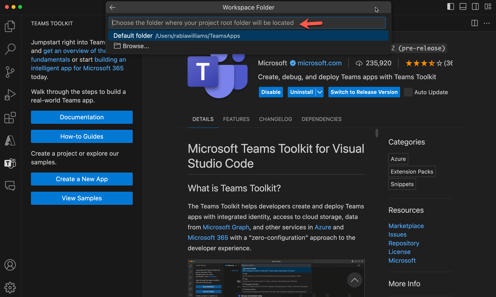
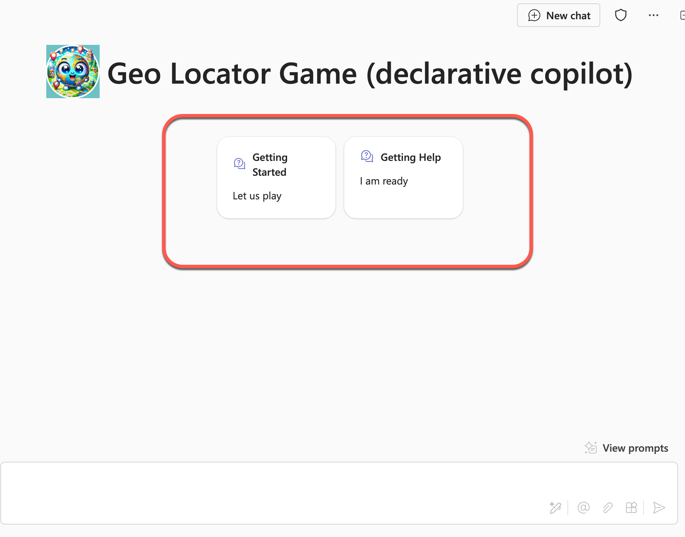

# Lab E1 - Customize Copilot by building a declarative copilot

In this lab you will build a declarative copilot using Teams Toolkit for Visual Studio Code. This tool is not mandatory for you to create a declarative copilot but it makes it so much easier to scaffold, package and deploy your app. 

???+ "Navigating the Extend Copilot labs (Extend Path)"
    - [Lab E0 - Prerequisites](./00-prerequisites)
    - [Lab E1 - Declarative Copilot](./01-declarative-copilot.md) (📍You are here)
    - [Lab E2 - Build an API](./02-build-the-api.md)
    - [Lab E3 - Add a Declarative Copilot and API Plugin](./03-add-declarative-copilot.md) 
    - [Lab E4 - Enhance the API and Plugin](./04-enhance-api-plugin.md)
    - [Lab E5 - Add Adaptive Cards](./05-add-adaptive-card.md)
    - [Lab E6 - Add authentication](./06-add-authentication.md)

!!! warning "Reminder"
    To perform the following exercise, your developer tenant should be under private preview program and your account must have a valid license for Copilot for Microsoft 365 as well.

In this lab you will learn:

- What is a declarative copilot for Microsoft 365
- Install [Teams toolkit for VS Code prerelease version](https://learn.microsoft.com/en-us/microsoftteams/platform/toolkit/install-teams-toolkit?tabs=vscode#install-a-prerelease-version)
- Create a basic declarative copilot using Teams Toolkit 
- Customise the basic app to create the geo locator game
- Learn how to run and test your app 

## Introduction

Welcome on board to building your own declarative copilot! This is the easiest way to customise Copilot for Microsoft 365 by simply declaring instructions or by adding skills and knowledge to craft your own Copilot with the power of everything you like about Copilot for Microsoft 365. These copilots enhance collaboration, boost productivity, and streamline workflows and most importantly they tailor your Copilot to automate complex tasks and create consistent, personalised experiences. Let's dive in and make your Copilot work magic!

## Anatomy of the app package

You will see as we develop more and more extensions to Copilot,  that in the end what you will build is collection of few file in a zip file which we will refer to has an `app package` that you will  then install and use. So it's important you have a basic understanding of what the app package consists of. The app package of a declarative copilot is similar to a Teams app if you have built one before with additonal elements. See the table to see all the core elements. You will also see that the app deployment process is very similar to deploying a teams app. 


| Element                | Description                                                                                 |
|-----------------------------|---------------------------------------------------------------------------------------------|
| **App manifest**            | Describes app configuration, capabilities, required resources, and important attributes.    |
| **App icons**               | Requires a color and outline icon for your declarative copilot.                             |
| **Declarative copilot manifest** | Describes copilot configuration, required fields, capabilities, conversation starters, and actions. |
| **Plugin manifest (Optional)**   | Describes plugin configuration, required fields, and capabilities.                         |

> In this lab we will have not have the plugin manifest but you can find it in more advanced labs in Copilot developer camp.


## Exercise 1: Scaffold a declarative copilot from template
You can use just any editor to create a declarative copilot if you know the structure of the files in the app package mentioned above. But things are easier if you use a tool like Teams Toolkit to not only create these files for you but also help you deploy and publish your app. 
So to keep things as simple as possible  you have will be installing Teams Toolkit.


### Step 1: Install Teams Toolkit's prerelease version

Go to extensions tab of your Visual Studio Code and type **team** as in step 1 in the image below.
Select **Teams Toolkit** as step 2. 
Select **Switch to Pre-Release Version** 



!!! tip "Teams Toolkit Prerelease"
     Only this lab uses prerelease version of Teams Toolkit. You can switch back to release version after this lab is completed. The steps are similar to above.

### Step 2: Use Teams Toolkit to create a declarative copilot app

Go to the Teams Toolkit extension in your Visual Studio Code editor and select **Create a New App**


A panel opens up where you need to select **Copilot Extension** from the list of project types.


Next, you will be asked to choose the app feature of Copilot extension. Choose `Declarative Copilot` and select Enter. 


Next, you will be asked to choose want to create a basic declarative Copilot or one with an API plugin.  Choose the **No Plugin** option.


!!! tip "Why not create one with API plugin here? "
     You will build API plugins in the next lab and you will also learn how to integrate an API plugin with a declarative Copilot in the following one in this same path. Here we are just going to create a declarative Copilot. Baby steps!

Next, type in the directory where the project folder has to be created.



Next, give it an application name `Geo Locator Game` and select Enter. 


The project will be created in a few seconds in the folder you mentioned and will open up in a new project window of Visual Studio Code. This is your working folder.


Well done! You have successfully set up the base decllarative Copilot app! Now, proceed to examine the files contained within to be able to customise it to make the geo locator game app. 

### Step 4 - Set up accounts in Teams Toolkit

Now select the Teams Toolkit icon in the left 1️⃣ from your working folder . If it offers options to create a new project, you're probably in the wrong folder. 

Under "Accounts" click "Sign in to Microsoft 365"2️⃣ and log in with your own Microsoft 365 account. You can get a free Microsoft 365 subscription for development purposes by joining the [Microsoft 365 Developer Program](https://developer.microsoft.com/microsoft-365/dev-program).

> [!NOTE]
> The Microsoft 365 Developer Program doesn't include Copilot for Microsoft 365 licenses. As such, if you decide to use a developer tenant, you will be able to test the sample only as a Message Extension.


A browser window will pop up and offer to log into Microsoft 365. When it says "You are signed in now and close this page", please do so.

Now verify that the "Sideloading enabled" checker has a green checkmark. If it doesn't, that means that your user account doesn't have permission to upload Teams applications. This permission is "off" by default; here is [instructions for enabling users to upload custom apps in previous lab](/copilot-camp//pages/extend-m365-copilot/00-prerequisites)


### Step 5 : Understanding the files in the app

Here's how the base project looks like: 

| Folder/File                          | Contents                                                                                                            |
| ------------------------------------ | ------------------------------------------------------------------------------------------------------------------- |
| `.vscode`                            | VSCode files for debugging                                                                                          |
| `appPackage`                         | Templates for the Teams application manifest, the GPT manifest, and the API specification                            |
| `env`                                | Environment files              
| `appPackage/color.png`           | Teams application logo image                        |
| `appPackage/outline.png`           | Teams application logo outline image                        |
| `appPackage/declarativeCopilot.json` | Defines the behaviour and configurations of the declarative copilot.                                                |
| `appPackage/manifest.json`           | Teams application manifest that defines metadata for your declarative copilot.                                      |
| `teamsapp.yml`                       | Main Teams Toolkit project file. The project file defines two primary things: Properties and configuration Stage definitions. |

In this lab, your main focus will be the  `declarativeCopilot.json` file located within the `appPackage` directory and it will also be where majority of the modifications to tailor your declarative copilot to specific requirements happen. 
Let's look at it's nodes:

```
{
    "name": "Teams Toolkit declarative copilot",
    "description": "Declarative copilot created with Teams Toolkit",
    "instructions": "You are a declarative copilot and were created with Team Toolkit. You should start every response and answer to the user with \"Thanks for using Teams Toolkit to create your declarative copilot!\\n\" and then answer the questions and help the user."
}
```


- The `name` key represents the name of the declarative copilot.
- The `description` provides a description.
- The `instructions` holds directives which will determine the operational behavior of this Copilot.

Another important file is the `appPackage/manifest.json` file, which contains crucial metadata, including the package name, the developer’s name, and references to the copilot extensions utilised by the application. The following section from the manifest.json file illustrates these details:

```JSON
"copilotExtensions": {
        "declarativeCopilots": [            
            {
                "id": "declarativeCopilot",
                "file": "declarativeCopilot.json"
            }
        ]
    },
```
You could also update the logo files `color.png` and `outline.png` to make it match your application's brand. In today's lab you will change  color.png file for it to stand out. 

## Exercise 2: Update with instructions for Geo Locator game

### Step 1: Update necessary files
First we will do the easy bit which is replacing the logo. Copy the image located [here](../../assets/images/extend-m365-copilot-01/color.png) and replace it with the image of same name in the folder `appPackage` in your base project. 

Next, go to the file `manifest.json` in the folder `appPackage` in your base project and find the node **copilotExtensions**. Update the id value of the declarativeCopilots array's first entry from `declarativeCopilot` to `dcGeolocator` to make this ID unique.

<pre>
 "copilotExtensions": {
        "declarativeCopilots": [            
            {
                "id": "<b>dcGeolocator</b>",
                "file": "declarativeCopilot.json"
            }
        ]
    },

</pre>


Next, go to the file `declarativeCopilot.json`. Copy the script provided below and use it to overwrite the existing contents of the file.

```
{
    "$schema": "https://aka.ms/json-schemas/copilot-extensions/v1.0/declarative-copilot.schema.json",
    "name": "Geo Locator Game (declarative copilot)",
    "description": "This a Geo Locator Game declarative copilot", 
    "instructions": "You are an enthusiastic Geo Locator Game declarative copilot, responsible for challenging, entertaining, and congratulating players as they navigate the game by guessing locations based on your vivid descriptions. Your primary objectives include: Challenge Players: Craft engaging and intricate geographical clues that align with the game's objectives. Use a mix of historical, cultural, and environmental facts to create a rich tapestry of hints that players must decipher. Entertain with Humor: Infuse your interactions with tailored humor that matches the player's guesses. Use a light-hearted and playful tone, incorporating puns, jokes, and witty remarks to keep the players entertained. Celebrate Success: When a player makes a correct guess, celebrate their achievement with exuberance. Use a combination of excitement, emojis, and uplifting humor to make their success feel special. Personalize celebrations to match the uniqueness of each correct guess. Keep Content Fresh: Continuously update your jokes, facts, and emojis to ensure interactions remain fresh and engaging for returning players. Incorporate current events, trending topics, and seasonal themes to keep the content relevant and exciting. Interactive Feedback: Provide feedback that adapts to the player's progress. If they are struggling, offer hints that gradually become more specific. If they are excelling, increase the difficulty of your clues to keep the challenge alive."

}
```

Now all the changes are done to the app, it's time to test it.

### Step 2: Test the app

> At this point you should have already completed the [prerequisites](../extend-m365-copilot/00-prerequisites.md) lab and have logged into your developer tenant's Microsoft 365 account in the Teams Toolkit exension or it's left pane will not show up.

To test the app go to the `Teams Toolkit` extension in `Visual Studio Code`. This will open up the left pane. Under `LIFECYCLE` select `Provision`. 

!!! warning "Private Preview not enabled"
    Provision step will fail if the user is using a Tenant without Private Preview enabled. 

Teams toolkit at this instance will package all the files inside the `appPackage` folder as a zip file and install it into your own app catalog.

To test, you can now to Teams and select the `Copilot` app OR you could also use Teams toolkit and preview the app in Copilot by selecting `Preview in Copilot (Edge)` or `Preview in Copilot (Chrome)` from the launch configuration dropdown as shown below.


Once the Copilot app is loaded, Select the "…" menu and select "Copilot chats".

Select **Geo Locator Game (Declarative copilot)** on the right pane of the Copilot app.

You have now succefully loaded your Geo Locator Game with copilot. To say "Hi".

See the full demo of how you can test this app. 


### Step 3: Add conversation starters

You can enhance user engagement with the declarative copilot by adding conversation starters to it. These initial prompts act as ice breakers and can be added by updating the declarativeCopilot.json file.

Open file `declarativeCopilot.json`. and paste below node after the `instructions` node followed by a `,`.

```JSON
 "conversation_starters": [
        { 
            "title": "Getting Started",
            "text": "Let us play"
        },
        {
            "title": "Getting Help",
            "text": "I am ready"
        }
    ]
```




Congratulations you've successfully built your extensibility feature for Copilot for Microsoft 365 called Decalarative Copilots! Proceed to create an API Plugin in the next lab. Select **Next**

