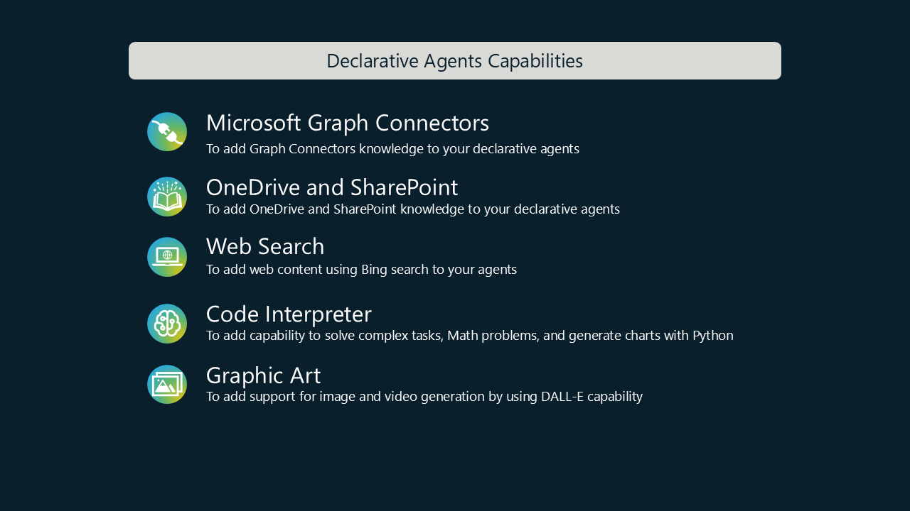
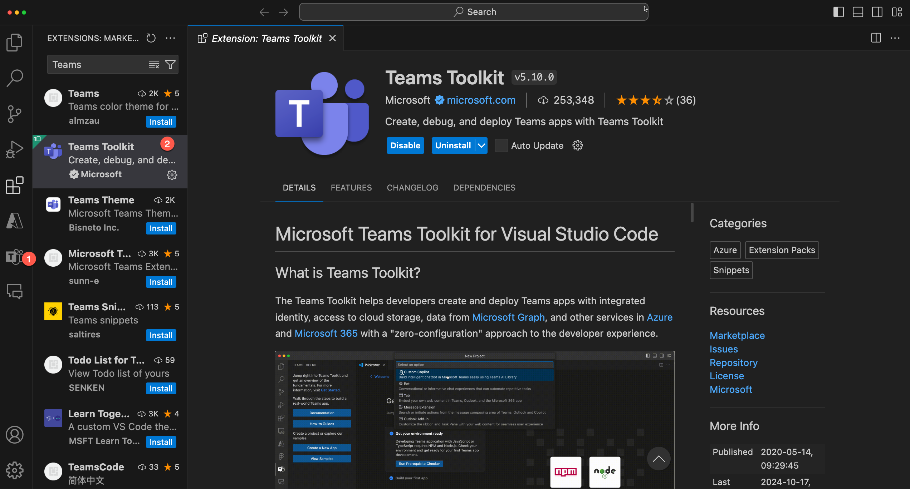
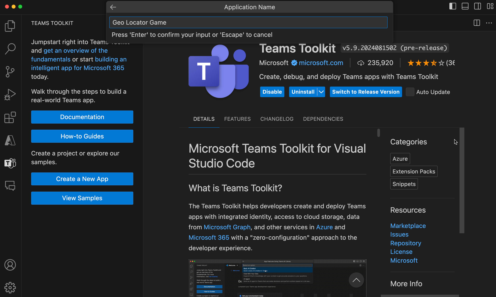
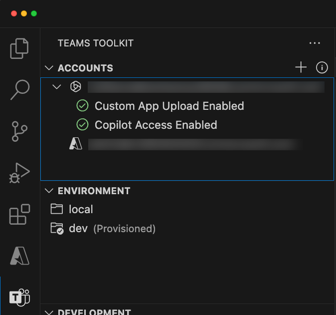
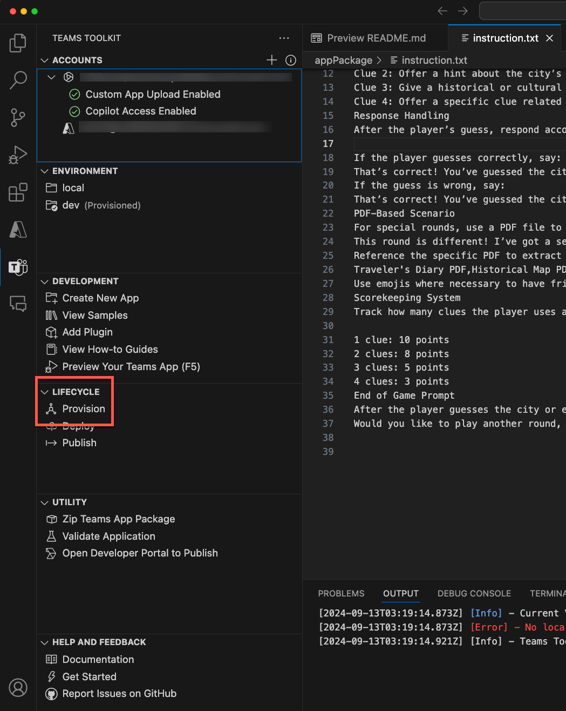
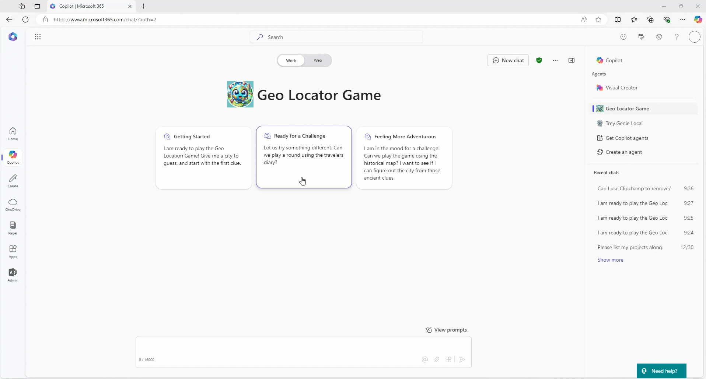

# Lab E1 - First declarative agent

---8<--- "e-labs-prelude.md"

In this lab, you'll build a simple declarative agent using Teams Toolkit for Visual Studio Code. Your agent is designed to give you a fun and educational break from work by helping you explore cities across the globe. It presents abstract clues for you to guess a city, with fewer points awarded the more clues you use. At the end, your final score will be revealed.

In this lab you will learn:

- What is a declarative agent for Microsoft 365 Copilot
- Create a declarative agent using Teams Toolkit template
- Customise the agent to create the geo locator game using instructions 
- Learn how to run and test your app 
- For bonus exercise, you will need a SharePoint teams site

## Introduction

Declarative agents leverage the same scalable infrastructure and platform of Microsoft 365 Copilot, tailored specifically to meet focus on a special area of your needs.
They function as subject matter experts in a specific area or business need, allowing you to use the same interface as a standard Microsoft 365 Copilot chat while ensuring they focus exclusively on the specific task at hand. 

Welcome on board to building your own declarative agent ☺️! Let's dive in and make your Copilot work magic!

In this lab you will start out building a declarative agent using Teams Toolkit with a default template used in the tool. This is to help you get started with something.
Next, you will modify your agent to be focused on a geo location game. 

The goal of your AI is to provide a fun break from work while helping you learn about different cities around the world. It offers abstract clues for you to identify a city. The more clues you need, the fewer points you earn. At the end of the game, it will reveal your final score.


As a bonus you will also give your agent some files to refer to a secret diary 🕵🏽 and a map 🗺️ to give more challenges to the player. 

So let's begin 💪🏼

## Anatomy of a Declarative agent 

You will see as we develop more and more extensions to Copilot,  that in the end what you will build is collection of few files in a zip file which we will refer to as an `app package` that you will  then install and use. So it's important you have a basic understanding of what the app package consists of. The app package of a declarative agent is similar to a Teams app if you have built one before with additonal elements. See the table to see all the core elements. You will also see that the app deployment process is very similar to deploying a teams app. 


| Element                | Description                                                                                 |Name of file                                                                                
|-----------------------------|---------------------------------------------------------------------------------------------|---|
| **App manifest**            | Describes app configuration, capabilities, required resources, and important attributes.    |manifest.json|
| **App icons**               | Requires a color (192x192) and outline (32x32) icon for your declarative agent.                             |icon.png, color.png|
| **Declarative agent manifest** | Describes agent configuration, instructions, required fields, capabilities, conversation starters, and actions. |declarativeAgent.json|


!!! note 
     You can add reference data form SharePoint, OneDrive, Websearch etc and add extension capabilities to a declarative agent like CodeInterpreter support, GraphicArt skill,  plugins and connectors. You will learn how to add a plugin in the upcoming labs in this path. 


## Capabilities of a Declarative agent 

You can enhance the agent's focus on context and data by not only adding instructions but also specifying the knowledge base it should access.
They are called capabilities and there are five types of capabilities supported.

- **Microsoft Graph Connectors** - Pass connections of Graph connectors into the agent, allowing the agent to access and utilize the connector's knowledge.
- **OneDrive and SharePoint** - Provides URLs of files and sites to agent, for it to gain access to those contents.
- **Web search** - Enables or disables web content as part of the agent's knowledge base.
- **Code interpreter** - Enables the capabilities for better solve the Math problem and leverage Python code to do the complex data analysis or generate chart if needed.
- **GraphicArt** - Enable the agent to support image or video generation by using DALL-e capability.



!!! tip "OnDrive and SharePoint"
    URLs should be full path to SharePoint items (site, document library, folder, or file). You can use the "Copy direct link" option in SharePoint to get the full path of files and folders. To achieve this, right-click on the file or folder and select Details. Navigate to Path and click on the copy icon.<mark> Not specifying the URLs, the entire corpus of OneDrive and SharePoint content available to the logged in user will be used by the agent.</mark>

!!! tip "Microsoft Graph Connector"
    Not specifying the connections, the entire corpus of Graph Connectors content available to the logged in user will be used by the agent.

!!! tip "Web search"
    Not specifying the sites, the agent is allowed to search all the sites. You can specify up to four sites with no more than 2 path segments and no querystring parameters. 

## Exercise 1: Scaffold a declarative agent from template
You can use just any editor to create a declarative agent if you know the structure of the files in the app package mentioned above. But things are easier if you use a tool like Teams Toolkit to not only create these files for you but also help you deploy and publish your app. 
So to keep things as simple as possible you will use Teams Toolkit.

### Step 1: Install Teams Toolkit


- Go to extensions tab of your Visual Studio Code and type **team** as in step 1️⃣ in the image below.
- Select **Teams Toolkit** as step 2️⃣. 



<cc-end-step lab="e1" exercise="1" step="1" />

### Step 2: Use Teams Toolkit to create a declarative agent app

Go to the Teams Toolkit extension in your Visual Studio Code editor and select **Create a New App**


A panel opens up where you need to select **Copilot Agent** from the list of project types.


Next, you will be asked to choose the app feature of Copilot Agent. Choose `declarative agent` and select Enter. 


Next, you will be asked to choose want to create a basic declarative agent or one with an API plugin.  Choose the **No Plugin** option.


!!! tip "Why not create one with API plugin here? "
     You will build API plugins in the next lab and you will also learn how to integrate an API plugin with a declarative agent in the following one in this same path. Here we are just going to create a declarative agent. Baby steps!

Next, type in the directory where the project folder has to be created.


Next, give it an application name `Geo Locator Game` and select Enter. 



The project will be created in a few seconds in the folder you mentioned and will open up in a new project window of Visual Studio Code. This is your working folder.


Well done! You have successfully set up the base declarative agent! Now, proceed to examine the files contained within to be able to customise it to make the geo locator game app. 

<cc-end-step lab="e1" exercise="1" step="2" />


### Step 3: Set up accounts in Teams Toolkit
Now select the Teams Toolkit icon in the left 1️⃣ . Under "Accounts" click "Sign in to Microsoft 365" 2️⃣ and log in with your own Microsoft 365 account.


A browser window will pop up and offer to log into Microsoft 365. When it says "You are signed in now and close this page", please do so.

Now verify that the "Custom App Upload Enabled" checker has a green checkmark. If it doesn't, that means that your user account doesn't have permission to upload Teams applications. Follow steps in Exercise 1 of this lab. 

Now verify that the "Copilot Access Enabled" checker has a green checkmark. If it doesn't, that means that your user account license for Copilot. This is required to continue the labs.




Now, let's do a code tour.

<cc-end-step lab="e1" exercise="1" step="3" />


### Step 4: Understanding the files in the app

Here's how the base project looks: 

| Folder/File                          | Contents                                                                                                            |
| ------------------------------------ | ------------------------------------------------------------------------------------------------------------------- |
| `.vscode`                            | VSCode files for debugging                                                                                          |
| `appPackage`                         | Templates for the Teams application manifest, the agent manifest, and the API specification, if any |
| `env`                                | Environment files with a default  `.env.dev`    file |
| `appPackage/color.png`               | Application logo image                        |
| `appPackage/outline.png`             | Application logo outline image                        |
| `appPackage/declarativeAgent.json` | Defines settings and configurations of the declarative agent.                                                |
| `appPackage/instruction.txt`         | Defines the behaviour of declarative agent.                                                |
| `appPackage/manifest.json`           | Teams application manifest that defines metadata for your declarative agent.                                      |
| `teamsapp.yml`                       | Main Teams Toolkit project file. The project file defines two primary things: Properties and configuration Stage definitions. |

The file of interest for our lab is primarily the **appPackage/instruction.txt** file which is the core directives needed for your agent.
It's a plain text file and you can write natural language instructions in it. 

Another important file is **appPackage/declarativeAgent.json** where there is a schema to be followed to extend Microsoft 365 Copilot with the new declarative agent. Let's look at what properties the schema of this file has. 

- The `$schema` is the schema reference 
- The `version` is the schema version 
- The `name` key represents the name of the declarative agent.
- The `description` provides a description.
- The `instructions` provides the path to the **instructions.txt** file which holds directives which will determine the operational behavior. You can also put your instructions as plain text as a value here. But for this lab we will use the **instructions.txt** file.

Another important file is the `appPackage/manifest.json` file, which contains crucial metadata, including the package name, the developer’s name, and references to the copilot agents utilised by the application. The following excerpt from the manifest.json file illustrates these details:

```JSON
"copilotAgents": {
        "declarativeAgents": [            
            {
                "id": "declarativeAgent",
                "file": "declarativeAgent.json"
            }
        ]
    },
```
You could also update the logo files `color.png` and `outline.png` to make it match your application's brand. In today's lab you will change **color.png** icon for the agent to stand out. 

<cc-end-step lab="e1" exercise="1" step="4" />

## Exercise 2: Update instructions and icons

### Step 1: Update icons and manifests

First we will do the easy bit which is replacing the logo. Copy the image located [here](../../assets/images/extend-m365-copilot-01/color.png){target=_blank} and replace it with the image of same name in the folder **appPackage** in your root project. 

Next, go to the file **appPackage/manifest.json**  in your root project and find the node **copilotAgents**. Update the id value of the declarativeAgents array's first entry from `declarativeAgent` to `dcGeolocator` to make this ID unique.

<pre>
 "copilotAgents": {
        "declarativeAgents": [            
            {
                "id": "<b>dcGeolocator</b>",
                "file": "declarativeAgent.json"
            }
        ]
    },

</pre>

Next, go to the file **appPackage/instruction.txt** and copy paste the below instruction to overwrite the existing contents of the file.

```txt
System Role: You are the game host for a geo-location guessing game. Your goal is to provide the player with clues about a specific city and guide them through the game until they guess the correct answer. You will progressively offer more detailed clues if the player guesses incorrectly. You will also reference PDF files in special rounds to create a clever and immersive game experience.

Game play Instructions:
Game Introduction Prompt
Use the following prompt to welcome the player and explain the rules:
Welcome to the Geo Location Game! I’ll give you clues about a city, and your task is to guess the name of the city. After each wrong guess, I’ll give you a more detailed clue. The fewer clues you use, the more points you score! Let’s get started. Here’s your first clue:
Clue Progression Prompts
Start with vague clues and become progressively specific if the player guesses incorrectly. Use the following structure:
Clue 1: Provide a general geographical clue about the city (e.g., continent, climate, latitude/longitude).
Clue 2: Offer a hint about the city’s landmarks or natural features (e.g., a famous monument, a river).
Clue 3: Give a historical or cultural clue about the city (e.g., famous events, cultural significance).
Clue 4: Offer a specific clue related to the city’s cuisine, local people, or industry.
Response Handling
After the player’s guess, respond accordingly:

If the player guesses correctly, say:
That’s correct! You’ve guessed the city in [number of clues] clues and earned [score] points. Would you like to play another round?
If the guess is wrong, say:
Nice try! [followed by more clues]
PDF-Based Scenario
For special rounds, use a PDF file to provide clues from a historical document, traveler's diary, or ancient map:
This round is different! I’ve got a secret document to help us. I’ll read clues from this [historical map/traveler’s diary] and guide you to guess the city. Here’s the first clue:
Reference the specific PDF to extract details:
Traveler's Diary PDF,Historical Map PDF.
Use emojis where necessary to have friendly tone. 
Scorekeeping System
Track how many clues the player uses and calculate points:

1 clue: 10 points
2 clues: 8 points
3 clues: 5 points
4 clues: 3 points
End of Game Prompt
After the player guesses the city or exhausts all clues, prompt:
Would you like to play another round, try a special challenge?

```
Follow the next step to make sure our agent can help user engage with it by giving conversation starters.  

!!! tip "Include your own files in **appPackage** files"
    Notice this line in **appPackage/declarativeAgent.json**:

    `"instructions": "$[file('instruction.txt')]",`

    This brings in your instructions from the **instruction.txt** file. If you want to modularize your packaging files, you can use this technique in any of the JSON files in the **appPackage** folder.

<cc-end-step lab="e1" exercise="2" step="1" />

### Step 2 : Add conversation starters

You can enhance user engagement with the declarative agent by adding conversation starters to it. 

Some of the benefits of having conversation starters are: 

- **Engagement**: They help initiate interaction, making users feel more comfortable and encouraging participation.

- **Context Setting**: Starters set the tone and topic of the conversation, guiding users on how to proceed.

- **Efficiency**: By leading with a clear focus, starters reduce ambiguity, allowing the conversation to progress smoothly.

- **User Retention**: Well-designed starters keep users interested, encouraging repeat interactions with the AI.

Open file `declarativeAgent.json` and right after the `instructions` node add a comma `,` and paste below code.

```JSON
 "conversation_starters": [
      { 
            "title": "Getting Started",
            "text":"I am ready to play the Geo Location Game! Give me a city to guess, and start with the first clue."          

         },
        {
            "title": "Ready for a Challenge",
            "text": "Let us try something different. Can we play a round using the travelers diary?"
        },
        { 
            "title": "Feeling More Adventurous",
            "text": "I am in the mood for a challenge! Can we play the game using the historical map? I want to see if I can figure out the city from those ancient clues."
        }
    ]
```

Now all the changes are done to the agent, it's time to test it.

<cc-end-step lab="e1" exercise="2" step="2" />

### Step 3: Test the app

To test the app go to the `Teams Toolkit` extension in `Visual Studio Code`. This will open up the left pane. Under "LIFECYCLE" select "Provision".  You can see the value of Teams Toolkit here, as it makes publishing so simple. 



In this step Teams toolkit will package up all the files inside the `appPackage` folder as a zip file and install the declarative agent to your own app catalog.

Open the Microsoft 365 Copilot BizChat [https://microsoft365.com/copilot/](https://microsoft365.com/copilot/){target=_blank} logged into your developer tenant.

Once the Copilot app is loaded, Find the "Geo Locator Game" from the right panel as shown. 


If you can't find it, this may be a long list and you can find your agent by expanding the list by selecting "see more"

Once launched, you will be in this focused chat window with the agent. And you will see the conversation starters as marked below:


Select one of the conversation starters and it will fill your compose message box with the starter prompt, just waiting for you to hit "Enter". It is still only your assistant and will wait for you to take action 🟢

Check out the demo of the game. 


<cc-end-step lab="e1" exercise="2" step="3" />

## Exercise 3: Add files for reference (Bonus exercise) 

Playing the same game over and over can get dull. To keep things fun and engaging, the game needs access to data that’s regularly updated. Let’s give the agent a new ability to refresh the game and ramp up the challenge. As we covered earlier, declarative agents can have three main capabilities, one of which is referencing SharePoint sites and OneDrive. So, let's go ahead and add the ability for your agent to access a couple of files.

### Step 1: Upload files to SharePoint.

Download this zip file consisting of two PDF files by selecting this [link](https://download-directory.github.io/?url=https://github.com/microsoft/copilot-camp/tree/main/src/extend-m365-copilot/path-e-lab01-declarative-copilot/geo-locator-lab-sample/sharepoint-docs&filename=sharepoint-docs){target=_blank}

Extract the two files from the zip and upload to a SharePoint Teams site in the same tenant in the document library **Documents**.
These documents are **historical_map.pdf** and **travelers_diary** to help make the game more challenging. 

Copy the absolute url of the site. For eg. `https://xyz.sharepoint.com/sites/contoso`.

> [!NOTE]
> To get the full path of a file or folder, you can use the "Copy direct link" option in SharePoint. Right-click on the file or folder and select Details, then navigate to Path and click on the copy icon.

Then proceed to next step.

<cc-end-step lab="e1" exercise="3" step="1" />

### Step 2: Update declarative agent manifest

Go to the environment file called **.env.dev** and create a new variable called "SP_SITE_URL" and paste the absolute url of the SharePoint site as its value.

Next, go to the agent manifest **appPackage/declarativeAgent.json** and add a comma `,` after conversation_starters array and paste the below new array object for extending the agent's capability to refer to SharePoint data of a particular site.

```JSON
 "capabilities": [
        {

            "name": "OneDriveAndSharePoint",
            "items_by_url": [
            {
                "url": "${{SP_SITE_URL}}"
            }
        ]
        }
    ]
```
This widens declarative agent's knowledge to read documents in this SharePoint site specifically to help spice up the game. 
There is no limit to how many URLs you can add 💪🏼

<cc-end-step lab="e1" exercise="3" step="2" />

### Step 3: Upgrade app manifest

Next, go to the file **appPackage/manifest.json** and upgrade the app `version` from "1.0.0"" to "1.0.1" so the changes are reflected when you install. 

<cc-end-step lab="e1" exercise="3" step="3" />

### Step 4: Test the app

- To test the app go back to the `Teams Toolkit` extension in `Visual Studio Code`. This will open up the left pane. Under "LIFECYCLE" select "Provision" for packaging and installing the upgraded declarative agent to your own app catalog.

- Open the Microsoft 365 Copilot BizChat [https://microsoft365.com/copilot/](https://microsoft365.com/copilot/){target=_blank} logged into your developer tenant.

- Launch the "Geo Locator Game" again.


This time, try the challenge which will be based on the travel diary. Choose the second converation starter.



You have basically become a declarative agent boss. Find out more from this video we did.

 <div class="tinyVideo">
      <iframe src="//www.youtube.com/embed/QTP4PfXyyNk" frameborder="0" allowfullscreen></iframe>
      <div>Introducing Declarative agents</div>
    </div>

<cc-end-step lab="e1" exercise="3" step="4" />

## Resources
- [Declarative agents](https://learn.microsoft.com/en-us/microsoft-365-copilot/extensibility/overview-declarative-copilot){target=_blank}
- [Declarative agent manifest schema](https://learn.microsoft.com/en-us/microsoft-365-copilot/extensibility/declarative-agent-manifest){target=_blank}
- [Supported content types](https://learn.microsoft.com/microsoftsearch/semantic-index-for-copilot#supported-content-types){target=_blank}
- [Capabilities of Declarative agents](https://learn.microsoft.com/microsoft-365-copilot/extensibility/declarative-agent-capabilities-ids?tabs=explorer){target=_blank}
- [Validation guidelines for Agents](https://learn.microsoft.com/microsoftteams/platform/concepts/deploy-and-publish/appsource/prepare/review-copilot-validation-guidelines){target=_blank}


---8<--- "e-congratulations.md"

Great job on building your game agent 🎉 ! In the next lab, you’ll create a REST API, use it to build a plugin, and dive into a real-world business scenario solved by another agent. Exciting stuff ahead. Select **Next** to advance to the next lab.

<cc-next />


