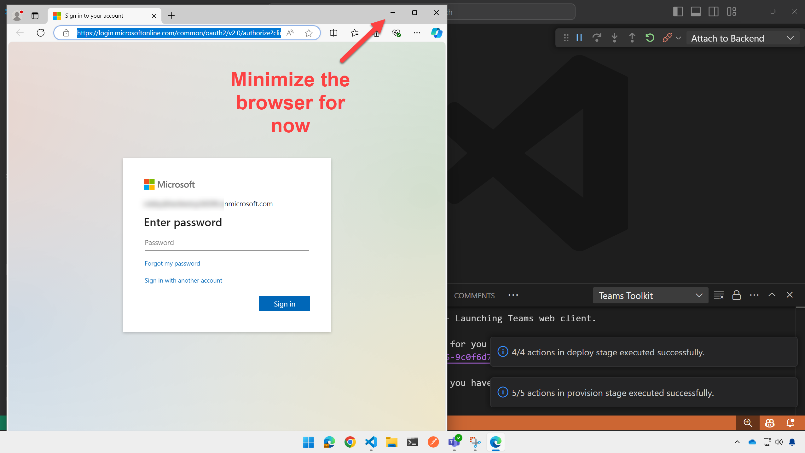
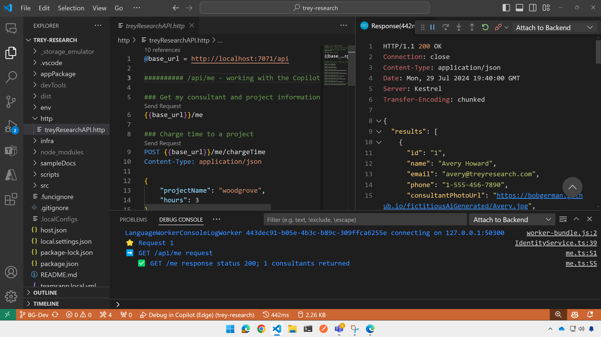

# Lab E2 - First API Plugin

In this lab you will set up an API based on Azure Functions and install it as an API plugin for Copilot for Microsoft 365.

???+ "Navigating the Extend Copilot labs (Extend Path)"
    - [Lab E0 - Prerequisites](./00-prerequisites.md)
    - [Lab E1 - Declarative Copilot](./01-declarative-copilot.md)
    - [Lab E2 - Build an API](./02-build-the-api.md) (📍You are here)
    - [Lab E3 - Add a Declarative Copilot and API Plugin](./03-add-declarative-copilot.md) 
    - [Lab E4 - Enhance the API and Plugin](./04-enhance-api-plugin.md)
    - [Lab E5 - Add Adaptive Cards](./05-add-adaptive-card.md)
    - [Lab E6 - Add authentication](./06-add-authentication.md)

---8<--- "e-path-prelude.md"

## Introduction

In this lab you will set up a REST API for Trey Research, a hypothetical consulting company. It provides API's for accessing information about consultants (using the /api/consultants path) and about the current user (using the /api/me path). For now the API doesn't support authentication, so the current user will always be "Avery Howard"; in [Lab E6](./06-add-authentication.md) you will add authentication and the ability to access the logged in user.

The code consists of Azure Functions written in TypeScript, backed by a database in Azure Table storage. When you run the app locally, table storage will be provided by the Azurite storage emulator.

???+ Question "How did you create this API?"
    The project was created using Teams Toolkit. You can create the same scaffolding for your own project by opening an empty folder in VS Code and going to Teams Toolkit. Create a new project and select "Copilot Extensions", then "Declarative Copilot" and "Declarative Copilot with a new API". The wording may change as the platform becomes generally available.

## Exercise 1 - Configure and run the starting application

### Step 1 - Install additional prerequisites

This lab calls for a couple of additional prerequisites; please install them now.

* [REST Client add-in for Visual Studio Code](https://marketplace.visualstudio.com/items?itemName=humao.rest-client) - You will use this to test your API locally
* (optional)[Azure Storage Explorer](https://azure.microsoft.com/products/storage/storage-explorer) - This will allow you to view and modify the Trey Research database

<cc-lab-end-step lab="e2" exercise="1" step="1" />

### Step 2 - Download the starting application

Begin by downloading the Copilot developer camp repository at [https://github.com/microsoft/copilot-camp](https://github.com/microsoft/copilot-camp){target=_blank}. Select the "Code" button and clone or download the content to your computer.

Find starting code in the repo at **/src/extend-m365-copilot/path-a-lab02-first-api-plugin/trey-research**.
Copy this folder to a location on your computer where you want to do your work. These instructions will refer to this as the "working folder" going forward.

<cc-lab-end-step lab="e2" exercise="1" step="2" />

### Step 3 - Set up the local environment files

Open your working folder in Visual Studio Code. Copy the **/env/.env.local.user.sample** file to **/env/.env.local.user**. If **env.local.user** already exists, ensure this line is present:

~~~text
SECRET_STORAGE_ACCOUNT_CONNECTION_STRING=UseDevelopmentStorage=true
~~~

<cc-lab-end-step lab="e2" exercise="1" step="3" />

### Step 4: Install the dependencies

Open a command line in your working folder and type:

~~~sh
npm install
~~~

<cc-lab-end-step lab="e2" exercise="1" step="4" />

### Step 5: Run the application

In Visual Studio Code, click the Teams logo in the left sidebar to open Teams Toolkit. Ensure you are logged into Microsoft 365 1️⃣ and that Custom App Uploads and Copilot Access Enabled indicators 2️⃣ are both showing green checkmarks.

Now you can just hit F5 to debug using Microsoft Edge, or you can hover over the "local" enviroment and click the debugger symbol that will be displayed 1️⃣, then select the browser of your choice 2️⃣.

Eventually a browser will open (it's faster after the first time). You'll log into this in the next lab to test with Copilot, but for now just minimize the browser so your app keeps running, and we'll proceed to test the API.

<cc-lab-end-step lab="e2" exercise="1" step="5" />

## Exercise 2: Test the app's web services

The Trey Resarch project is an API plugin, so naturally it includes an API. In this exercise you'll test the API manually and, in the process, learn about what it does. 

### Step 1: GET the /me resource

With the debugger still running 1️⃣, switch to the code view in Visual Studio Code 2️⃣. Open the **http** folder and select the **treyResearchAPI.http** file 3️⃣.

Before proceeding, ensure the log file is in view by opening the "Debug console" tab 4️⃣ and ensuring that the console called "Attach to Backend" is selected 5️⃣.

Now click the "Send Request" link in **treyResearchAAPI.http** just above the link `{{base_url}}/me` 6️⃣.

You should see the response in the right panel, and a log of the request in the bottom panel. The response shows the information about the logged-in user, but since we haven't implemented authentication as yet (that's coming in Lab 6), the app will return information on the fictitious consultant "Avery Howard". Take a moment to scroll through the response to see details about Avery, including a list of project assignments.

<cc-lab-end-step lab="e2" exercise="2" step="1" />

### Step 2: Try the other methods and resources

Now try sending the POST request for `{{base_url}}/me/chargeTime`. This will charge 3 hours of Avery's time to the Woodgrove Bank project. This is stored in the project database, which is a locally hosted emulation of Azure Table Storage, so the system will remember that Avery has delivered these hours. (To test this, call the `/me` resource again and look at the `"deliveredThisMonth"` property under the Woodgrove project).

Continue to try the various GET requests in the .http file to find consultants with various skills, certifications, roles, and availability. All this information will be available to Copilot so it can answer user prompts.

<cc-lab-end-step lab="e2" exercise="2" step="2" />

### Step 3: Examine the database (optional)

If you've installed the [Azure Storage Explorer](https://azure.microsoft.com/products/storage/storage-explorer), you can examine and modify the application's data. The data is stored in Azure Table Storage, which in this case is running locally using the Azurite emulator.

Within the Azure Storage Explorer, open the "Emulator & Attached" selection and pick the "(Emulator - Default Ports)" collection; then drill down to "Tables". You shold see 3 tables:

  * **Consultant:** This table stores details about Trey Research consultants
  * **Project:** This table stores details about Trey Research projects
  * **Assignment:** This table stores consultant assignments to projects, such as Avery Howard's assignment to the Woodgrove Bank project. This table includes a "delivered" field that contains a JSON representation of the hours delivered by that consultant on the project over time.

<cc-lab-end-step lab="e2" exercise="2" step="3" />

## CONGRATULATIONS

You've successfully built the lab sample API! You can now proceed to make it into a Copilot plugin, and expose it via a Declarateive Copilot.

