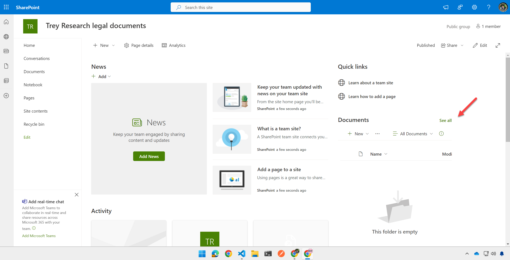
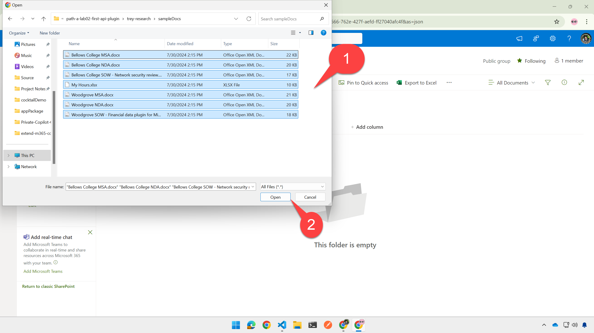

# Lab E3 - Add a declarative agent and API plugin

---8<--- "e-labs-prelude.md"

In this lab you will add a declarative agent which is grounded in the API plugin you created in the previous lab, as well as in specific SharePoint files

!!! note
    This lab builds on the previous one, Lab E2. You should be able to continue working in the same folder for labs E2-E6, but solution folders have been provided for your reference.
    The finished solution for this lab is in the [**/src/extend-m365-copilot/path-e-lab03-build-declarative-agent/trey-research-lab03-END**](https://github.com/microsoft/copilot-camp/tree/main/src/extend-m365-copilot/path-e-lab03-build-declarative-agent/trey-research-lab03-END) folder.

## Exercise 1: Upload sample documents

In this step you will upload sample documents which will be used by your declarative agent to respond to user prompts. These include some consulting documents such as Statements of Work, and a simple spreadsheet containing your hours as a consultant.

### Step 1: Create a SharePoint site

Within the [Microsoft 365 app](https://www.office.com/){target=_blank}, or elsewhere in Microsoft 365, click the "waffle" menu 1️⃣ and select "SharePoint" 2️⃣.

Then click "Create Site" 1️⃣ and choose a "Team site" 2️⃣.

Select the Standard team site template; you will be shown a preview of the site. Click "Use Template" to continue.

Give your site a name such as "Trey Research legal documents" 1️⃣ and click "Next" 2️⃣.

Then select your privacy settings and language, and click "Create Site"

After a few moments, you will be presented with a new SharePoint site. 

<cc-end-step lab="e3" exercise="1" step="1" />

### Step 2: Upload the sample documents

In the Documents web part, select "See all" to view the document library page.

Next, click the "Upload" 1️⃣ toolbar button and select "Files" 2️⃣.

Navigte to your working folder; you will find a directory called **sampleDocs** within. Highlight all the sample documents 1️⃣ and click "Open" 2️⃣.

Make note of the site url, which will resemble "https://&lt;your-tenant&gt;.sharepoint.com/sites/TreyResearchlegaldocuments", as you will need it in the next exercise.

<cc-end-step lab="e3" exercise="1" step="2" />

## Exercise 2: Create the declarative agent

### Step 1: Add the declarative agent JSON to your project

Create a new file called **trey-declarative-copilot.json** within your **appPackage** folder. Copy the following JSON into this file and save it.

~~~json
{
    "$schema": "https://aka.ms/json-schemas/copilot-extensions/vNext/declarative-copilot.schema.json",
    "version": "v1.0",
    "name": "Trey Genie Local",
    "description": "You are a handy assistant for consultants at Trey Research, a boutique consultancy specializing in software development and clinical trials. ",
    "instructions": "Greet users in a professional manner, introduce yourself as the Trey Genie, and offer to help them. Always remind users of the Trey motto, 'Always be Billing!'. Your main job is to help consultants with their projects and hours. Using the TreyResearch action, you are able to find consultants based on their names, project assignments, skills, roles, and certifications. You can also find project details based on the project or client name, charge hours on a project, and add a consultant to a project. If a user asks how many hours they have billed, charged, or worked on a project, reword the request to ask how many hours they have delivered. In addition, you may offer general consulting advice. If there is any confusion, encourage users to speak with their Managing Consultant. Avoid giving legal advice.",
    "conversation_starters": [
        {
            "title": "Find consultants",
            "text": "Find consultants with TypeScript skills"
        },
        {
            "title": "My Projects",
            "text": "What projects am I assigned to?"
        },
        {
            "title": "My Hours",
            "text": "How many hours have I delivered on projects this month?"
        }
    ],
    "capabilities": [
        {
            "name": "OneDriveAndSharePoint",
            "items_by_url": [
                {
                    "url": "${{SHAREPOINT_DOCS_URL}}"
                }
            ]
        }
    ],
    "actions": [
        {
            "id": "treyresearch",
            "file": "trey-plugin.json"
        }
    ]
}
~~~

Notice that the file includes a name, description, and instructions for the declarative agent. Notice that as part of the instructions, Copilot is instructed to "Always remind users of the Trey motto, 'Always be Billing!'." You should see this when you prompt Copilot in the next exercise.

<cc-end-step lab="e3" exercise="2" step="1" />

### Step 2: Add the URL of your SharePoint site to the declarative agent

Under "Capabilities" you will notice a SharePoint file container. While Microsoft 365 Copilot may reference any documents in SharePoint or OneDrive, this declarative agent will only access files in the Trey Research Legal Documents site you created in Exercise 1. 

~~~json
"capabilities": [
    {
        "name": "OneDriveAndSharePoint",
        "items_by_url": [
            {
                    "url": "${{SHAREPOINT_DOCS_URL}}"
            }
        ]
    }
],
~~~

Notice that the SharePoint URL is actually an environment variable `SHAREPOINT_DOCS_URL`, so you need to add that to your **.env.local** file in the **env** folder. Add this in its own line at the end of the file, using your SharePoint URL:

~~~text
SHAREPOINT_DOCS_URL=https://mytenant.sharepoint.com/sites/TreyResearchLegalDocuments
~~~

<cc-end-step lab="e3" exercise="2" step="2" />

### Step 3: Examine the API Plugin files

Within the **trey-declarative-agent.json** file, you'll find an "actions" section which tells the declarative agent to access the Trey Research API.

~~~json
"actions": [
    {
        "id": "treyresearch",
        "file": "trey-plugin.json"
    }
]
~~~

In this step we'll look at **trey-plugin.json** and how it and another file describe the API to Copilot so it can make the REST calls.

These two files are used to describe your API to Copilot. They were already included in the project you downloaded in Lab 2, so you can examine them now:

 * [**appPackage/trey-definition.json**](https://github.com/microsoft/copilot-camp/blob/main/src/extend-m365-copilot/path-e-lab03-build-declarative-copilot/trey-research-lab03-END/appPackage/trey-definition.json){target=_blank} - This is the [OpenAPI Specifiction (OAS)](https://swagger.io/specification/){target=_blank} or "Swagger" file, which is an industry standard format for describing a REST API
 * [**appPackage/trey-plugin.json**](https://github.com/microsoft/copilot-camp/blob/main/src/extend-m365-copilot/path-e-lab03-build-declarative-copilot/trey-research-lab03-END/appPackage/trey-plugin.json){target=_blank} - This file contains all the Copilot-specific details that aren't described in the OAS file

 In this step, take a moment to examine these files. In the next few labs you'll get to know them better as we add more features to the solution.

 In **appPackage/trey-definition.json**, you'll find the general description of the aplication. This includes the server URL; Teams Toolkit will create a [developer tunnel](https://learn.microsoft.com/azure/developer/dev-tunnels/){target=_blank} to expose your local API on the Internet, and replace the token `"${{OPENAPI_SERVER_URL}}` with the public URL. It then goes on to describe every resource path, verb, and paremeter in the API. Notice the detailed descriptions; these are important to help Copilot understand how the API is to be used.

~~~json
{
  "openapi": "3.0.1",
  "info": {
      "version": "1.0.0",
      "title": "Trey Research API",
      "description": "API to streamline consultant assignment and project management."
  },
  "servers": [
      {
          "url": "${{OPENAPI_SERVER_URL}}/api/",
          "description": "Production server"
      }
  ],
  "paths": {
      "/consultants/": {
          "get": {
              "operationId": "getConsultants",
              "summary": "Get consultants working at Trey Research based on consultant name, project name, certifications, skills, roles and hours available",
              "description": "Returns detailed information about consultants identified from filters like name of the consultant, name of project, certifications, skills, roles and hours available. Multiple filters can be used in combination to refine the list of consultants returned",
              "parameters": [
                  {
                      "name": "consultantName",
                      "in": "query",
                      "description": "Name of the consultant to retrieve",
                      "required": false,
                      "schema": {
                          "type": "string"
                      }
                  },
      ...
~~~

The **appPackage/trey-plugin.json** file has the Copilot-specific details. This includes breaking the API calls down into _functions_ which can be called when Copilot has a particular use case. For example, all GET requests for `/consultants` look up one or more consultants with various parameter options, and they are grouped into a function `getConsultants`:

~~~json
  "functions": [
    {
      "name": "getConsultants",
      "description": "Returns detailed information about consultants identified from filters like name of the consultant, name of project, certifications, skills, roles and hours available. Multiple filters can be used in combination to refine the list of consultants returned",
      "capabilities": {
        "response_semantics": {
          "data_path": "$.results",
          "properties": {
            "title": "$.name",
            "subtitle": "$.id",
            "url": "$.consultantPhotoUrl"
          }
        }
      }
    },
~~~

Scrolling down you can find the runtime settings, 

~~~json
"runtimes": [
  {
    "type": "OpenApi",
    "auth": {
      "type": "None"
    },
    "spec": {
      "url": "trey-definition.json"
    },
    "run_for_functions": [
      "getConsultants",
      "getUserInformation",
      "postBillhours"
    ]
  }
],
~~~

They include a pointer to the **trey-definition.json** file, and an enumeration of the available functions.

<cc-end-step lab="e3" exercise="2" step="4" />

### Step 4: Add the declarative agent to your app manifest

Now open the **manifest.json** file within the **appPackage** directory. Add a new `declarativeCopilots` object to the `copilotExtensions` object as follows, so it references the declarative agent JSON file you created in the previous step.

~~~json
  "copilotExtensions": {
    "declarativeCopilots": [
      {
        "id": "treygenie",
      "file": "trey-declarative-copilot.json"
      }
    ]
  }, 
~~~

Be sure to save your work. 

<cc-end-step lab="e3" exercise="2" step="4" />

### Step 5: Remove the dummy feature from the app manifest

The initial solution that you ran in Lab E2 didn't have a declarative agent yet, so the manifest would not install because it had no features. So we added a "dummy" feature, which is a static tab pointing to the Copilot Camp home page. This would allow users to view the Copilot Camp web site in a tab within Teams, Outlook, and the the Microsoft 365 app ([https://office.com](https://office.com))s

If you ever tried [Teams App Camp](https://aka.ms/app-camp){target=_blank} you would know all about them. If not, don't worry about it, just delete these lines from **manifest.json** as they aren't needed anymore.

~~~json
"staticTabs": [
  {
    "entityId": "index",
    "name": "Copilot Camp",
    "contentUrl": "https://microsoft.github.io/copilot-camp/",
    "websiteUrl": "https://microsoft.github.io/copilot-camp/",
    "scopes": [
      "personal"
    ]
  }
],
"validDomains": [
  "microsoft.github.io"
],
~~~

<cc-end-step lab="e3" exercise="2" step="5" />

## Exercise 3: Run and test the declarative agent

### Step 1: Run the new project

If you're still in the debugger, stop it to force a complete re-deloyment.

Then start the debugger by clicking the arrow or pressing F5 and return to the Copilot user interface.

<cc-end-step lab="e3" exercise="3" step="1" />

### Step 2: Test the declarative agent

Open the Copilot chat and the right flyout 1️⃣ to show your previous chats and declarative agents and select the Trey Genie Local copilot 2️⃣.

Try a prompt such as "Please list my projects along with details from the Statement of Work doc". 
You should see a list of your projects from the API plugin, enhanced with details from each project's Statement of Work 1️⃣. Notice that Copilot includes the Trey Research motto 2️⃣ and references to the documents 3️⃣. Click one of the references to check out the document.

<cc-end-step lab="e3" exercise="3" step="2" />

---8<--- "e-congratulations.md"

You've completed adding a declarative agent to your API plugin. You are now ready to proceed to add authentication to your API plugin. 

