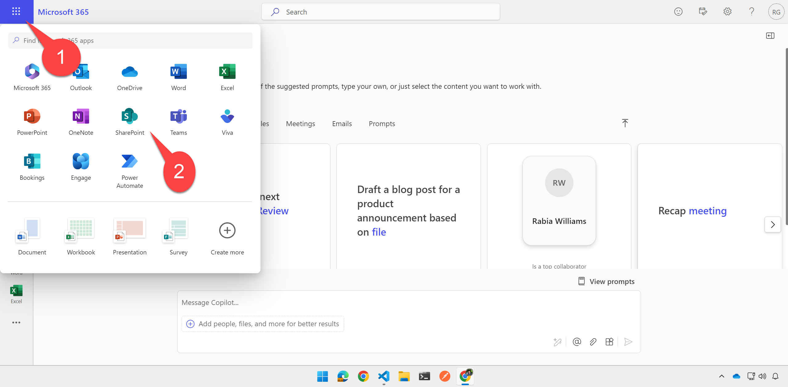
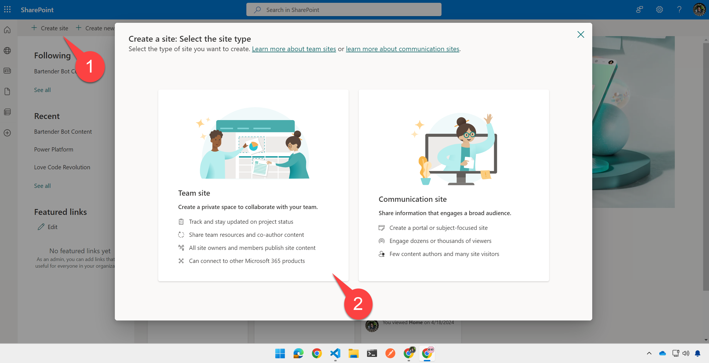
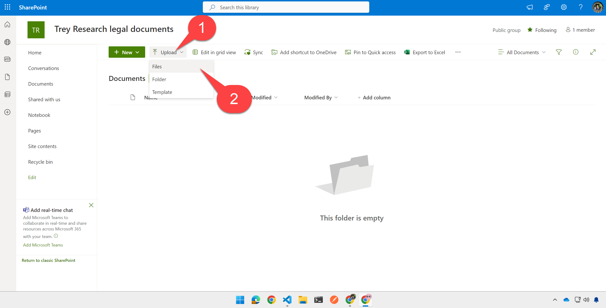

# Lab E3 - Add a declarative agent and API plugin

---8<--- "e-labs-prelude.md"

In this lab you will add a Declarative Copilot which is grounded in the API plugin you created in the previous lab, as well as in specific SharePoint files

## Exercise 1: Upload sample documents

In this step you will upload sample documents which will be used by your declarative copilot to respond to user prompts. These include some consulting documents such as Statements of Work, and a simple spreadsheet containing your hours as a consultant.

### Step 1: Create a SharePoint site

Within the [Microsoft 365 app](https://www.office.com/){target=_blank}, or elsewhere in Microsoft 365, click the "waffle" menu 1️⃣ and select "SharePoint" 2️⃣.

Then click "Create Site" 1️⃣ and choose a "Team site" 2️⃣.

Select the Standard team site template; you will be shown a preview of the site. Click "Use Template" to continue.

Give your site a name such as "Trey Research legal documents" 1️⃣ and click "Next" 2️⃣.

Then select your privacy settings and language, and click "Create Site"

After a few moments, you will be presented with a new SharePoint site. 

<cc-end-step lab="e3" exercise="1" step="1" />

### Step 2: Upload the sample documents

In the Documents web part, select "See all" to view the document library page.

Next, click the "Upload" 1️⃣ toolbar button and select "Files" 2️⃣.

Navigte to your working folder; you will find a directory called "Sample Documents" within. Highlight all the sample documents 1️⃣ and click "Open" 2️⃣.

Make note of the site url, which will resemble "https://&lt;your-tenant&gt;.sharepoint.com/sites/TreyResearchlegaldocuments", as you will need it in the next exercise.

<cc-end-step lab="e3" exercise="1" step="2" />

## Exercise 2: Create the declarative copilot

### Step 1: Add the declarative copilot JSON to your project

Create a new file called **trey-declarative-copilot.json** within your **appPackage** folder. Copy the contents of the [solution file](https://github.com/microsoft/copilot-camp/blob/main/src/extend-m365-copilot/path-e-lab03-build-declarative-copilot/trey-research-lab03-END/appPackage/trey-declarative-copilot.json) into this file and save it.

Notice that the file includes a name, description, and instructions for the declarative copilot. Notice that as part of the instructions, Copilot is instructed to "Always remind users of the Trey motto, 'Always be Billing!'." You should see this when you prompt Copilot in the next exercise.

<cc-end-step lab="e3" exercise="2" step="1" />

### Step 2: Add the URL of your SharePoint site to the declarative copilot

Under "Capabilities" you will notice a SharePoint file container. While Microsoft 365 Copilot may reference any documents in SharePoint or OneDrive, this declarative copilot will only access files in the Trey Research Legal Documents site you created in Exercise 1. To set that up, replace the SharePoint URL with yours.

~~~json
"capabilities": [
    {
        "name": "OneDriveAndSharePoint",
        "items_by_url": [
            {
                "url": "https://<your-tenant-name>.sharepoint.com/sites/TreyResearchLegalDocuments"
            }
        ]
    }
],
~~~

And there's an "actions" section which tells the Declarative Copilot to access the Trey Research API. In the next step we'll look at **trey-plugin.json** and how it and another file describe the API to Copilot so it can make the REST calls.

~~~json
"actions": [
    {
        "id": "treyresearch",
        "file": "trey-plugin.json"
    }
]
~~~

<cc-end-step lab="e3" exercise="2" step="2" />

### Step 3: Examine the API Plugin files

Two files are used to describe your API to Copilot. They were already included in the project you downloaded in Lab 2, so you can examine them now:

 * [**appPackage/trey-definition.json**](https://github.com/microsoft/copilot-camp/blob/main/src/extend-m365-copilot/path-e-lab03-build-declarative-copilot/trey-research-lab03-END/appPackage/trey-definition.json){target=_blank} - This is the [Open API Specifiction (OAS)](https://swagger.io/specification/){target=_blank} or "Swagger" file, which is an industry standard format for describing a REST API
 * [**appPackage/trey-plugin.json**](https://github.com/microsoft/copilot-camp/blob/main/src/extend-m365-copilot/path-e-lab03-build-declarative-copilot/trey-research-lab03-END/appPackage/trey-plugin.json){target=_blank} - This file contains all the Copilot-specific details that aren't described in the OAS file

 In this step, take a moment to examine these files. In the next few labs you'll get to know them better as we add more features to the solution.

 In **appPackage/trey-definition.json**, you'll find the general description of the aplication. This includes the server URL; Teams Toolkit will create a [developer tunnel](https://learn.microsoft.com/azure/developer/dev-tunnels/){target=_blank} to expose your local API on the Internet, and replace the token `"${{OPENAPI_SERVER_URL}}` with the public URL. It then goes on to describe every resource path, verb, and paremeter in the API. Notice the detailed descriptions; these are important to help Copilot understand how the API is to be used.

~~~json
{
  "openapi": "3.0.1",
  "info": {
      "version": "1.0.0",
      "title": "Trey Research API",
      "description": "API to streamline consultant assignment and project management."
  },
  "servers": [
      {
          "url": "${{OPENAPI_SERVER_URL}}/api/",
          "description": "Production server"
      }
  ],
  "paths": {
      "/consultants/": {
          "get": {
              "operationId": "getConsultants",
              "summary": "Get consultants working at Trey Research based on consultant name, project name, certifications, skills, roles and hours available",
              "description": "Returns detailed information about consultants identified from filters like name of the consultant, name of project, certifications, skills, roles and hours available. Multiple filters can be used in combination to refine the list of consultants returned",
              "parameters": [
                  {
                      "name": "consultantName",
                      "in": "query",
                      "description": "Name of the consultant to retrieve",
                      "required": false,
                      "schema": {
                          "type": "string"
                      }
                  },
      ...
~~~

The **appPackage/trey-plugin.json** file has the Copilot-specific details. This includes breaking the API calls down into _functions_ which can be called when Copilot has a particular use case. For example, all GET requests for `/consultants` look up one or more consultants with various parameter options, and they are grouped into a function `getConsultants`:

~~~json
  "functions": [
    {
      "name": "getConsultants",
      "description": "Returns detailed information about consultants identified from filters like name of the consultant, name of project, certifications, skills, roles and hours available. Multiple filters can be used in combination to refine the list of consultants returned",
      "capabilities": {
        "response_semantics": {
          "data_path": "$.results",
          "properties": {
            "title": "$.name",
            "subtitle": "$.id",
            "url": "$.consultantPhotoUrl"
          }
        }
      }
    },
~~~

Scrolling down you can find the runtime settings, 

~~~json
"runtimes": [
  {
    "type": "OpenApi",
    "auth": {
      "type": "None"
    },
    "spec": {
      "url": "trey-definition.json"
    },
    "run_for_functions": [
      "getConsultants",
      "getUserInformation",
      "postBillhours"
    ]
  }
],
~~~

They include a pointer to the **trey-definition.json** file, and an enumeration of the available functions.

<cc-end-step lab="e3" exercise="2" step="4" />

### Step 4: Add the declarative copilot to your app manifest

Now open the **manifest.json** file within the **appPackage** directory. Add a new `declarativeCopilots` object to the `copilotExtensions` object as follows, so it references the declarative copilot JSON file you created in the previous step.

~~~json
  "copilotExtensions": {
    "declarativeCopilots": [
      {
        "id": "treygenie",
      "file": "trey-declarative-copilot.json"
      }
    ],
    "plugins": [
      {
        "id": "treyresearch",
        "file": "trey-plugin.json"
      }
    ]
  }, 
~~~

Be sure to save your work. 

By leaving the "plugins" object in place, you are enabling the direct use of the API plugin _or_ the declarative copilot.

<cc-end-step lab="e3" exercise="2" step="4" />

## Exercise 3: Run and test the declarative copilot

### Step 1: Run the new project

If you're still in the debugger, stop it to force a complete re-deloyment.

Then start the debugger by clicking the arrow or pressing F5 and return to the Copilot user interface.

<cc-end-step lab="e3" exercise="3" step="1" />

### Step 2: Test the declarative copilot

Open the Copilot chat and the right flyout 1️⃣ to show your previous chats and declarative copilots and select the Trey Genie Local copilot 2️⃣.

Try a prompt such as "Please list my projects along with details from the Statement of Work doc". 
You should see a list of your projects from the API plugin, enhanced with details from each project's Statement of Work 1️⃣. Notice that Copilot includes the Trey Research motto 2️⃣ and references to the documents 3️⃣. Click one of the references to check out the document.

<cc-end-step lab="e3" exercise="3" step="2" />

## CONGRATULATIONS

You've completed adding a Declarative Copilot to your API plugin. You are now ready to proceed to add authentication to your API plugin. 

