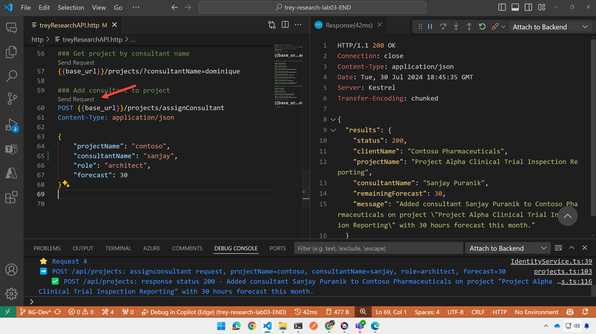
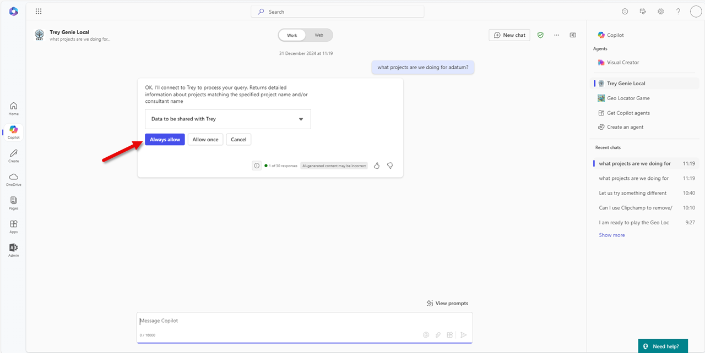

# Lab E4 - Enhance the API Plugin

---8<--- "e-labs-prelude.md"

In this lab you will add additional REST calls to the API and add them to the API Plugin packaging so Copilot can call them. In the process you will learn all the places where an API needs to be defined for Copilot.

## Exercise 1: Add /projects resource

In this exercise you will add a /projects resource to the Trey Research API. This will allow you to request information about projects using GET requests, and to assign a consultant to a project using a POST request. In the process, you'll learn about the **appPackage/trey-Plugin.json** and **trey-definition.json** files as you modify them to add the new projects API calls.

### Step 1: Add Azure function code

To begin, create a new file, **projects.ts** in the **/src/functions** folder of your solution from Lab 2. Then [copy the code from here](https://github.com/microsoft/copilot-camp/blob/main/src/extend-m365-copilot/path-e-lab04-enhance-api-plugin/trey-research-lab04-END/src/functions/projects.ts){target=_blank}.

This will implement a new Azure function to provide access to Trey Research projects

<cc-end-step lab="e4" exercise="1" step="1" />

### Step 2: Review the Azure function code (optional)

Let's take a moment to review the code.

This is a version 4 Azure function, so the code looks a lot like traditional Express code for NodeJS. The `projects` class implements an HTTP request trigger, which is called when the "/projects" path is accessed. This is followed by some in-line code that defines the methods and route. For now, access is anonymous; we'll add authentication in [Lab E6](./06-add-authentication.md).

~~~typescript
export async function projects(
    req: HttpRequest,
    context: InvocationContext
): Promise<Response> {
    // ...
}
app.http("projects", {
    methods: ["GET", "POST"],
    authLevel: "anonymous",
    route: "projects/{*id}",
    handler: projects,
});
~~~

The class includes a switch statement for handling GET vs. POST requests, and obtains the parameters from the URL path (in the case of a project ID), query strings (such as ?projectName=foo, in the case of a GET), and the request body (in the case of a POST). It then accesses the project data using the [ProjectApiService](https://github.com/microsoft/copilot-camp/blob/main/src/extend-m365-copilot/path-e-lab04-enhance-api-plugin/trey-research-lab04-END/src/services/ProjectApiService.ts){target=_blank}, which was part of the starting solution. It also sends responses for each request and logging of requests to the debug console.

<cc-end-step lab="e4" exercise="1" step="2" />

### Step 3: Add HTTP test requests

Now let's add the new requests to the **http/treyResearchAPI.http** file so we can try them out. Open the file and add this text to the bottom, then save your changes, or [copy the updated file from here](https://github.com/microsoft/copilot-camp/blob/main/src/extend-m365-copilot/path-e-lab04-enhance-api-plugin/trey-research-lab04-END/http/treyResearchAPI.http){target="_blank"}	

~~~text
########## /api/projects - working with projects ##########

### Get all projects
{{base_url}}/projects

### Get project by id
{{base_url}}/projects/1

### Get project by project or client name
{{base_url}}/projects/?projectName=supply

### Get project by consultant name
{{base_url}}/projects/?consultantName=dominique

### Add consultant to project
POST {{base_url}}/projects/assignConsultant
Content-Type: application/json

{
    "projectName": "contoso",
    "consultantName": "sanjay",
    "role": "architect",
    "forecast": 30
}
~~~

<cc-end-step lab="e4" exercise="1" step="3" />

### Step 4: Test the new resource

If your app is still running from Lab 2, stop the debugger and restart it. Or, just start the debugger normally and wait for the app to start. When everything is ready, Teams Toolkit will display a web browser wanting you to log into Microsoft 365. Minimize this browser as you don't need it yet, but closing it would stop the debugger.

Now try sending the new requestsm and you should be able to see Trey Research project details or assign a new consultant to a project using the POST request.

<cc-end-step lab="e4" exercise="1" step="4" />

## Exercise 2: Add projects to the application package

The API plugin's application package is a zip file that contains all the information Copilot needs to use the API.
In this exercise, you'll add information about the new /projects resource to the app package.

### Step 1: Update the Open API Specifiction file

An important part of the application package is the [Open API Specification (OAS)](https://swagger.io/specification/){target=_blank} definition file. OAS defines a standard format for describing a REST API, and is based on the popular "Swagger" definition.

To begin, in the **/appPackage** folder, open the file **trey-definition.json**. 
Since editing large JSON files can be tricky, please just [copy the updated file from here](https://github.com/microsoft/copilot-camp/blob/main/src/extend-m365-copilot/path-e-lab04-enhance-api-plugin/trey-research-lab04-END/appPackage/trey-definition.json) and save the new trey-definition.json. In the steps that follow, you can review and understand the changes.

<cc-end-step lab="e4" exercise="2" step="1" />

### Step 2: Review the updates (optional)

The first update was to add the `/projects/` path to the `paths` collection in the JSON. 
As you can see, this includes all the available query strings when retrieving the `/projects/` resource, along with data types and required fields. It also includes the data that will be returned in API responses, including different payloads for status 200 (successful) and 400 (failed) responses.

~~~json
"/projects/": {
    "get": {
        "operationId": "getProjects",
        "summary": "Get projects matching a specified project name and/or consultant name",
        "description": "Returns detailed information about projects matching the specified project name and/or consultant name",
        "parameters": [
            {
                "name": "consultantName",
                "in": "query",
                "description": "The name of the consultant assigned to the project",
                "required": false,
                "schema": {
                    "type": "string"
                }
            },
            {
                "name": "projectName",
                "in": "query",
                "description": "The name of the project or name of the client",
                "required": false,
                "schema": {
                    "type": "string"
                }
            }
        ],
        "responses": {
            "200": {
                "description": "Successful response",
                "content": {
                    "application/json": {
                        "schema": {
                            "type": "object",
                            "properties": {
                                "results": {
                                    "type": "array",
                                    "items": {
                                        "type": "object",
                                        "properties": {
                                            "name": {
                                                "type": "string"
                                            },
                                            "description": {
                                                "type": "string"
                                            },
                                            "location": {
                                                "type": "object",
                                                "properties": {
                                                    "street": {
                                                        "type": "string"
                                                    },
                                                    "city": {
                                                        "type": "string"
                                                    },
                                                    "state": {
                                                        "type": "string"
                                                    },
                                                    "country": {
                                                        "type": "string"
                                                    },
                                                    "postalCode": {
                                                        "type": "string"
                                                    },
                                                    "latitude": {
                                                        "type": "number"
                                                    },
                                                    "longitude": {
                                                        "type": "number"
                                                    },
                                                    "mapUrl": {
                                                        "type": "string",
                                                        "format": "uri"
                                                    }
                                                }
                                            },
                                            "role": {
                                                "type": "string"
                                            },
                                            "forecastThisMonth": {
                                                "type": "integer"
                                            },
                                            "forecastNextMonth": {
                                                "type": "integer"
                                            },
                                            "deliveredLastMonth": {
                                                "type": "integer"
                                            },
                                            "deliveredThisMonth": {
                                                "type": "integer"
                                            }
                                        }
                                    }
                                },
                                "status": {
                                    "type": "integer"
                                }
                            }
                        }
                    }
                }
            },
            "404": {
                "description": "Project not found"
            }
        }
    }
},
~~~

You will also find that a path has been added at `/projects/assignConsultant` to handle the POST requests.

!!! tip "Descriptions are important!"
    This file, along with all the files in the app package, are going to be read by an intelligence. It may be
    artificial, but it's still intelligent enough to read the descriptions! You can help Copilot properly use
    your API by using descriptive names and descriptions in this and all the application package files!

<cc-end-step lab="e4" exercise="2" step="2" />

### Step 3: Add projects to the plugin definition file

Now open the file **trey-plugin.json** within the **/appPackage** folder. This file contains extra information not included in the OAS definition file. Replace the contents of **trey-plugin.json** with [this updated JSON](https://github.com/microsoft/copilot-camp/blob/main/src/extend-m365-copilot/path-e-lab04-enhance-api-plugin/trey-research-lab04-END/appPackage/trey-plugin.json).

<cc-end-step lab="e4" exercise="2" step="3" />

### Step 4: Review the changes to the plugin definition file (optional)

The plugin JSON file contains a collection of _functions_, each of which corresponds to a type of API call. Copilot will choose among these functions when utilizing your plugin at runtime.

The new **trey-plugin.json** file includes new functions `getProjects` and `postAssignConsultant`. For example, here is `getProjects`:

~~~json
{
    "name": "getProjects",
    "description": "Returns detailed information about projects matching the specified project name and/or consultant name",
    "capabilities": {
        "response_semantics": {
            "data_path": "$.results",
            "properties": {
            "title": "$.name",
            "subtitle": "$.description"
            }
        }
    }
},
~~~

Notice that it includes some `response_semantics` which instruct Copilot in the important properties to mention when referring to a project in its responses. The POST request has a similar function:

~~~json
{
    "name": "postAssignConsultant",
    "description": "Assign (add) consultant to a project when name, role and project name is specified.",
    "capabilities": {
    "response_semantics": {
        "data_path": "$",
        "properties": {
        "title": "$.results.clientName",
        "subtitle": "$.results.status"
        }
    },
    "confirmation": {
        "type": "AdaptiveCard",
        "title": "Assign consultant to a project when name, role and project name is specified.",
        "body": "* **ProjectName**: {{function.parameters.projectName}}\n* **ConsultantName**: {{function.parameters.consultantName}}\n* **Role**: {{function.parameters.role}}\n* **Forecast**: {{function.parameters.forecast}}"
    }
    }
}
~~~

It includes an [adaptive card](https://adaptivecards.io) to be used in the confirmation card, which is shown to users to confirm an action prior to issuing a POST request.

Scrolling down, you can see the `runtimes` object which defines the type of plugin, the OAS definition file location, and a list of functions. The new functions have been added to the list.

~~~json
"runtimes": [
{
    "type": "OpenApi",
    "auth": {
    "type": "None"
    },
    "spec": {
    "url": "trey-definition.json"
    },
    "run_for_functions": [
    "getConsultants",
    "getUserInformation",
    "getProjects",
    "postBillhours",
    "postAssignConsultant"
    ]
}
],
~~~

Finally, it includes some conversation starters which are prompt suggestions shown to users; the new file has a conversation starter relating to projects.

~~~json
"capabilities": {
"localization": {},
"conversation_starters": [
    {
    "text": "What Trey projects am i assigned to?"
    },
    {
    "text": "Charge 5 hours to the Contoso project for Trey Research"
    },
    {
    "text": "Which Trey consultants are Azure certified?"
    },
    {
    "text": "Find a Trey consultant who is available now and has Python skills"
    },
    {
    "text": "Add Avery as a developer on the Contoso project for Trey"
    }
]
}
~~~

<cc-end-step lab="e4" exercise="2" step="4" />

## Exercise 3: Test the plugin in Copilot

### Step 1: Restart the application

Stop and restart your project to force it to re-deploy the application package.
You will be brought into Microsoft Teams. Once you're back in Copilot, open the right flyout 1️⃣ to show your previous chats and declarative copilots and select the Trey Genie Local copilot 2️⃣.

<cc-end-step lab="e4" exercise="3" step="1" />

### Step 2: Prompt the Trey Genie

Now try a prompt such as "what projects are we doing for adatum?"

You may see a confirmation card, even for the GET request. If you do, allow the request to view the project details.

<cc-end-step lab="e4" exercise="3" step="2" />

## CONGRATULATIONS

You've now completed enhancing your API plugin. You are now ready to proceed to the next lab to add rich card responses using adaptive cards. 

