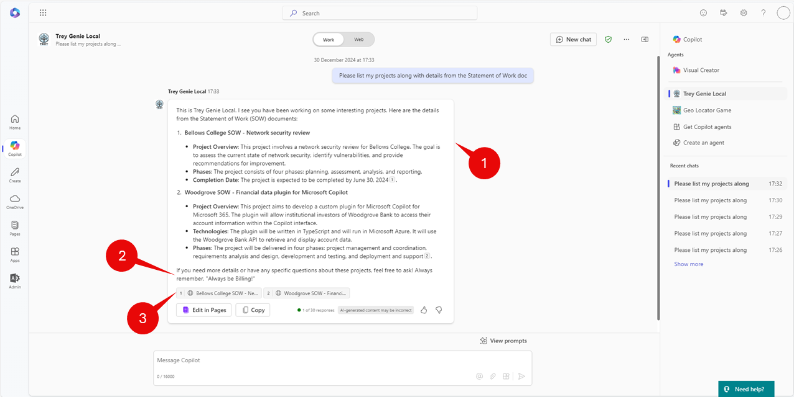

# Lab A5 - Add a declarative copilot to your API plugin

In this lab you will add a Declarative Copilot which is grounded in the API plugin you created in the previous lab, as well as in specific SharePoint files

???+ "Navigating the Extending Copilot labs (A Path)"
    - [Lab A0 - Prerequisites](/copilot-camp/pages/extend-m365-copilot/00-prerequisites)
    - [Lab A1 - Declarative Copilot](/copilot-camp/pages/extend-m365-copilot/01-declarative-copilot)
    - [Lab A2 - First API Plugin](/copilot-camp/pages/extend-m365-copilot/02-api-plugin)
    - [Lab A3 - Enhance the API Plugin](/copilot-camp/pages/extend-m365-copilot/03-enhance-api-plugin) 
    - [Lab A4 - Add Adaptive Cards](/copilot-camp/pages/extend-m365-copilot/04-add-adaptive-card)
    - [Lab A5 - Add a Declarative Copilot](/copilot-camp/pages/extend-m365-copilot/05-add-declarative-copilot) (📍You are here)
    - [Lab A6 - Add authentication](/copilot-camp/pages/extend-m365-copilot/06-add-authentication)

## Exercise 1: Upload sample documents

In this step you will upload sample documents which will be used by your declarative copilot to respond to user prompts. These include some consulting documents such as Statements of Work, and a simple spreadsheet containing your hours as a consultant.

### Step 1: Create a SharePoint site

Within the [Microsoft 365 app](https://www.office.com/), or elsewhere in Microsoft 365, click the "waffle" menu 1️⃣ and select "SharePoint" 2️⃣.

Then click "Create Site" 1️⃣ and choose a "Team site" 2️⃣.

Select the Standard team site template; you will be shown a preview of the site. Click "Use Template" to continue.

Give your site a name such as "Trey Research legal documents" 1️⃣ and click "Next" 2️⃣.

Then select your privacy settings and language, and click "Create Site"

After a few moments, you will be presented with a new SharePoint site. 

### Step 2: Upload the sample documents

In the Documents web part, select "See all" to view the document library page.

Next, click the "Upload" 1️⃣ toolbar button and select "Files" 2️⃣.

Navigte to your working folder; you will find a directory called "Sample Documents" within. Highlight all the sample documents 1️⃣ and click "Open" 2️⃣.

Make note of the site url, which will resemble "https://&lt;your-tenant&gt;.sharepoint.com/sites/TreyResearchlegaldocuments", as you will need it in the next exercise.

## Exercise 2: Create the declarative copilot

### Step1: Add the declarative copilot JSON to your project

Create a new file called **trey-declarative-copilot.json** within your **appPackage** folder. Copy the contents of the [solution file](https://github.com/BobGerman/copilot-camp/blob/main/src/extend-m365-copilot/path-a-lab05-add-declarative-copilot/trey-research-lab05-END/appPackage/trey-declarative-copilot.json) into this file and save it.

Notice that the file includes a name, description, and instructions for the declarative copilot. Notice that as part of the instructions, Copilot is instructed to "Always remind users of the Trey motto, 'Always be Billing!'." You should see this when you prompt Copilot in the next exercise.

### Step 2: Add the URL of your SharePoint site to the declarative copilot

Under "Capabilities" you will notice a SharePoint file container. While Microsoft 365 Copilot may reference any documents in SharePoint or OneDrive, this declarative copilot will only access files in the Trey Research Legal Documents site you created in Exercise 1. To set that up, replace the SharePoint URL with yours.

~~~json
"capabilities": [
    {
        "name": "SharePoint",
        "file_containers": [
            {
                "path": "https://<your-tenant>.sharepoint.com/sites/TreyResearchLegalDocuments"
            }
        ]
    }
],
~~~

Notice that under "actions", the declarative copilot refers to the API plugin you developed over the last few exercises.

~~~json
"actions": [
    {
        "id": "treyresearch",
        "file": "trey-plugin.json"
    }
]
~~~

### Step 3: Add the declarative copilot to your app manifest

Now open the **manifest.json** file within the **appPackage** directory. Add a new `declarativeCopilots` object to the `copilotExtensions` object as follows, so it references the declarative copilot JSON file you created in the previous step.

~~~json
  "copilotExtensions": {
    "declarativeCopilots": [
      {
        "id": "treygenie",
      "file": "trey-declarative-copilot.json"
      }
    ],
    "plugins": [
      {
        "id": "treyresearch",
        "file": "trey-plugin.json"
      }
    ]
  }, 
~~~

Be sure to save your work. 

By leaving the "plugins" object in place, you are enabling the direct use of the API plugin _or_ the declarative copilot.

## Exercise 3: Run and test the declarative copilot

### Step 1: Run the new project

If you're still in the debugger, stop it to force a complete re-deloyment.

Then start the debugger by clicking the arrow or pressing F5 and return to the Copilot user interface.

### Step 2: Test the declarative copilot

Once you're back in Copilot, open the right flyout 1️⃣ to show your previous chats and declarative copilots and select the Trey Genie Local copilot 2️⃣.

Try a prompt such as "Please list my projects along with details from the Statement of Work doc". 
You should see a list of your projects from the API plugin, enhanced with details from each project's Statement of Work 1️⃣. Notice that Copilot includes the Trey Research motto 2️⃣ and references to the documents 3️⃣. Click one of the references to check out the document.

## CONGRATULATIONS

You have completed Lab A5 - Declarative Copilot
You are now ready to proceed to [Lab A6 - Add Authentication](/copilot-camp/pages/extend-m365-copilot/06-add-authentication/).

