# Lab E6c - Add SSO

---8<--- "e-labs-prelude.md"

In this lab you will add Microsoft Entra ID SSO authentication enabling users to authenticate with their existing Entra ID credentials.

!!! note
    This lab builds on the previous one, Lab E5. You should be able to continue working in the same folder for labs E2-E6a, E6b or E6c, but solution folders have been provided for your reference.
    The finished solution for this lab is in the [**/src/extend-m365-copilot/path-e-lab06-add-authentication/trey-research-lab06-END**](https://github.com/microsoft/copilot-camp/tree/main/src/extend-m365-copilot/path-e-lab06-add-auth/trey-research-lab06-END){target=_blank} folder.

!!! note
    There are many detailed setup steps for Entra ID in this lab.
    A new version of Teams Toolkit is available which will automate many of these steps for you; we plan to provide a more streamlined version of the lab shortly.

In this lab you will register an Entra ID application that secures your API. Below are the two things you will need to configure SSO.

~~~text
API Base URL: 
API's Entra ID application ID: 
~~~

## Exercise 1: Set up a persistent developer tunnel (optional)

By default, Teams Toolkit creates a new developer tunnel - and thus a new URL for accesing your locally running API - every time you start the project. Normally this is fine because Teams Toolkit automatically updates the URL where needed, but since this lab will be a manual setup, you'll have to manually update the URL in Entra ID and in Teams Developer Portal each time you start the debugger. For that reason, you may wish to set up a persistent developer tunnel with a URL that does not change.

??? Note "If you don't want to set up a persistent tunnel, open this note ▶▶▶"
    You are free to skip this exercise and use the developer tunnel provided by Teams Toolkit. Once your project is running, you can copy this URL from the terminal tab 1️⃣ by choosing the "Start local tunnel" terminal 2️⃣; copy the Forwarding URL 3️⃣. Note this URL will change every time you start the project, and you will need to manually update the app registration reply URL (exercise 2 step 1) and the Teams Developer Portal URL (exercise 5 step 1).
    

### Step 1: Install the developer tunnel CLI

Here are the command lines for installing the developer tunnel. [Full instructions and download links for the Developer Tunnel are here.](https://learn.microsoft.com/azure/developer/dev-tunnels/get-started){target=_blank}. 

| OS | Command |
| --- | --- |
| Windows | `winget install Microsoft.devtunnel` |
| Mac OS | `brew install --cask devtunnel` |
| Linux | `curl -sL https://aka.ms/DevTunnelCliInstall | bash` |

!!! tip
    You may have to restart your command line to update the file path before devtunnel commands will work

Once you have it installed, you'll need to log in. You can use your Microsoft 365 account to log in.

~~~sh
devtunnel user login
~~~

<cc-end-step lab="e6" exercise="1" step="1" />

### Step 2: Create and host the tunnel

Then you'll need to set up a persistent tunnel to the Azure Functions local port (7071).
You can use these commands and substitute your own name instead of "mytunnel" if you wish.

~~~sh
devtunnel create mytunnel -a --host-header unchanged
devtunnel port create mytunnel -p 7071
devtunnel host mytunnel
~~~

The command line will display the connection information, such as:


Copy the "Connect via browser" URL and save it as the "API Base URL".

<cc-end-step lab="e6" exercise="1" step="2" />

### Step 3: Disable the dynamically created tunnel in your project

If your project is running locally, stop it. Then edit [\.vscode\tasks.json](https://github.com/microsoft/copilot-camp/blob/main/src/extend-m365-copilot/path-e-lab06-add-auth/trey-research-lab06-END/.vscode/tasks.json){target=_blank} and locate the "Start Teams App task. Comment out the "Start local tunnel" depdendency and add its dependency, "Start Azurite emulator" instead. The resulting task should look like this:

~~~json
{
    "label": "Start Teams App Locally",
    "dependsOn": [
        "Validate prerequisites",
        //"Start local tunnel",
        "Start Azurite emulator",
        "Create resources",
        "Build project",
        "Start application"
    ],
    "dependsOrder": "sequence"
},
~~~
<cc-end-step lab="e6" exercise="1" step="3" />

### Step 4: Manually override the server URL

Open **env/.env.local** and change the value of OPENAPI_SERVER_URL to the persistent tunnel URL. This is the `API base URL` that is needed for the configuration in the steps later.

<cc-end-step lab="e6c" exercise="1" step="4" />

## Exercise 2: Register an Entra ID application for your API

### Step 1: Add a new Entra ID app registration

Browse to the Entra ID admin center either via the [Microsoft 365 Admin center](https://portal.office.com/AdminPortal/){target=_blank} or directly at [https://entra.microsoft.com/](https://entra.microsoft.com/){target=_blank}. Make sure you are logged into your development tenant and not some other.

Once you're there, click "Identity" 1️⃣, then "Applications" 2️⃣, and then "App registrations" 3️⃣. Then click the "+" 4️⃣ to add a new app registration.


Give your application a unique and descriptive name such as "Trey API Service" 1️⃣. Under "Supported account types", select "Accounts in this organizational directory only (Microsoft only - single tenant) 2️⃣. 

Then click "Register" 3️⃣ to register your application.

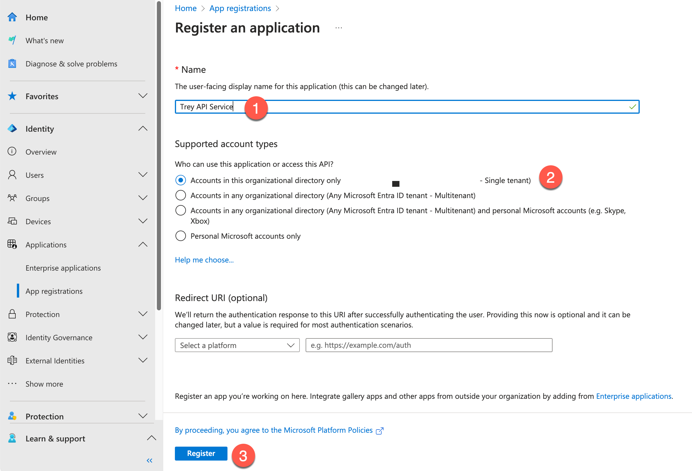

<cc-end-step lab="e6" exercise="2" step="1" />

### Step 2: Copy application info to a safe place
Copy the Application ID (also called the Client ID) 1️⃣ which is the `API's Entra ID application ID` and `Directory (tenant) ID` 2️⃣ that is needed for the configuration in the steps later.

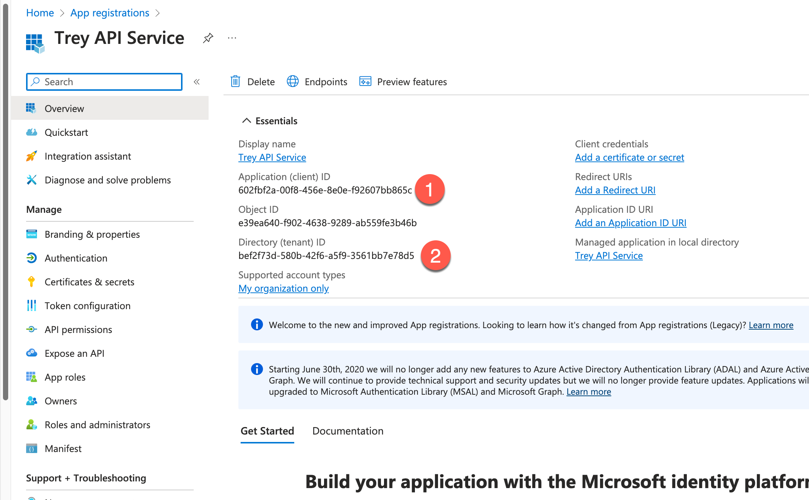

<cc-end-step lab="e6" exercise="2" step="2" />

## Exercise 3: Register Microsoft Entra SSO client ID  in the Teams Developer Portal

Now you're API is all set up with Microsoft Entra ID, but Microsoft 365 doesn't know anything about it. To ensure secure connection of your API without requiring extra credentials, let's register it in the Teams Developer Portal.

### Step 1: 
Register an SSO client in Teams developer portal

Browse to the Teams Developer Portal at [https://dev.teams.microsoft.com](https://dev.teams.microsoft.com){target=_blank}. Select "Tools" 1️⃣ and then "Microsoft Entra SSO client ID registration." 2️⃣.

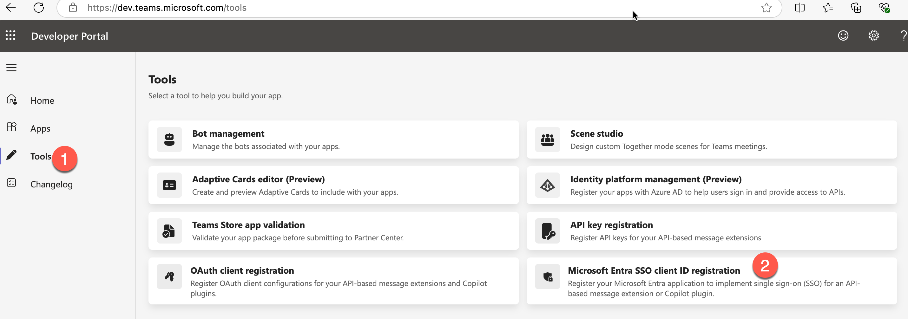

Select **New client registration** and fill up the values. 

| Field | Value |
| --- | --- |
| Name | Choose a name you'll remember |
| Base URL| API base URL|
| Restrict usage by org | select "My organization only" |
| Restrict usage by app | select "Any Teams app" |
| Client (application) ID | API's Entra ID application ID |

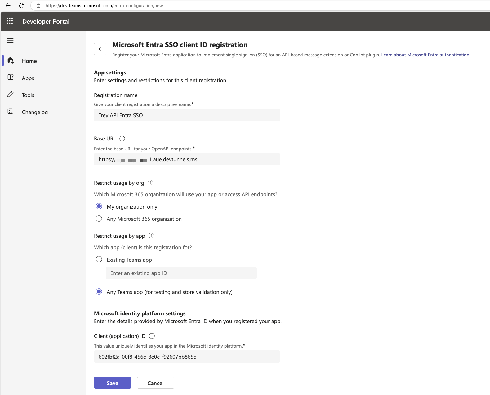


Now once you select **Save**, the registration generates a **Microsoft Entra SSO registration ID** and an **Application ID URI**.
Copy them to a note, to configure the plugin manifest file to enable SSO.

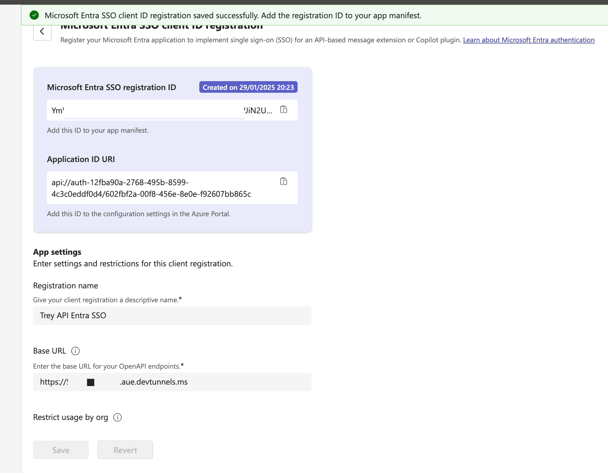

!!! Note "If you didn't make a persistent developer tunnel URL..."
    ...you will have to update the "Base URL" field with your new tunnel URL each time you start your application in Teams Toolkit

<cc-end-step lab="e6" exercise="5" step="1" />

## Exercise 4: Update your application package

### Step 1: Update the Plugin file

Open your working folder in Visual Studio Code. In the **appPackage** folder, open the **trey-plugin.json** file. This is where information is stored that Copilot needs, but is not already in the Open API Specification (OAS) file.

Under `Runtimes` you will find an `auth` property with `type` of `"None"`, indicating the API is currently not authenticated. Change it as follows to tell Copilot to authenticate using the **Microsoft Entra SSO registration ID** you saved in the vault.

~~~json
"auth": {
  "type": "OAuthPluginVault",
  "reference_id": "<Microsoft Entra SSO registration ID>"
},
~~~

## Exercise 5: Update the API's Microsoft Entra app registration

### Step 1: Update Application ID URI 
- Go back to the [Microsoft Entra admin center](https://entra.microsoft.com/) and find the Microsoft Entra app registration of your API, we called it here **Trey API Service**. 
- Open  **Expose an API** and add/edit **Application ID URI**.  Paste the entire **Application ID URI** generated by the Teams developer portal here and select **Save**

### Step 2: Add API Scope

In order to validate calls to your API, you need to expose an API Scope, which represents the permission to call the API. Though these could be very specific - allowing permission to do specific operations via the API - in this case we'll set up a simple scope called "access_as_user".

Under "Add a scope" enter "access_as_user" as the scope name 1️⃣. Fill in the remaining fields as follows:

| Field | Value |
| --- | --- |
| Who can consent? | Admins and users |
| Admin consent display name | Access My API as the user |
| Admin consent description | Allows an API to access My API as a user |
| User consent display name | Access My API as you |
| User consent description | Allows an app to access My API as you |
| State | Enabled |

When you're done, click "Add Scope" 2️⃣.

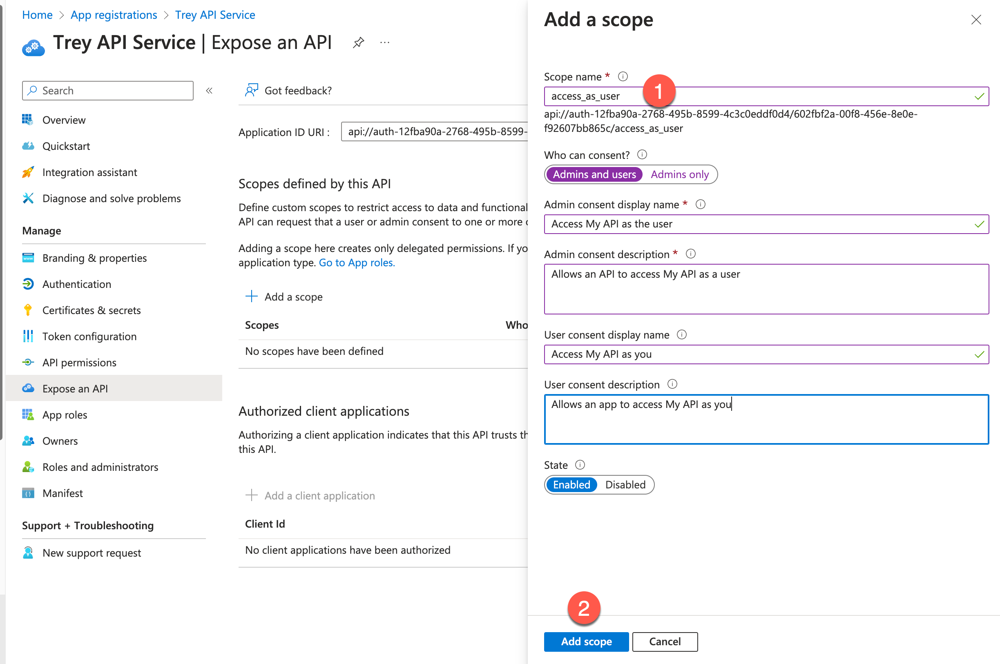

### Step 3: Add authorized client apps
Select **Add a client application** 1️⃣ in the same **Expose an API page** and add the client ID of Microsoft's enterprise token store, `ab3be6b7-f5df-413d-ac2d-abf1e3fd9c0b` 2️⃣. Authorize it for the access scope by selecting 3️⃣. Select **Add application** 4️⃣

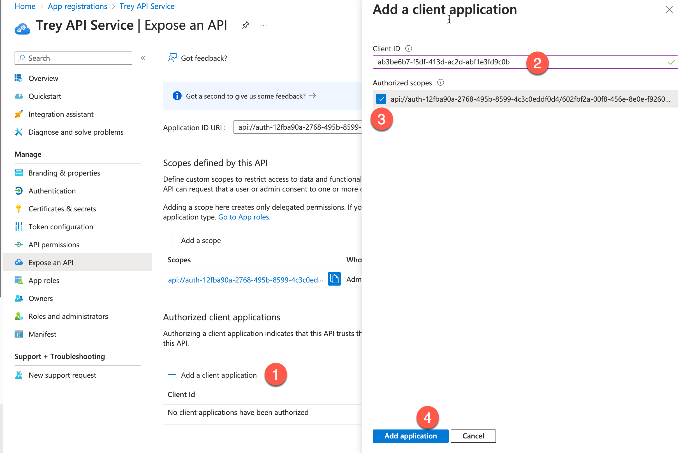

### Step 4 : Redirect URIs for Authentication
Now in the left navigation, go to **Authentication** 1️⃣ , **Add a platform** 2️⃣, select **Web** 3️⃣. 

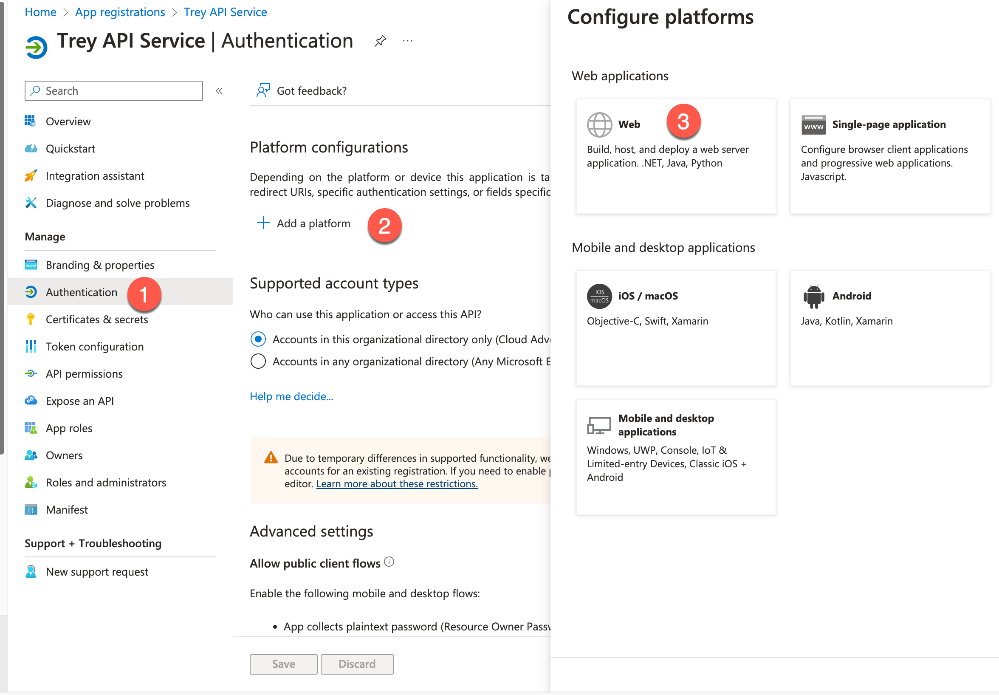

Paste the url `https://teams.microsoft.com/api/platform/v1.0/oAuthConsentRedirect` as the **Redirect URIs** 1️⃣ and select **Configure** 2️⃣.

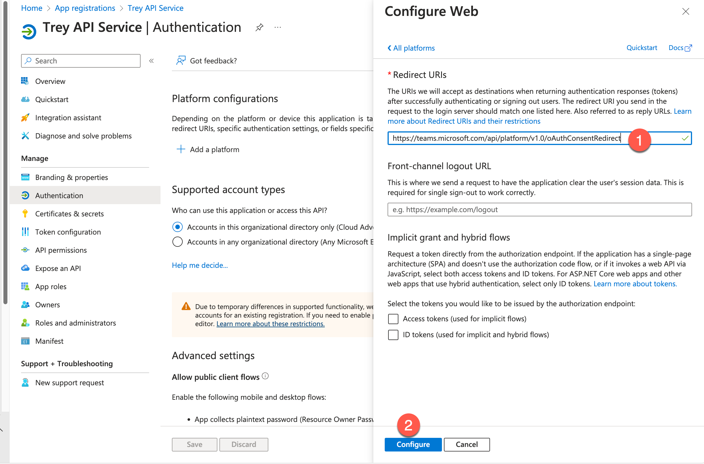


<cc-end-step lab="e6" exercise="2" step="4" />

## Exercise 7: Update the application code

### Step 1: Install the JWT validation library

From a command line in your working directory, type:

~~~sh
npm i jwt-validate
~~~

This will install a library for validating the incoming Entra ID authorization token.

!!! warning
    Microsoft does not provide a supported library for validating Entra ID tokens in NodeJS, but instead provides [this detailed documentation](https://learn.microsoft.com/entra/identity-platform/access-tokens#validate-tokens){target=_blank} on how to write your own. [Another useful article](https://www.voitanos.io/blog/validating-entra-id-generated-oauth-tokens/){target=_blank} is also available from [Microsoft MVP Andrew Connell](https://www.voitanos.io/pages/about/#whos-behind-voitanos){target=_blank}. This lab uses a [community provided library](https://www.npmjs.com/package/jwt-validate){target=_blank} written by [Waldek Mastykarz](https://github.com/waldekmastykarz){target=_blank}, which is intended to follow this guidance. Note that this library is not supported by Microsoft and is under an MIT License, so use it at your own risk.

<cc-end-step lab="e6" exercise="7" step="1" />

### Step 2: Add environment variables for your API

In the **env** folder in your working directory, open **env.local** and add these lines for your API Service app's client ID, auth config ID and tenant ID.

~~~text
APP_ID_URI=<Application ID URI>
API_TENANT_ID=<Directory (tenant) ID>
~~~


!!! Note "Generate Application ID URI manually"
    In case the Application ID URI isn't available, please construct it using the below steps temporarily:
    Go to [Base64 Decode and Encode](https://www.base64decode.org/) - Online
    Copy and paste the auth registration ID generated in last step and decode.
    Construct the application ID URI using the second part of the decoded value (after ##) as highlighted below – api://auth-<AuthConfigID_Decoded_SecondPart>, e.g., api://auth-16cfcd90-803e-40ba-8106-356aa4927bb9
    
  


To make these values available inside your code running in Teams Toolkit, you also need to update the **teamsapp.local.yml** file in the root of your working folder. Look for the comment "Generate runtime environment variables" and add the new values under the STORAGE_ACCOUNT_CONNECTION_STRING:

~~~yaml
  - uses: file/createOrUpdateEnvironmentFile
    with:
      target: ./.localConfigs
      envs:
        STORAGE_ACCOUNT_CONNECTION_STRING: ${{SECRET_STORAGE_ACCOUNT_CONNECTION_STRING}},
        APP_ID_URI: ${{APP_ID_URI}}
        API_TENANT_ID: ${{API_TENANT_ID}}
~~~

<cc-end-step lab="e6" exercise="7" step="2" />

### Step 3: Update the identity service

In the **src/services** folder, open **IdentityService.ts**. 
At the top of the file along with the other `import` statements, add this one:

~~~typescript
import { TokenValidator, ValidateTokenOptions, getEntraJwksUri } from 'jwt-validate';
~~~

Then, right under the `class Identity` statement, add this line:

~~~typescript
    private validator: TokenValidator;
~~~

Now look for the comment

~~~typescript
// ** INSERT REQUEST VALIDATION HERE (see Lab E6) **
~~~

Replace the comment with this code:

~~~typescript
// Try to validate the token and get user's basic information
try {
    const { APP_ID_URI, API_TENANT_ID } = process.env;
    const token = req.headers.get("Authorization")?.split(" ")[1];
    if (!token) {
        throw new HttpError(401, "Authorization token not found");
    }

    // create a new token validator for the Microsoft Entra common tenant
    if (!this.validator) {
        // We need a new validator object which we will continue to use on subsequent
        // requests so it can cache the Entra ID signing keys
        // For multitenant, use:
        // const entraJwksUri = await getEntraJwksUri();
        const entraJwksUri = await getEntraJwksUri(API_TENANT_ID);
        this.validator = new TokenValidator({
            jwksUri: entraJwksUri
        });
        console.log ("Token validator created");
    }

 
    const options: ValidateTokenOptions = {
                audience: APP_ID_URI, 
                issuer: `https://sts.windows.net/${API_TENANT_ID}/`,              
                scp: ["access_as_user"],
            
            };

    // validate the token
    const validToken = await this.validator.validateToken(token, options);

    userId = validToken.oid;
    userName = validToken.name;
    userEmail = validToken.upn;
    console.log(`Request ${this.requestNumber++}: Token is valid for user ${userName} (${userId})`);
}
catch (ex) {
    // Token is missing or invalid - return a 401 error
    console.error(ex);
    throw new HttpError(401, "Unauthorized");
}
~~~

!!! Note "Learn from the code"
    Have a look at the new source code. First, it obtains the token from the `Authorization` header in the HTTPs request. This header contains the word "Bearer", a space, and then the token, so a JavaScript `split(" ")` is used to obtain only the token.

    Also note that the code will throw an exception if authentication should fail for any reason; the Azure function will then return
    the appropriate error.

    The code then creates a validator for use with the `jwks-validate` library. This call reads the latest private keys from Entra ID, so it is an async call that may take some time to run.

    Next, the code sets up a `ValidateTokenOptions` object. Based on this object, in addition to validating that the token was signed with Entra ID's private key, the library will validate that:

    * the _audience_ must be the same as the API service app URI; this ensures that the token is intended for our web service and no other

    * the _issuer_ must be from the security token service for our tenant

    * the _scope_ must match the scope defined in our app registration, which is `"access_as_user"`.

    If the token is valid, the library returns an object with all the "claims" that were inside, including the user's unique ID, name, and email. We will use these values instead of relying on the fictitious "Avery Howard".

!!! Note "If your app will be multi-tenant"
    Check the comments in the above code for notes about validating tokens for a multi-tenant app

Once the code has a `userId` it will look for a Consultant record for the user. This was hard-coded to Avery Howard's ID in the original code. Now it will use the user ID for the logged in user, and create a new Consultant record if it doesn't find one in the database.

As a result, when you run the app for the first time, it should create a new Consultant for your logged-in user with a default set of skills, roles, etc. If you want to change them to make your own demo, you can do that using the [Azure Storage Explorer](https://azure.microsoft.com/en-us/products/storage/storage-explorer/){target=_blank}


Note that project assignments are stored in the `Assignment` table and reference the project ID and the assigned consultant's consultant ID.

<cc-end-step lab="e6" exercise="7" step="3" />

## Exercise 8: Test the application

Before you test the application, update the manifest version of your app package in the `appPackage\manifest.json` file, follow these steps:

1. Open the `manifest.json` file located in the `appPackage` folder of your project.

2. Locate the `version` field in the JSON file. It should look something like this:  
   ```json
   "version": "1.0.0"
   ```

3. Increment the version number to a small increment. For example, change it to:  
   ```json
   "version": "1.0.1"
   ```

4. Save the file after making the change.

### Step 1: (Re)start the application

Restart the application if it was already running and open Trey Genie in Copilot app.

Prompt - "What projects am I assigned to?" 
After allowing the agent, you will be asked to sign in as below (this is one time)

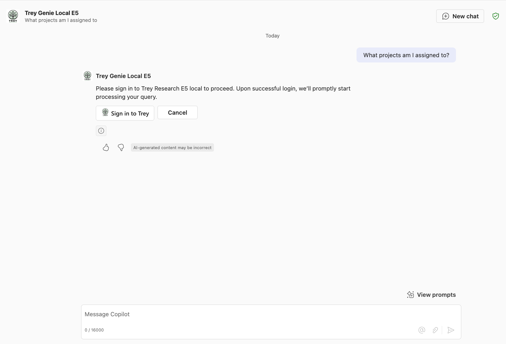

Once you select the sign in button, you need to allow the application's API to be access as the current user, so go ahead and give the permission by selecting "Accept".

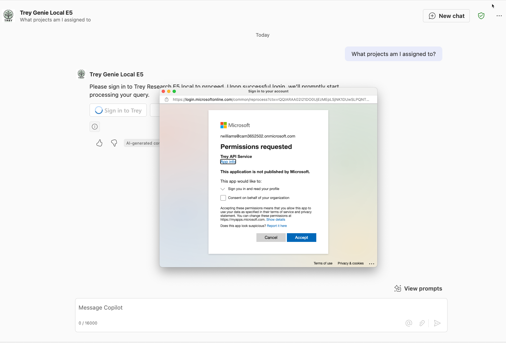

From now on, the sign in will be smooth for the user when interacting with the agent, without having to sign in each time.

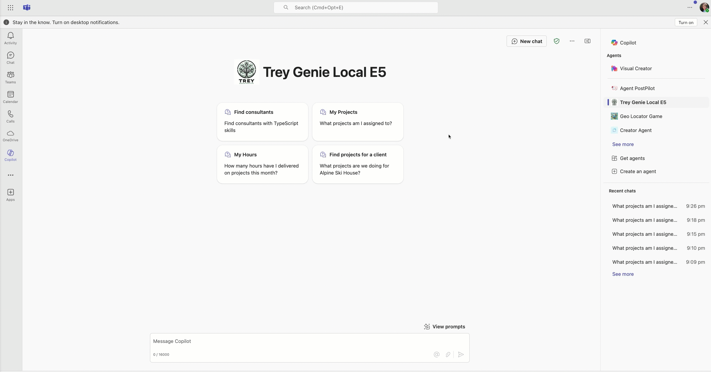


<cc-end-step lab="e6" exercise="8" step="1" />

---8<--- "e-congratulations.md"

You have completed lab E6c, Add SSO!

