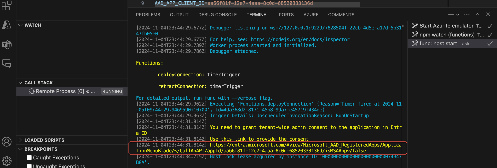
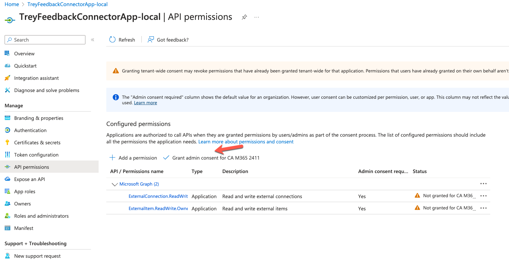
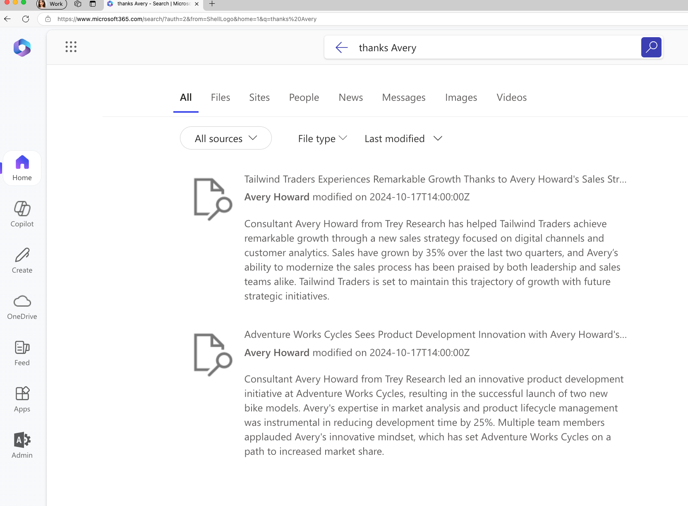
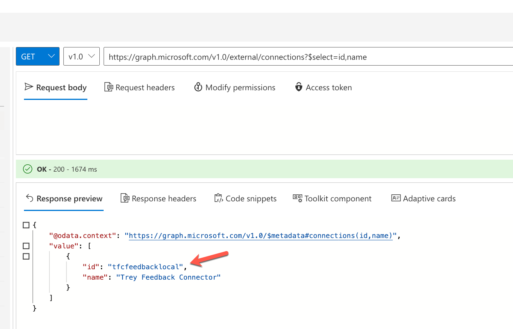

# Bonus Lab - Add Knowldege capability to Trey Genie using a Microsoft Graph connector

---8<--- "e-labs-prelude.md"

In this lab you will learn how to add your own data into the Microsoft Graph to be then organically utilised by the declarative agent as it's own knowledge.  In the process you will learn all how to deploy a Microsoft Graph connector and use the connector in Trey Genie declarative agent. 

!!! note
    This lab builds on the Lab E4. You should be able to continue working in the same folder for labs E2-E6, but solution folders have been provided for your reference.
    The finished Trey Genie declarative solution for this lab is in the [**/src/extend-m365-copilot/path-e-bonus-gc-lab/trey-research-labEB-END**](https://github.com/microsoft/copilot-camp/tree/main/src/extend-m365-copilot/path-e-bonus-gc-lab/trey-research-labEB-END){target=_blank} folder.
    The Microsoft Graph connector source code is in [**/src/extend-m365-copilot/path-e-bonus-gc-lab/trey-feedback-connector**](https://github.com/microsoft/copilot-camp/tree/main/src/extend-m365-copilot/path-e-bonus-gc-lab/trey-feedback-connector){target=_blank} folder.


In this lab you will learn to:

- deploy a Microsoft Graph connector of your own data into Microsoft Graph and have it power various Microsoft 365 experiences
- customise the trey genie declarative agent to use the Graph connector as a capability to extend its knowledge
- learn how to run and test your app 

!!! note "Prerequisites: Tenant Admin Access"
    Additonal prerequisites are needed to run this lab. You will need <mark>tenant administrator privileges</mark> as Microsoft Graph connectors use app-only authentication to access the connector APIs.

!!! note "Prerequisites: Azure Functions Visual Studio Code extension"
    - [Azure Functions Visual Studio Code extension](https://marketplace.visualstudio.com/items?itemName=ms-azuretools.vscode-azurefunctions){target=_blank}

## Exercise 1 : Deploy Graph Connector

### Step 1: Download sample project

- In your browser, go to [this link](https://download-directory.github.io?url=https://github.com/microsoft/copilot-camp/tree/main/src/extend-m365-copilot/path-e-bonus-gc-lab/trey-feedback-connector&filename=trey-feedback-connector){target=_blank}
- Extract the **trey-feedback-connector.zip** file

!!! note
    The extracted folder of the sample project is **trey-feedback-connector**. It has a folder called **content** which consist of feedback files from various clients for consultants at Trey Research. The files are all created by AI and are for demo purposes only. 
    The aim is to deploy these external files into Microsoft 365 data to be available as knowledge base for our declarative agent Trey Genie. 

<cc-end-step lab="eb" exercise="1" step="1" />

### Step 2: Create external connection

- Open the folder **trey-feedback-connector** in Visual Studio Code
- In the Activity Bar of Visual Studio Code, open the Teams Toolkit extension
- Create a file **.env.local** in the **env** folder of the root folder **trey-feedback-connector**
- Paste below contents in the newly created file

```txt
APP_NAME=TreyFeedbackConnectorApp
CONNECTOR_ID=tfcfeedback
CONNECTOR_NAME=Trey Feedback Connector
CONNECTOR_DESCRIPTION=The Trey Feedback Connector seamlessly integrate feedback data from various clients about consultants in Trey Research.
CONNECTOR_BASE_URL=https://localhost:3000/

```
- Select **F5**, which will then kick off the creation of the Entra ID app registration needed for your connector API to authenicate and load data into Microsoft Graph 
- In the `Terminal` window, for the `func:host start` Task, you will notice below link provided. Using this link you can grant the app-only permission for the Entra ID app



- Copy the link and open in a browser where you are logged in as the tenant admin for the Microsoft 365 tenant. 
- Grant the required permissions to the app using the **Grant admin consent** button.



- Once granted, the connector creates an external connection, provisions the schema and ingests the sample contents in the **content** folder to your Microsoft 365 tenant. This takes a while, so keep the project running. 
- Once all files in the **content** folder are loaded, the debugger can be stopped. 
- You can also close this connector project folder.

<cc-end-step lab="eb" exercise="1" step="2" />

### Step 3: Test the connector data in Microsoft365 app

Now that your data is loaded into Microsoft 365 tenant, let's test if a regular search is picking up the contents in Microsoft365.com.

Go to [https://www.microsoft365.com/](https://www.microsoft365.com/){target=_blank} and in the search box above, type `thanks Avery`.

You will see the results as below from the external connection which are basically the clients' feedback for consultant Avery Howard.



Now that your data is part of Microsoft 365 data or Microsoft Graph, let's go ahead and add this connector data as focused knowledge for our declarative agent for Trey Research called **Trey Genie**.

<cc-end-step lab="eb" exercise="1" step="3" />

## Exercise 2 : Add Graph Connector to Declarative Agent

In the previous exercise, we established a new external connection to load our data into the Microsoft 365 tenant. Next, we will integrate this connector into our declarative agent to provide focused knowledge on Trey Research consultants.

### Step 1: Get the connection id of the Microsoft Graph Connector

In exercise 1, we added the environment variable in the **.env.local** file which has the configuration values for the Graph connector. 
The connection id value we gave is `tfcfeedback`. When Teams Toolkit deploys this connector it will add a suffix of its environment value like `local` to the connection id. Hence we can infer the connection id is `tfcfeedbacklocal`.
But the most straightforward way to get the Graph connector id is to use Graph Explorer.

- Browse to [Microsoft Graph Explorer](https://aka.ms/ge){target=_blank} and sign in with your admin account.
- Select your user avatar in the upper right corner and select **Consent to permissions**.
- Search for `ExternalConnection.Read.All` and select Consent for that permission. Follow the prompts to grant consent.
- Enter `https://graph.microsoft.com/v1.0/external/connections?$select=id,name` in the request field and select Run query.
- Locate the connector you want and copy its id property.




<cc-end-step lab="eb" exercise="2" step="1" />

### Step 2: Update declarative agent manifest

Let's now resume with our declarative agent from Lab 4. If you have it open, then continue or go to the finished lab 4 solution in this folder [**/src/extend-m365-copilot/path-e-lab04-enhance-api-plugin/trey-research-lab04-END**](https://github.com/microsoft/copilot-camp/tree/main/src/extend-m365-copilot/path-e-lab04-enhance-api-plugin/trey-research-lab04-END){target=_blank}.

- Open the lab 4 solution for Trey Genie declarative agent.
- Go to **appPackage\trey-declarative-agent.json**
- Add a new item into the `capabilities` array as below and save

```JSON
 {
            "name": "GraphConnectors",
            "connections": [
                {
                    "connection_id": "tfcfeedbacklocal"
                }
            ]
}
```
Now the capability is added, it's time to test.

<cc-end-step lab="eb" exercise="2" step="2" />

## Exercise 3: Test the plugin in Copilot

Before you test the application, update the manifest version of your app package in the `appPackage\manifest.json` file, follow these steps:

1. Open the `manifest.json` file located in the `appPackage` folder of your project.

2. Locate the `version` field in the JSON file. It should look something like this:  
   ```json
   "version": "1.0.0"
   ```

3. Increment the version number to a small increment. For example, change it to:  
   ```json
   "version": "1.0.1"
   ```

4. Save the file after making the change.

### Step 1: Start the application

This update ensures that the platform detects the changes and properly applies the latest version of your app.

Start your project to force it to re-deploy the application package by selecting **F5**.
You will be brought into Microsoft Teams. Once you're back in Copilot, open the right flyout 1️⃣ to show your previous chats and agents and select the Trey Genie Local agent 2️⃣.


<cc-end-step lab="eb" exercise="3" step="1" />

### Step 2: Test knowledge in Copilot

In the immersive experience of Trey Genie, use below prompts and test them

- Can you check for any feedback from clients for consultants Trey Research
- How did Avery's guidance specifically streamline the product development process?


<cc-end-step lab="eb" exercise="3" step="2" />


---8<--- "e-congratulations.md"

You have completed lab Add Graph Connector, Well done!

