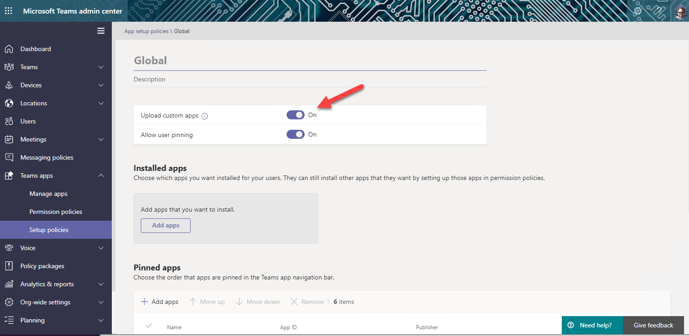
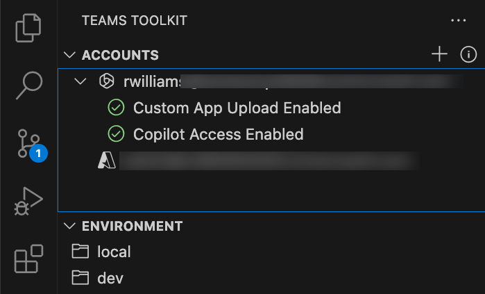
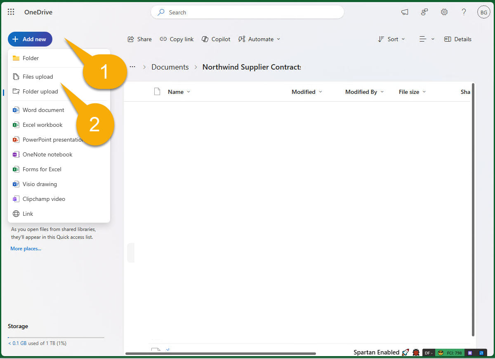

# Lab M0 - Prerequisites

In this lab, you will set up the development environment to build, test, and deploy the plugins that will extend the capabilities of Copilot for Microsoft 365.

???+ "Navigating the Extend Teams Message Extension labs (Extend Path)"
    - [Lab M0 - Prerequisites](/copilot-camp/pages/extend-message-ext/00-prerequisites) (📍You are here)
    - [Lab M1 - Get to know Northwind message extension](/copilot-camp/pages/extend-message-ext/01-nw-teams-app) 
    - [Lab M2 - Run app in Microsoft Copilot for Microsoft 365](/copilot-camp/pages/extend-message-ext/02-nw-plugin) 
    - [Lab M3 - Enhance plugin with new search command](/copilot-camp/pages/extend-message-ext/03-enhance-nw-plugin)
    - [Lab M4 - Add authentication](/copilot-camp/pages/extend-message-ext/04-add-authentication) 
    - [Lab M5 - Enhance plugin with an action command](/copilot-camp/pages/extend-message-ext/05-add-action) 

In this lab you will learn:

- How to set up your developer tenant for the entire lab exercises
- How to install and configure Teams toolkit for Visual Studio Code and other tools
- How to set up your development environment with a base project

> [!IMPORTANT]
> These samples and labs are intended for instructive and demonstration purposes and are not intended for use in production. Do not put them into production without upgrading them to production quality.

> [!IMPORTANT]  
> To extend Copilot for Microsoft 365, you must ensure that your development environment meets the [requirements](https://learn.microsoft.com/microsoft-365-copilot/extensibility/prerequisites).

## Exercise 1: Enable Teams application uploads
You will need a Microsoft work or school account with permissions to upload custom Teams applications. 

By default, end users can't upload applications directly; instead an administrator needs to upload them into the enterprise app catalog. In this step you will ensure your tenant is set up for direct uploads by Teams Toolkit.
a. Navigate to [https://admin.microsoft.com/](https://admin.microsoft.com/){target=_blank}, which is the Microsoft 365 Admin Center.
b. In the left panel of the admin center, select "Show all" to open up the entire navigation. When the panel opens, select Teams to open the Microsoft Teams admin center.
c. In the left of the Microsoft Teams admin center, open the Teams apps accordion 1️⃣ and select Setup Policies 2️⃣. You will see a list of App setup policies. Select the Global (Org-wide default) policy 3️⃣.

d. Ensure the first switch, "Upload custom apps" is turned On.

e. Be sure to scroll down and select the "Save" button to persist your change.

> The change can take up to 24 hours to take effect, but usually it's much faster.

## Exercise 2: Install Teams Toolkit and prerequisites
You can complete these labs on a Windows, Mac, or Linux machine, but you do need the ability to install the prerequisites. If you are not permitted to install applications on your computer, you'll need to find another machine (or virtual machine) to use throughout the workshop.

### Step 1: Install Visual Studio Code

It should be no surprise that [Teams Toolkit for Visual Studio Code](){target=_blank} requires Visual Studio Code! You can download it here: [Visual Studio Code](https://code.visualstudio.com/download){target=_blank}.

### Step 2: Install NodeJS

NodeJS is a program that allows you to run JavaScript on your computer; it uses the open source "V8" engine, which is used in popular web browsers such as Microsoft Edge and Google Chrome. You will need NodeJS to run the web server code used throughout this workshop.

Browse to [https://nodejs.org/en/download/](https://nodejs.org/en/download/){target=_blank} and install version 20.x, the "LTS" (Long Term Support) version for your operating system. This lab has been tested using NodeJS version LTS.

???+ tip "If you need more than one version of NodeJS"
    Browse to https://nodejs.org/en/download/ and install the "LTS" (Long Term Support) version for your operating system. This lab has been tested using NodeJS version 18.x and 20.x. If you already have another version of NodeJS installed, or want future flexibility to change Node versions, you may want to set up the [Node Version Manager](https://github.com/nvm-sh/nvm){target=_blank} (or [this variation](https://github.com/coreybutler/nvm-windows) for Microsoft Windows), which allows you to easily switch Node versions on the same computer.

### Step 3: Install Tools

These labs are based on the latest general available version of [Teams Toolkit](https://marketplace.visualstudio.com/items?itemName=TeamsDevApp.ms-teams-vscode-extension){target=_blank}.
Follow the steps as shown in the screen shot below.

1️⃣ Open Visual Studio Code and click on the Extensions toolbar button

2️⃣ Search for "Teams" and locate Teams Toolkit

3️⃣ Click "Install"

!!! note "If you have Teams Toolkit installed but hidden"
    If you previously installed Teams Toolkit, and then hid it on the Visual Studio sidebar, you might wonder why you can't see it. Right-click on the left sidebar and check off Teams Toolkit to bring it back into view.
    
Now you are all set to create your first extensibility feature for Copilot for Microsoft 365. Proceed to create a Declarative Copilot in the next lab. 

>  [Azure Storage Explorer](https://azure.microsoft.com/products/storage/storage-explorer/) (OPTIONAL) - Download this if you want to view and edit the Northwind database used in this sample

## Exercise 3 - Set up your project and developer tenant data

### Step 1 - Download the sample code

In a web browser navigate to [sample source code selecting this link](https://download-directory.github.io/?url=https://github.com/microsoft/copilot-camp/tree/main/src/extend-message-ext/Lab01-Run-NW-Teams/Northwind). You get a prompt to download a ZIP file with the sample project. 

Save the ZIP file on your computer. 

Extract the ZIP file contents. 

Open Visual Studio Code. 
In Visual Studio Code: 

From the File menu choose the Open folder... option 

Open the project root folder **Northwind** in Teams Toolkit

These labs will refer to this as your "root folder" since this is where you'll be working.

### Step 2 - Set up accounts in Teams Toolkit

Now select the Teams Toolkit icon in the left 1️⃣ . If it offers options to create a new project, you're probably in the wrong folder. In the Visual Studio Code file menu select "Open Folder" and directly open the **Northwind** folder. You should see sections for Accounts, Environment, etc. as shown below.

Under "Accounts" click "Sign in to Microsoft 365"2️⃣ and log in with your own Microsoft 365 account. You can get a free Microsoft 365 subscription for development purposes by joining the [Microsoft 365 Developer Program](https://developer.microsoft.com/microsoft-365/dev-program).

> [!NOTE]
> The Microsoft 365 Developer Program doesn't include Copilot for Microsoft 365 licenses. As such, if you decide to use a developer tenant, you will be able to test the sample only as a Message Extension.

A browser window will pop up and offer to log into Microsoft 365. When it says "You are signed in now and close this page", please do so.

Now verify that the "Custom App Upload Enabled" checker has a green checkmark. If it doesn't, that means that your user account doesn't have permission to upload Teams applications. This permission is "off" by default; here are [instructions for enabling users to upload custom apps](https://learn.microsoft.com/microsoftteams/teams-custom-app-policies-and-settings#allow-users-to-upload-custom-apps)

Now verify that the "Copilot Access Enabled" checker has a green checkmark. If it doesn't, that means that your user account license for Copilot. This is required to continue the labs.

### Step 3 - Copy sample documents to your test user's OneDrive

The sample application includes some documents for Copilot to reference during the labs. In this step you will copy these files to your user's OneDrive so Copilot can find them. Depending on how the tenant is set up, you may be asked to set up multi-factor authentication as part of this process.

Open your browser and browse to Microsoft 365 ([https://www.office.com/](https://www.office.com/)). Log in using the Microsoft 365 account you will be using throughout the lab. You may be asked to set up multi-factor authentication.

Using the "waffle" menu in the upper left corner of the page 1️⃣ , navigate to the OneDrive application within Microsoft 365 2️⃣ .

Within OneDrive, navigate to "My Files" 1️⃣ . If there's a documents folder, click into that as well. If not, you can work directly within the "My Files" location.

Now click "Add new" 1️⃣ and "Folder" 2️⃣ to create a new folder.

Name the folder "Northwind contracts" and click "Create".

Now, from within this new folder, click "Add new" 1️⃣  again but this time click "Files upload" 2️⃣ .

Now browse to the **sampleDocs** folder within your working folder. Highlight all the files 1️⃣ and click "OK" 2️⃣  to upload them all.

By doing this step early, there's a good chance that the Microsoft 365 search engine will have discovered them by the time you're ready for them.

## Congratulations

You have completed the prerequisites lab. You are now ready to proceed to run your app. Select Next.

