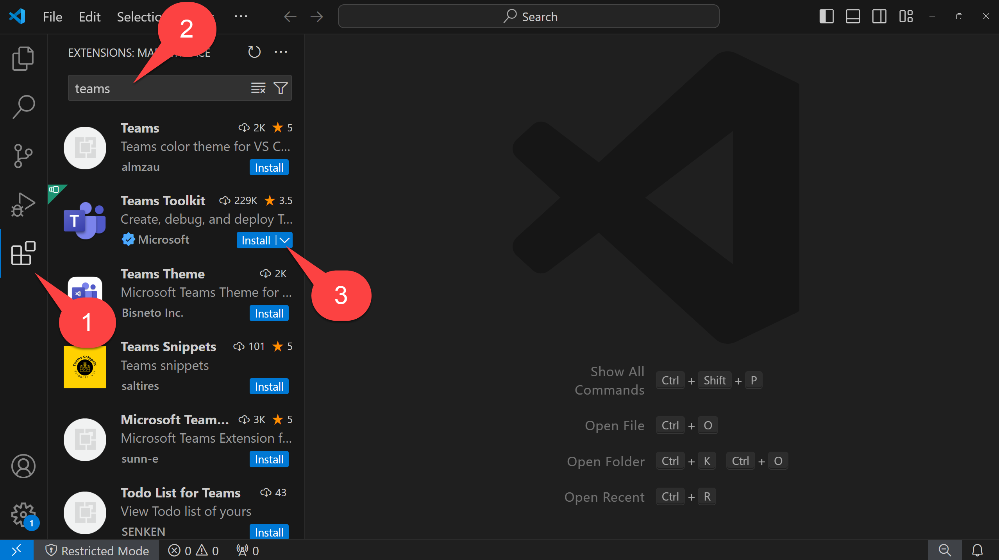
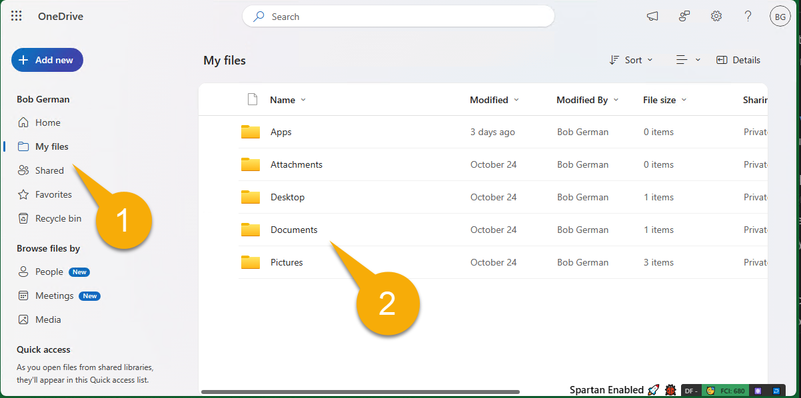

# Lab M0 - Prerequisites

In this lab, you will set up the development environment to build, test, and deploy the plugins that will extend the capabilities of Copilot for Microsoft 365.

???+ "Navigating the Extend Teams Message Extension labs (Extend Path)"
    - [Lab M0 - Prerequisites](/copilot-camp/pages/extend-message-ext/00-prerequisites) Set up your development environment (📍You are here)
    - [Lab M1 - Get to know Northwind message extension](/copilot-camp/pages/extend-message-ext/01-nw-teams-app) Get to know Northwind message extension
    - [Lab M2 - Run app in Microsoft Copilot for Microsoft 365](/copilot-camp/pages/extend-message-ext/02-nw-plugin) Run Northwind message extension as a plugin in Microsoft Copilot for Microsoft 365
    - [Lab M3 - Enhance plugin with new search command](/copilot-camp/pages/extend-message-ext/03-enhance-nw-plugin) Enhance the plugin with a new search command
    - [Lab M4 - Add authentication](/copilot-camp/pages/extend-message-ext/04-add-authentication) Secure your plugin in Authentication
    - [Lab M5 - Enhance plugin with an action command](/copilot-camp/pages/extend-message-ext/05-add-action) Enhance the plugin with a new action command

In this lab you will learn:

- How to get a developer tenant for Microsoft 365
- How to set up your developer tenant for the entire lab exercises
- How to install and configure Teams toolkit for Visual Studio Code and other tools
- How to set up your development environment with a base project

## Exercise 1: Set up your Microsoft 365 Subscription
To install and run your own declarative copilot, you'll need a Microsoft 365 tenant where you have administrator permission. Fortunately you can get one for free through the Microsoft 365 Developer Program! In the labs which follow, you'll also use this tenant to run Microsoft Teams where you can test this lab.
You will also need Copilot License to test the app.

### Step 1: Get a tenant

If you don't yet have a tenant, please join the [Microsoft 365 Developer Program](https://developer.microsoft.com/microsoft-365/dev-program?WT.mc_id=m365-58890-cxa){target=_blank} to get a free one. Your tenant includes 25 [E5 user licenses](https://www.microsoft.com/microsoft-365/enterprise/compare-office-365-plans?WT.mc_id=m365-58890-cxa){target=_blank} and can be renewed as long as you keep developing!

Select "Join now" to begin.
Log in with any Microsoft personal or work and school account, enter your information, and select "Next". You will have an opportunity to choose what kind of "sandbox" you want; the "Instant sandbox" is recommended.

Follow the wizard and select your administrator username and password, tenant domain name, etc. The domain name you choose is just the left-most portion - for example if you enter "Contoso" your domain will be "Contoso.onmicrosoft.com".

Remember this information as you'll need it throughout the labs! You will log in as &gt;username&lt;@&gt;domain&lt;.onmicrosoft.com with the password you chose. You'll be prompted for your phone number and then the system will set up your subscription.

Eventually you'll be prompted to log into your new tenant. Be sure to use the new administrator credentials you just created, not the ones you used when you signed up for the developer program.

!!! tip "Tip: Navigating many tenants"
    Consider creating a browser profile for each tenant that will have its own favorites, stored credentials, and cookies so you can easily swtch between tenants as you work.

!!! note "You may be asked to enable multi-factor authentication (MFA)"
    [This is certainly a good idea!](https://www.microsoft.com/security/blog/2019/08/20/one-simple-action-you-can-take-to-prevent-99-9-percent-of-account-attacks/){target=_blank} Just follow the instructions. If you really must turn off MFA, [here are instructions](https://docs.microsoft.com/en-us/answers/questions/101179/how-to-disable-the-two-factor-authentication-from.html){target=_blank}. 

??? info "More tips on setting up your Microsoft 365 Development Tenant!"
    

      <iframe src="//www.youtube.com/embed/DhhpJ1UjbJ0" frameborder="0" allowfullscreen></iframe>
      
Setting up your Microsoft 365 Development tenant

    

### Step 2: Enable Teams application uploads

By default, end users can't upload applications directly; instead an administrator needs to upload them into the enterprise app catalog. In this step you will ensure your tenant is set up for direct uploads by Teams Toolkit.
a. Navigate to [https://admin.microsoft.com/](https://admin.microsoft.com/){target=_blank}, which is the Microsoft 365 Admin Center.
b. In the left panel of the admin center, select "Show all" to open up the entire navigation. When the panel opens, select Teams to open the Microsoft Teams admin center.
c. In the left of the Microsoft Teams admin center, open the Teams apps accordion 1️⃣ and select Setup Policies 2️⃣. You will see a list of App setup policies. Select the Global (Org-wide default) policy 3️⃣.

d. Ensure the first switch, "Upload custom apps" is turned On.

e. Be sure to scroll down and select the "Save" button to persist your change.

> The change can take up to 24 hours to take effect, but usually it's much faster.

## Exercise 2: Install Teams Toolkit and prerequisites
You can complete these labs on a Windows, Mac, or Linux machine, but you do need the ability to install the prerequisites. If you are not permitted to install applications on your computer, you'll need to find another machine (or virtual machine) to use throughout the workshop.

### Step 1: Install Visual Studio Code

It should be no surprise that [Teams Toolkit for Visual Studio Code](){target=_blank} requires Visual Studio Code! You can download it here: [Visual Studio Code](https://code.visualstudio.com/download){target=_blank}.

### Step 2: Install NodeJS

NodeJS is a program that allows you to run JavaScript on your computer; it uses the open source "V8" engine, which is used in popular web browsers such as Microsoft Edge and Google Chrome. You will need NodeJS to run the web server code used throughout this workshop.

Browse to [https://nodejs.org/en/download/](https://nodejs.org/en/download/){target=_blank} and install version 20.x, the "LTS" (Long Term Support) version for your operating system. This lab has been tested using NodeJS version LTS.

???+ tip "If you need more than one version of NodeJS"
    Browse to https://nodejs.org/en/download/ and install the "LTS" (Long Term Support) version for your operating system. This lab has been tested using NodeJS version 18.x and 20.x. If you already have another version of NodeJS installed, or want future flexibility to change Node versions, you may want to set up the [Node Version Manager](https://github.com/nvm-sh/nvm){target=_blank} (or [this variation](https://github.com/coreybutler/nvm-windows) for Microsoft Windows), which allows you to easily switch Node versions on the same computer.

### Step 3: Install Tools

These labs are based on the latest general available version of [Teams Toolkit](https://marketplace.visualstudio.com/items?itemName=TeamsDevApp.ms-teams-vscode-extension){target=_blank}.
Follow the steps as shown in the screen shot below.

1️⃣ Open Visual Studio Code and click on the Extensions toolbar button

2️⃣ Search for "Teams" and locate Teams Toolkit

3️⃣ Click "Install"

!!! note "If you have Teams Toolkit installed but hidden"
    If you previously installed Teams Toolkit, and then hid it on the Visual Studio sidebar, you might wonder why you can't see it. Right-click on the left sidebar and check off Teams Toolkit to bring it back into view.
    
Now you are all set to create your first extensibility feature for Copilot for Microsoft 365. Proceed to create a Declarative Copilot in the next lab. 

>  [Azure Storage Explorer](https://azure.microsoft.com/products/storage/storage-explorer/) (OPTIONAL) - Download this if you want to view and edit the Northwind database used in this sample

## Exercise 3 - Set up your project and developer tenant data

## Step 1 - Download the sample code

Please download [sample source code here](https://github.com/microsoft/copilot-camp/tree/main/src/extend-message-ext/Lab01-Run-NW-Teams/Northwind) and open the project root folder **Northwind** in Teams Toolkit
These labs will refer to this as your "root folder" since this is where you'll be working.

## Step 2 - Copy sample documents to your test user's OneDrive

The sample application includes some documents for Copilot to reference during the labs. In this step you will copy these files to your user's OneDrive so Copilot can find them. Depending on how the tenant is set up, you may be asked to set up multi-factor authentication as part of this process.

Open your browser and browse to Microsoft 365 ([https://www.office.com/](https://www.office.com/)). Log in using the Microsoft 365 account you will be using throughout the lab. You may be asked to set up multi-factor authentication.

Using the "waffle" menu in the upper left corner of the page 1️⃣ , navigate to the OneDrive application within Microsoft 365 2️⃣ .

Within OneDrive, navigate to "My Files" 1️⃣ . If there's a documents folder, click into that as well. If not, you can work directly within the "My Files" location.

Now click "Add new" 1️⃣ and "Folder" 2️⃣ to create a new folder.

Name the folder "Northwind contracts" and click "Create".

Now, from within this new folder, click "Add new" 1️⃣  again but this time click "Files upload" 2️⃣ .

Now browse to the **sampleDocs** folder within your working folder. Highlight all the files 1️⃣ and click "OK" 2️⃣  to upload them all.

By doing this step early, there's a good chance that the Microsoft 365 search engine will have discovered them by the time you're ready for them.

## Congratulations

You have completed the prerequisites lab. You are now ready to proceed to run your app. Select Next.

