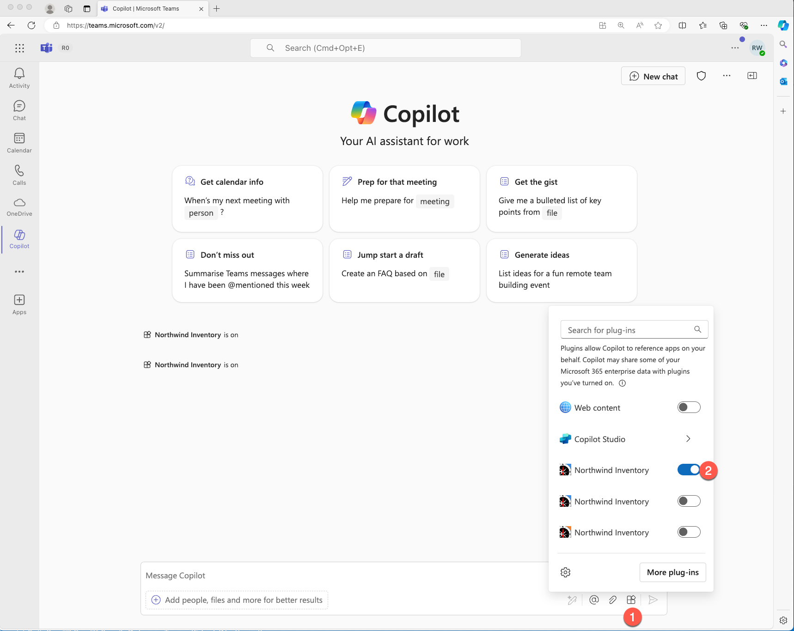
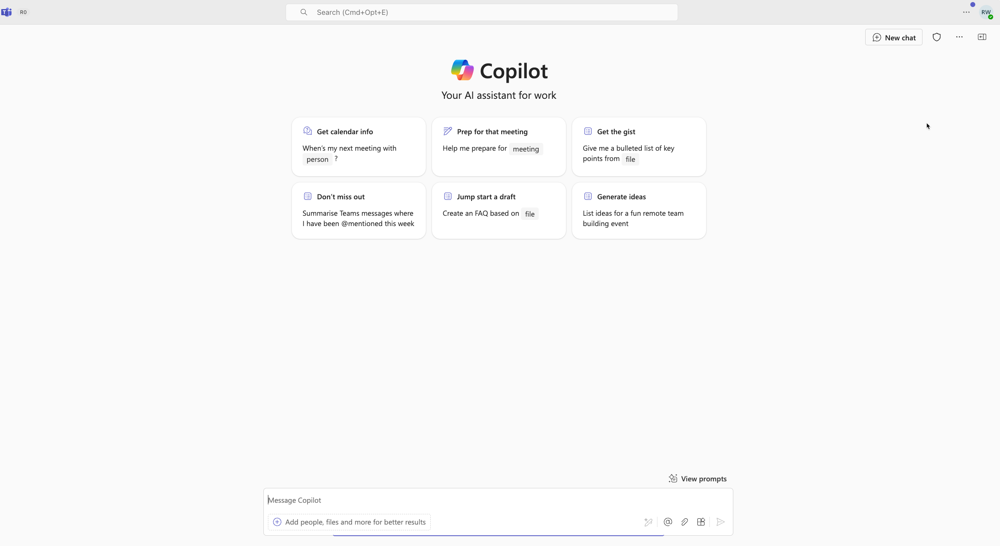
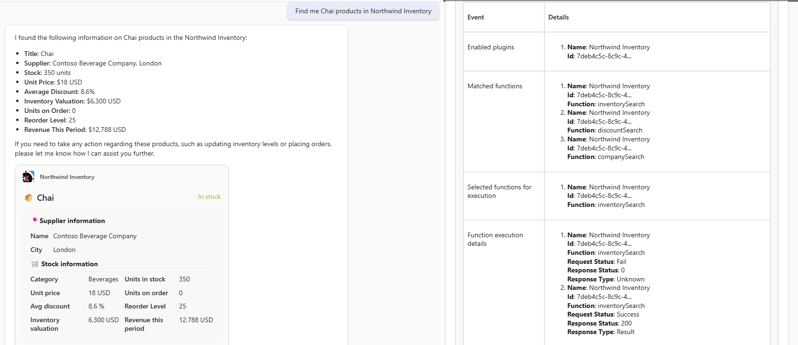

# Lab M2 - Run app in Microsoft Copilot for Microsoft 365
In this lab, you’ll run the Northwind app as a plugin in Microsoft Copilot for Microsoft 365. 

???+ "Navigating the Extend Teams Message Extension labs (Extend Path)"
    - [Lab M0 - Prerequisites](/copilot-camp/pages/extend-message-ext/00-prerequisites) 
    - [Lab M1 - Get to know Northwind message extension](/copilot-camp/pages/extend-message-ext/01-nw-teams-app) 
    - [Lab M2 - Run app in Microsoft Copilot for Microsoft 365](/copilot-camp/pages/extend-message-ext/02-nw-plugin) (📍You are here)
    - [Lab M3 - Enhance plugin with new search command](/copilot-camp/pages/extend-message-ext/03-enhance-nw-plugin)
    - [Lab M4 - Add authentication](/copilot-camp/pages/extend-message-ext/04-add-authentication) 
    - [Lab M5 - Enhance plugin with an action command](/copilot-camp/pages/extend-message-ext/05-add-action) 

    !!! tip "NOTE"
    The completed exercise with all of the code changes can be downloaded [from here](https://github.com/microsoft/copilot-camp/tree/main/src/extend-message-ext/Lab01-Run-NW-Teams/Northwind/). This can be useful for troubleshooting purposes.
    If you ever need to reset your edits, you can clone again the repository and start over.

In this lab you will:

- Run the plugin on Microsoft Copilot for Microsoft 365 using prompts for both single and multiparameter search


## Exercise 1 - Run the sample as a Copilot plugin

!!! tip "Reminder"
    To perform the following exercise, your account must have a valid license for Copilot for Microsoft 365.

## Step 1 - Test in Microsoft Copilot for Microsoft 365 (single parameter)

In the left navigation, click on "Copilot" to open Copilot.

Check the lower left of the chat user interface, below the compose box. You should see a plugin icon 1️⃣ . Click this and enable the Northwind Inventory plugin 2️⃣ .



For best results, start a new chat by typing "New chat" or by clicking on the **New chat** icon at the top right before each prompt or set of related prompts.



Here are some prompts to try that use only a single parameter of the message extension:

* **Find information about Chai in Northwind Inventory**

* **Find discounted seafood in Northwind. Show a table with the products, supplier names, average discount rate, and revenue per period.**

See if this last one also locates any of the documents you uploaded to your OneDrive.

As you're testing, watch the log messages within your application. You should be able to see when Copilot calls your plugin. For example, after requesting "discounted seafood items", Copilot issued this query using the `discountSearch` command.


You may see citations of the Northwind data in 3 forms. If there's a single reference, Copilot may show the whole card.


If there are multiple references, Copilot may show a small number next to each. You can hover over these numbers to display the adaptive card. References will also be listed below the response.


Try using these adaptive cards to take action on the products. Notice that this doesn't affect earlier responses from Copilot.

Feel free to try making up your own prompts. You'll find that they only work if Copilot is able to query the plugin for the required information. This underscores the need to anticipate the kinds of prompts users will issue, and providing corresponding types of queries for each one. Having multiple parameters will make this more powerful!

## Step 2 - Test in Microsoft Copilot for Microsoft 365 (multiple parameters)

In this exercise, you'll try some prompts that exercise the multi-parameter feature in the sample plugin. These prompts will request data that can be retrieved by name, category, inventory status, supplier city, and stock level, as defined in [the manifest](https://github.com/microsoft/copilot-camp/tree/main/src/extend-message-ext/Lab01-Run-NW-Teams/Northwind/appPackage/manifest.json).

For example, try prompting **Find Northwind beverages with more than 100 items in stock**. To respond, Copilot must identify products:

* where the category is **beverages**
* where inventory status is **in stock**
* where the stock level is **more than 100**

If you look at the log messages in your terminal in VS Code, you can see that Copilot was able to understand this requirement and fill in 3 of the parameters in the first message extension command.


The plugin code applies all three filters, providing a result set of just 4 products. Using the information on the 4 resulting adaptive cards, Copilot renders a result similar to this:


By using this prompt, Copilot might look also in your OneDrive files to find the payment terms with each supplier's contract. In this case, you will notice that some of the references won't have the Northwind Inventory icon, but the Word one.


Here are some more prompts to try:

- *Find Northwind dairy products that are low on stock. Show me a table with the product, supplier, units in stock and on order.*

- *We’ve been receiving partial orders for Tofu. Find the supplier in Northwind and draft an email summarizing our inventory and reminding them they should stop sending partial orders per our MOQ policy.*

- *Northwind will have a booth at Microsoft Community Days  in London. Find products with local suppliers and write a LinkedIn post to promote the booth and products.*

    !!! tip "Request an enhancement by prompting"
        *Emphasize how delicious the products are and encourage people to attend our booth*


- *What beverage is high in demand due to social media that is low stock in Northwind in London. Reference the product details to update stock.*

Which prompts work best for you? Try making up your own prompts and observe your log messages to see how Copilot accesses your plugin.

### Troubleshooting tip
If you're facing challenges while testing your plugin, you can enable 'developer mode'. Developer mode provides information on the plugin selected by the Copilot orchestrator to respond to the prompt. It also shows the available functions in the plugin and the API call's status code.

To enable developer mode, type the following into Copilot:
```
-developer on
```

Now just execute your prompt. This time, the output will look like this: 



As you can notice, below the response generated by Copilot, we have a table that provides us insightful information about what happened behind the scenes:

- Under **Enabled plugins**, we can see that Copilot has identified that the Northwind Inventory plugin is enabled.
- Under **Matched functions**, we can see that Copilot has determined that the Northwind inventory plugin offers three functions: `inventorySearch`, `discountSearch`, and `companySearch`.
- Under **Selected functions for execution**, we can see that Copilot has selected the `inventorySearch` function to respond to the prompt.
- Under **Function execution details**, we can see some detailed information about the execution, like the HTTP response returned by the plugin to the Copilot engine.

## Congratulations

You’ve done an excellent job testing the plugin in Microsoft Copilot for Microsoft 365. Now, proceed to the next lab to add code for another search criterion. Select **Next**.