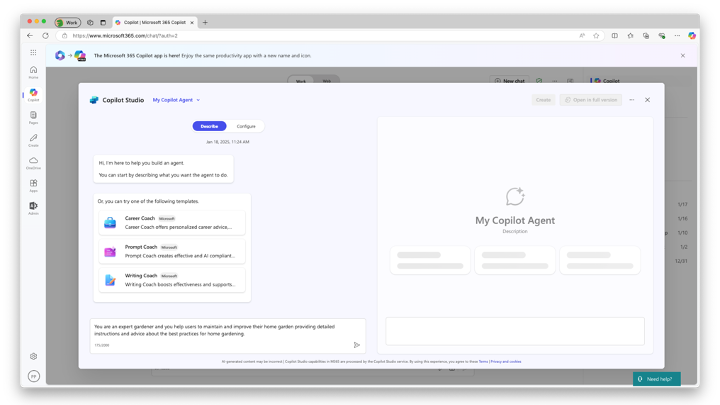
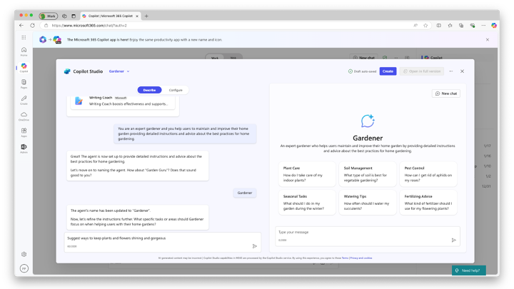
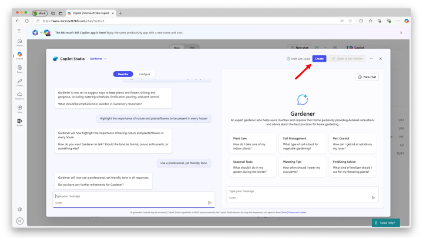
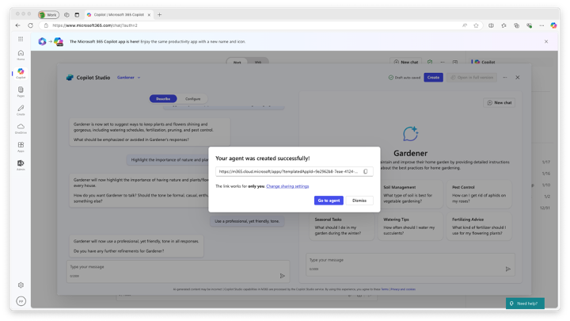
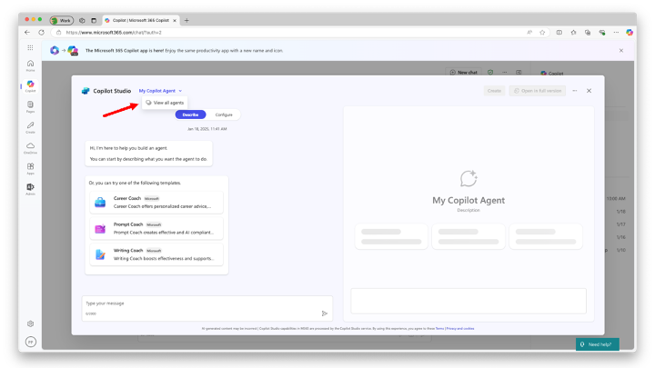
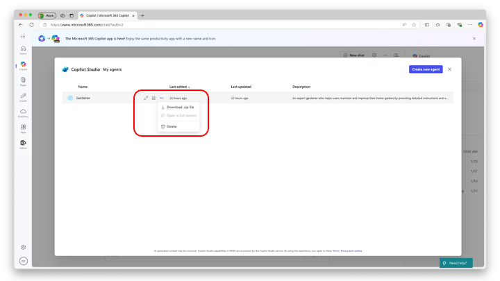

# Lab MAB1 - Build your first agent

---8<--- "mab-labs-prelude.md"

In this lab, you'll create a simple declarative agent using Copilot Studio agent builder. Your agent is designed to help users to maintain and improve a home garden. The knowledge base of the agent are a set of documents stored in SharePoint Online and the public web content. The agent can also engage the user in a nice game to guess the name of plants and flowers based on a set of clues.

In this lab you will learn:

- What is a declarative agent for Microsoft 365 Copilot
- Make a declarative agent using Copilot Studio agent builder
- Customise the agent to create a game using specific instructions 
- Configure the agent to rely on a set of documents stored in SharePoint Online
- Learn how to share the agent with other people 

## Introduction

Declarative agents leverage the same scalable infrastructure and platform of Microsoft 365 Copilot, tailored specifically to meet focus on a special area of your needs.
They function as subject matter experts in a specific area or business need, allowing you to use the same interface as a standard Microsoft 365 Copilot chat while ensuring they focus exclusively on the specific task at hand. 

Welcome on board to making your own declarative agent ☺️! Let's dive in and make your Copilot work magic!

In this lab you will start out building a declarative agent using Copilot Studio agent builder and providing a sample set of instructions. This is to help you get started with something. 

Next, you will modify your agent to be focused on a guess the plant/flower name game. 

You will also give your agent some files, stored in SharePoint Online, to refer to an hypothetical knowledge base. 

Lastly you will share the agent with other people in your organization.


Let's get started! 💪🏼

## Exercise 1: Creating the Declarative agent 

### Step 1: Describe your agent

To create a declarative agent with Copilot Studio agent builder, open the [Microsoft 365 Copilot chat home page](https://www.microsoft365.com/copilot){target=_blank} and select **Create an agent** in the right side panel, where there is the list of available agents, like illustrated in the following picture.


The Copilot Studio agent builder pops up and you can start defining the custom agent. You can choose a template to start from, or you can simply *describe* the agent by providing a description in natural language. You can also choose to manually configure the agent, selecting the **Configure** option, but you will get there later. Let's provide the following initial description:

```txt
You are an expert gardener and you help users to maintain and improve their home garden
providing detailed instructions and advice about the best practices for home gardening.
```



Once you provided the istructions, the agent builder will ask you about the name for the new agent. Provide the name: *Gardener*. While you interact with the agent builder, on the right side of the dialog you can see there is a preview of the agent itself, including some suggested conversation starters. If the agent builder asks you about refining instructions further, provide the following sentence.

```txt
Suggest ways to keep plants and flowers shining and gorgeous
```



Keep on interacting with the agent builder until it does have all the information needed to create the agent. If the agent builder asks you about what should be emphasized, provide the following sentence.

```txt
Highlight the importance of nature and plants/flowers to be present in every house!
```

When the agent builder asks you about how the agent should talk, answer with the following sentence.

```txt
Use a professional, yet friendly, tone.
```

Lastly, say that you don't have any further refinements and select the **Create** button in the upper right corner of the screen. 



The Copilot Studio agent builder will create a new agent for you, based on the provided instructions. 

<cc-end-step lab="mab1" exercise="1" step="1" />

### Step 2: Test the agent

Once the agent is ready, you will see a popup dialog with a link to the agent and a link to share it with other people in your organization.



By selecting the **Go to agent** button, you will be brought to the actual user experience of the new agent that you've just made. Congrats!


To start interacting with the agent, click on the first suggested prompt and observe the response from the agent. Your agent is now ready, congrats!


<cc-end-step lab="mab1" exercise="1" step="2" />

## Exercise 2: Customizing the agent 

It is now time to slightly customize the agent. You are going to add a custom icon, a data source based on SharePoint Online document library, and the image generation capability.

Start over with a **New chat** selecting the corresponding button in the upper right corner of the Microsoft 365 Copilot Chat user interface. Select the **Create an agent** command in the right side of the screen, like you did before while making your first agent.
The same dialog you used before to make your first agent will show up. This time, select the name of the agent **My Copilot Agent** dropdown just beside the **Copilot Studio** logo in the upper left side of the dialog. From there, select **View all agents** to see the whole list of agents that you created with Copilot Studio agent builder.



A new dialog with the whole list of agents that you designed will show up.



For each agent, you have command to edit, share, download, and delete it.

### Step 1: Provide a custom icon

Let's edit the **Gardener** agent that you just created. The dialog starts with the **Configure** panel active. You can go through the configuration settings and notice that all the descriptions that you provided in Exercise 1 are now specific settings for the agent.
There are configuration settings to define:

- Icon: to customize the icon of the agent
- Name: to provide a name for the agent
- Description: to define the description of the agent
- Instructions: it is the system prompt for the agent, where you define the system role and behavioral rules
- Knowledge: to configure the various knowledge bases for the agent
- Actions: this section is still under development, at the time of this writing
- Capabilities: to enable capabilites like code interpreting and image generation
- Starter prompts: to configure up to 6 starter prompts for the agent 

### Step 2: Define the guess plant/flower game rules

### Step 3: Add SharePoint Online knowledge base

### Step 4: Add support for image generation

### Step 5: Test the agent
