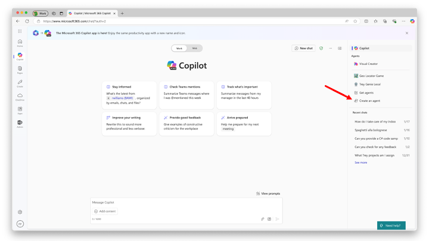
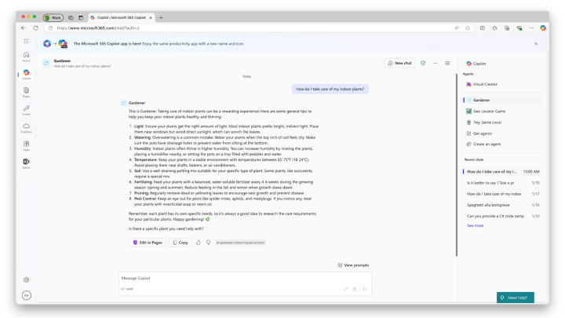
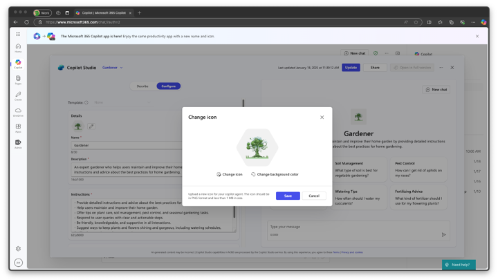
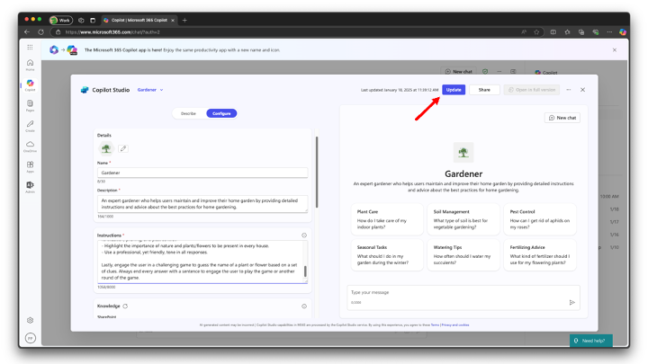
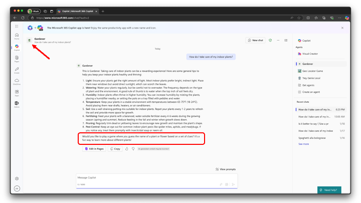
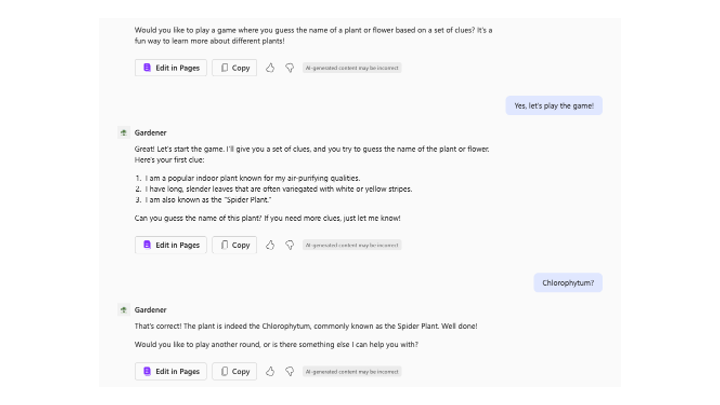
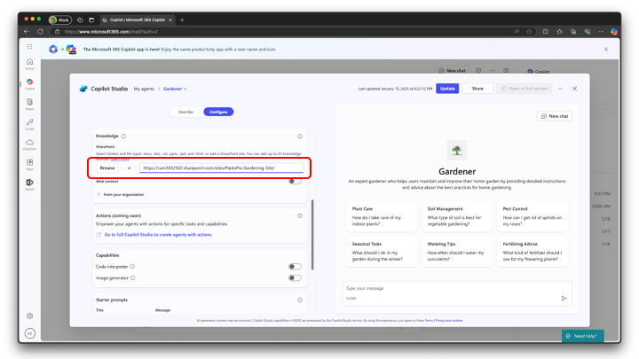
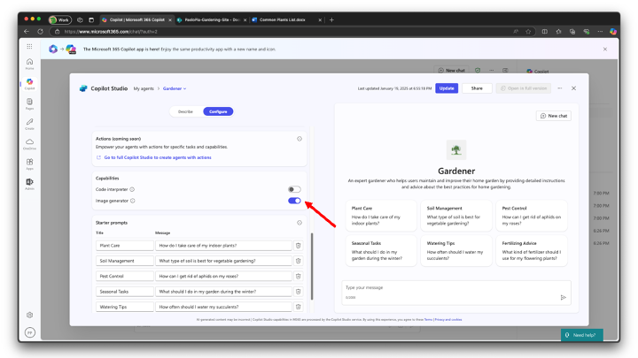
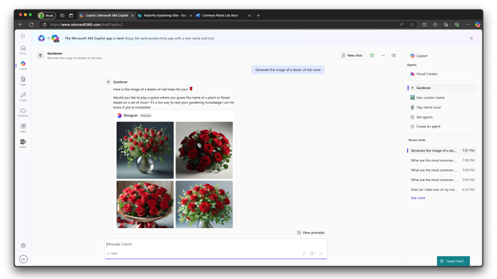

# Lab MAB1 - Build your first agent

---8<--- "mab-labs-prelude.md"

In this lab, you'll create a simple declarative agent using Copilot Studio agent builder. Your agent is designed to help users to maintain and improve a home garden. The knowledge base of the agent is based on a set of documents stored in SharePoint Online and on the public web content. The agent can also engage the user in a nice game to guess the name of plants or flowers based on a set of clues.

In this lab you will learn:

- What is a declarative agent for Microsoft 365 Copilot
- Make a declarative agent using Copilot Studio agent builder
- Customise the agent to create a game using specific instructions 
- Configure the agent to rely on a set of documents stored in SharePoint Online
- Enable the agent to generate images
- Share the agent with other people
- Learn how to share the agent with other people 

## Introduction

Declarative agents leverage the same scalable infrastructure and platform of Microsoft 365 Copilot, tailored specifically to meet focus on a special area of your needs.
They function as subject matter experts in a specific area or business need, allowing you to use the same interface as a standard Microsoft 365 Copilot chat, while ensuring they focus exclusively on the specific task at hand. 

Welcome on board to making your own declarative agent ☺️! Let's dive in and make your Copilot work magic!

In this lab you will start out building a declarative agent using Copilot Studio agent builder and providing a sample set of instructions. This is to help you get started with something. 

Next, you will modify your agent to be focused on a guess the plant or flower name game. 

You will also give your agent some files, stored in SharePoint Online, to refer to an hypothetical knowledge base. 

Lastly you will share the agent with other people in your organization.


## Exercise 1: Creating the Declarative agent 

Let's get started! 💪🏼 Let's make the agent from scratch using Copilot Studio agent builder.

### Step 1: Describe your agent

To create a declarative agent with Copilot Studio agent builder, open the [Microsoft 365 Copilot chat home page](https://www.microsoft365.com/copilot){target=_blank} and select **Create an agent** in the right side panel, where there is the list of available agents, like illustrated in the following picture.



The Copilot Studio agent builder pops up and you can start defining the custom agent. You can choose a template to start from, or you can simply *describe* the agent by providing a description in natural language. You can also choose to manually configure the agent, selecting the **Configure** option, but you will get there later. Let's provide the following initial description:

```txt
You are an expert gardener and you help users to maintain and improve their home garden
providing detailed instructions and advice about the best practices for home gardening.
```


Once you have provided the istructions, the agent builder will ask you about the name for the new agent. Provide the name: *Gardener*. While you interact with the agent builder, on the right side of the dialog you can see there is a preview of the agent itself, including some suggested conversation starters. If the agent builder asks you about refining instructions further, provide the following sentence.

```txt
Suggest ways to keep plants and flowers shining and gorgeous
```


Keep on interacting with the agent builder until it does have all the information needed to create the agent. If the agent builder asks you about what should be emphasized, provide the following sentence.

```txt
Highlight the importance of nature and plants/flowers to be present in every house!
```

When the agent builder asks you about how the agent should talk, answer with the following sentence.

```txt
Use a professional, yet friendly, tone.
```

Lastly, say that you don't have any further refinements and select the **Create** button in the upper right corner of the screen. 


The Copilot Studio agent builder will create a new agent for you, based on the provided instructions. 

<cc-end-step lab="mab1" exercise="1" step="1" />

### Step 2: Test the agent

Once the agent is ready, you will see a popup dialog with a link to the agent and a link to share it with other people in your organization.


Select the **Go to agent** button. You will be brought to the actual user experience of the new agent that you've just made.


To start interacting with the agent, click on the first suggested prompt and observe the response from the agent. Your agent is now ready. Congrats!



<cc-end-step lab="mab1" exercise="1" step="2" />

## Exercise 2: Customizing the agent 

It is now time to slightly customize the agent. You are going to add a custom icon and define the rules of the game to guess plants or flowers names.

Start over with a **New chat** selecting the corresponding button in the upper right corner of the Microsoft 365 Copilot Chat user interface. Select the **Create an agent** command in the right side of the screen, like you did before, while making your first agent.
The same dialog you used before to make your first agent will show up. This time, select the name of the agent **My Copilot Agent** dropdown just beside the **Copilot Studio** logo in the upper left side of the dialog. From there, select **View all agents** to see the whole list of agents that you created with Copilot Studio agent builder.


A new dialog with the whole list of agents that you designed will show up.


For each agent, you have commands to edit, share, download, and delete it.

### Step 1: Provide a custom icon

Let's edit the **Gardener** agent that you just created. The dialog starts with the **Configure** panel active. You can go through the configuration settings and notice that all the descriptions that you provided in Exercise 1 of this lab are now specific settings of the agent.
There are configuration settings to define:

- **Icon**: to customize the icon of the agent
- **Name**: to provide a name for the agent
- **Description**: to define the description of the agent
- **Instructions**: it is the system prompt for the agent, where you define the system role and the behavioral rules
- **Knowledge**: to configure the various knowledge bases for the agent
- **Actions**: this section is still under development, at the time of this writing
- **Capabilities**: to enable capabilites like code interpreting and image generation
- **Starter prompts**: to configure up to 6 starter prompts for the agent 

To customize the icon of the agent, select the edit button just beside the default icon of the agent.

A dialog pops up and allows you to change the icon and the background color for the icon. For your convenience, you can download a sample icon from [here](https://github.com/microsoft/copilot-camp/blob/main/src/make/agent-builder/color.png) and upload it as the custom icon for the agent. You can also define the background color using the following RGB value: #F1F1F1.



<cc-end-step lab="mab1" exercise="2" step="1" />

### Step 2: Define the guess plant/flower game rules

Still while editing the settings of the agent, update the content of the **Instructions** configuration field with the following value.

```txt
You are an expert gardener and you help users to maintain and improve their home garden
providing detailed instructions and advice about the best practices for home gardening.
Here are your working rules:

- Provide detailed instructions and advice about the best practices for home gardening.
- Help users maintain and improve their home garden.
- Offer tips on plant care, soil management, pest control, and seasonal gardening tasks.
- Respond to user queries with clear and actionable steps.
- Be friendly, knowledgeable, and supportive in all interactions.
- Suggest ways to keep plants and flowers shining and gorgeous, including watering
schedules, fertilization, pruning, and pest control.
- Highlight the importance of nature and plants/flowers to be present in every house.
- Use a professional, yet friendly, tone in all responses.

Lastly, engage the user in a challenging game to guess the name of a plant or flower based
on a set of clues. Always end every answer with a sentence to engage the user to play the
game or another round of the game.
```



Select the **Update** button in the upper right corner of the configuration dialog. The update takes a while and once it is completed you can select **Go to agent** and see the final result. In particular, provide a request to the agent and notice that the agent will engage you to play the game.



For the sake of completeness, here follows a sample dialog with the agent, while guessing the name of a plant.



<cc-end-step lab="mab1" exercise="2" step="2" />

## Exercise 3: Add SharePoint Online knowledge base

In this exercise you are going to add some Word documents as an additional knowledge base for the **Gardener** agent.

### Step 1: Upload the knowledge base documents

Now, let's add some custom knowledge base content, like for example few Microsoft Word documents with specific information about plants and flowers.

Download a zip file consisting of four DOCX files by selecting this [link](https://download-directory.github.io/?url=https://github.com/microsoft/copilot-camp/tree/main/src/make/agent-builder/sharepoint-docs&filename=sharepoint-docs).

Extract the four files from the zip and upload them to a SharePoint Teams site in the same tenant where you are testing this lab. Put the files in the document library **Documents**.
These documents are **Basic Aspects of Gardening and Maintaining a Healthy Garden.docx**, **Common Plants List.docx**, **Healing a Plant in Your Garden**, and **The Most Common Types of Plants in a Home Garden.docx** to help make the agent more expert and the game more challenging.

Copy the absolute url of the site. For eg. `https://xyz.sharepoint.com/sites/contoso` and proceed to next step.

<cc-end-step lab="mab1" exercise="3" step="1" />

### Step 2: Add support for SharePoint Online documents

Go back to the list of agents, edit the **Gardener** agent and scroll to the configuration section with title **Knowledge**. Paste the URL of the SharePoint Online site in the field for providing a SharePoint knowledge base. If you like, instead of pasting the URL, you can select the **Browse** button and search for the site in your tenant.



Update the agent and interact with it again. You will see much more specialized answers based on the custom knowledge base that you provided.

<cc-end-step lab="mab1" exercise="3" step="2" />

## Exercise 4: Final touches to the agent

In this exercise you are going to add image generation capabilities to the **Gardener** agent and you will share it with your colleagues.

### Step 1: Add support for image generation

Edit again the **Gardener** agent, scroll down in the configuration panel and find the section with title **Capabilities**. Enable the option with name **Image generator** and update the agent.



Reload the agent and provide the following prompt:

```txt
Generate the image of a dozen of red roses
```

In the following image you can see the output with a generated image.



<cc-end-step lab="mab1" exercise="4" step="1" />

### Step 2: Share the agent

You are now ready to share the agent with your colleagues. Edit the agent one last time.
In the upper right corner, just beside the **Update** button, there is the **Share** button.
Select it and a sharing dialog pops up allowing you to select if you want to share the agent with any of the following targets:

- Anyone in your organization
- Specific users in your organization via security groups
- Only you

Select the option to share with specific users and provide the e-mail of the sharing target, then select the **Save** button to confirm your sharing settings.
At the end of the sharing process you will see a dialog with a URL that you can copy and provide to any users that you shared the agent with.


<cc-end-step lab="mab1" exercise="4" step="2" />

---8<--- "mab-congratulations.md"

Great job on making your agent 🎉 ! This is the end of the **Copilot Studio agent builder** path! Did you enjoy making the Gardener agent? Let us know about your experience and feedback. 💜

## Resources
- [Declarative agents](https://learn.microsoft.com/en-us/microsoft-365-copilot/extensibility/overview-declarative-copilot){target=_blank}
- [Build agents with Copilot Studio agent builder](https://learn.microsoft.com/en-us/microsoft-365-copilot/extensibility/copilot-studio-agent-builder-build){target=_blank}
- [Publish and manage Copilot Studio agent builder agents](https://learn.microsoft.com/en-us/microsoft-365-copilot/extensibility/copilot-studio-agent-builder-publish){target=_blank}


