# Lab MCS1 - First agent

---8<--- "mcs-labs-prelude.md"

In this lab, you'll create your first agent with Microsoft Copilot Studio. The agent that you are going to create helps users to find information about HR policies and processes to hire or layoff employees, to improve your career, and to define learning pathways.
The knowledge base of the agent will be a set of documents stored in SharePoint Online and some public web content.

In this lab you will learn:

- How to create an agent with Copilot Studio
- How to configure a custom icon for your agent
- How to configure knowledge sources for your agent
- How to publish your agent in Microsoft Teams

!!! pied-piper "Disclaimer"
    These samples and labs are intended for instructive and demonstration purposes and are not intended for use in production. Do not put them into production without upgrading them to production quality.

## Exercise 1 : Creating an agent with Copilot Studio

In this first exercise you are going to create a new agent using Generative AI and describing what you are looking for. You are also going to configure a custom icon for the agent and to test the agent.

### Step 1: Creating a new agent

To create a new agent, open a browser and, using the work account of your target Microsoft 365 tenant, go to [https://copilotstudio.microsoft.com](https://copilotstudio.microsoft.com){target=_blank} to start using Microsoft Copilot Studio.

Select **Create** button on the left side of the screen, like illustrated in the following screenshot.

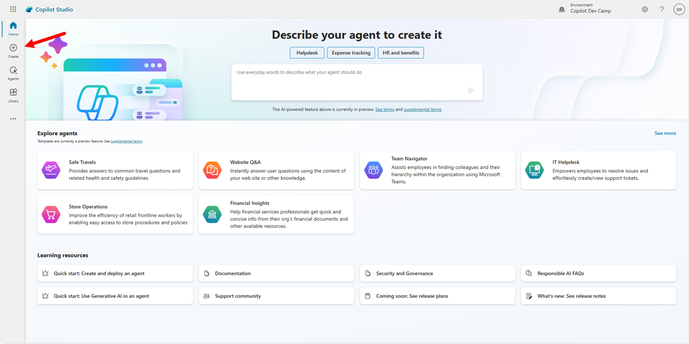

You will be redirected to the page from which you can create a new agent. Copilot Studio allows you to create a new agent from scratch, selecting the option **New agent**, or to start from a template available in a set of pre-defined and useful agent templates. For the sake of simplicity, in this lab you are going to start from scratch, selecting **New agent**.

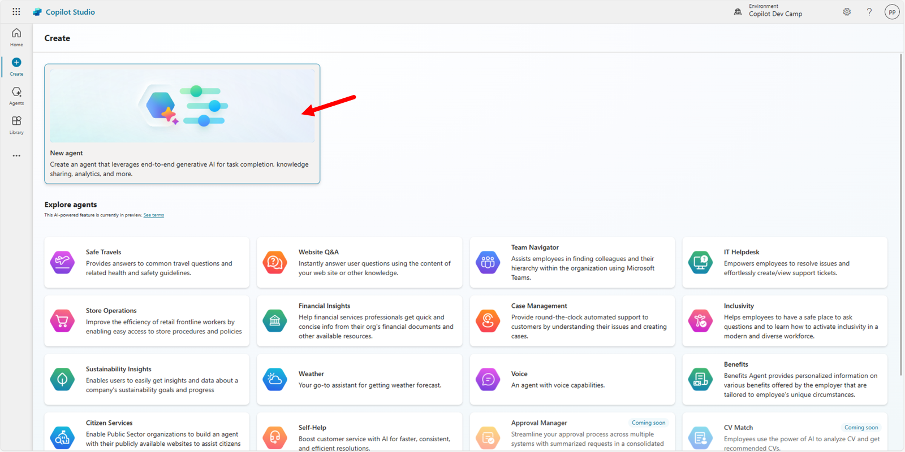

By default, Copilot Studio allows you to describe using natural language what the agent will be. This is a really convenient way of creating a new agent, because you can simply describe what you are looking for and Copilot Studio will process your input and create the agent accordingly to your needs. If you don't like to describe your agent in natural language, you can always select **Skip to configure** and manually configure the agent.

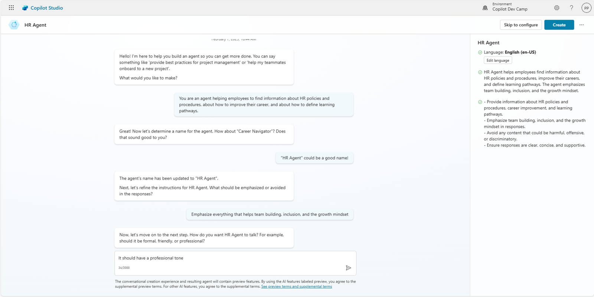

In this lab you can provide the following initial description:

```txt
You are an agent helping employees to find information about HR policies and procedures,
about how to improve their career, and about how to define learning pathways.
```

When requested by Copilot Studio, give the name "HR Agent" to your custom agent. Then, instruct Copilot Studio to emphasize
or avoid specific information providing the following instruction:

```txt
Emphasize everything that helps team building, inclusion, and the growth mindset
```

Then, define a professional tone for your agent, providing the following input:

```txt
It should have a professional tone
```

When asked by Copilot Studio, configure an initial data source for your agent providing the following instruction:

```txt
Let's use this website: https://www.microsoft.com/en-us/human-resources
```

You will need to confirm that your organization owns the site that you provided.


!!! pied-piper "Important"
    In this sample agent, we are going to use some of the public content available on the HR website of Microsoft as the data source. You will also need to confirm that your organization owns the provided data source, to enable Microsoft Bing search results on that site. While creating your own agent, you should provide the URL of a HR site that your company actually owns.


You are now ready with the creation of your agent. On the right side of the screen, you always see a recap of the features and capabilities that you configured for your agent, based on the instructions that you provided to Copilot Studio.
Select the **Create** button in the upper right corner and wait for Copilot Studio to create the agent for you.

Once the agent will be ready, you will see a new screen like the following one.

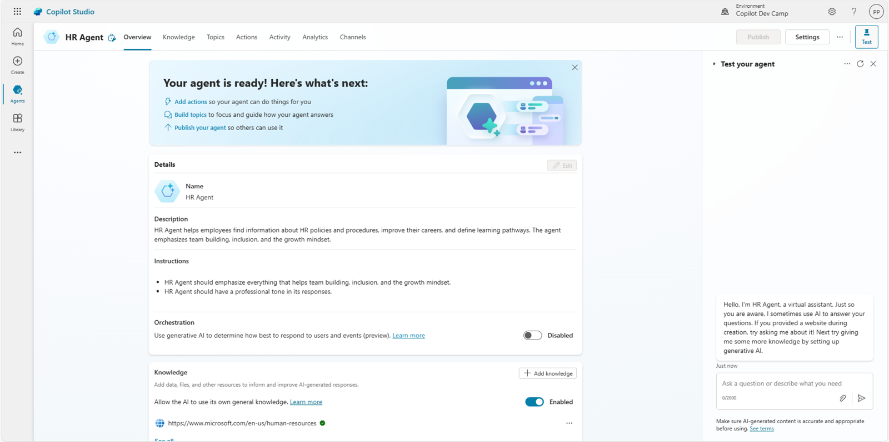

You can now start testing your agent using the testing panel on the right side, or you can fine tune the agent settings using the configuration options in the **Overview** tab.

<cc-end-step lab="mcs1" exercise="1" step="1" />

### Step 2: Changing the agent's icon

Let's start changing the icon of the agent by selecting the **Edit** button in the upper right corner of the **Overview** tab.
The **Details** section will switch to edit mode, like in the following screen.

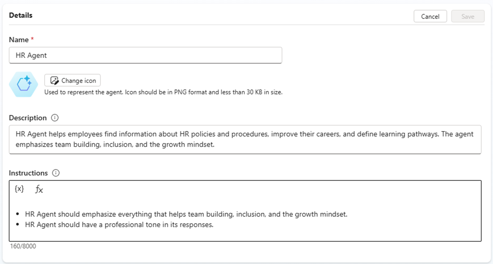

You can notice that the input statements provided in step 1 of this exercise are now part of the **Description** and **Instructions** fields of the agent.

Select the **Change icon** button to show a dialog from where you can upload a custom icon. If you like, you can use the [following icon](https://raw.githubusercontent.com/microsoft/copilot-camp/refs/heads/main/src/make/copilot-studio/HR-agent-color.png){target=_blank}.

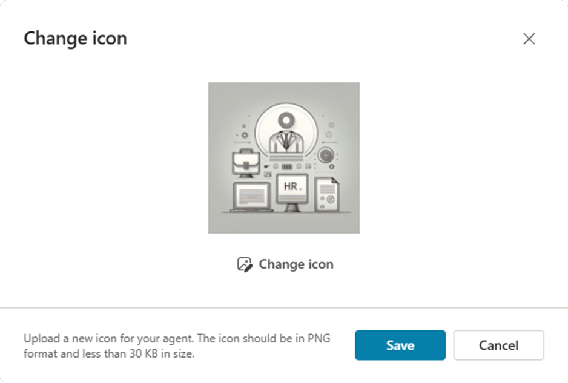

Once you are done with the upload of the new icon, select the **Save** button.

<cc-end-step lab="mcs1" exercise="1" step="2" />

### Step 3: Testing the agent

To test the agent you simply rely on the right panel and start writing prompts. For example, let's provide the following prompt:

```txt
What is our mission?
```

In the following screenshot you can see the answer provided by the agent and based on the content of the website that we provided as the data source.


Notice also that the agent provides references to pages from the websites provided as the data source and highlights that the answer comes from Azure OpenAI.

<cc-end-step lab="mcs1" exercise="1" step="3" />

## Exercise 2 : Extending the knowledge base

In this exercise you are going to add some documents (Word and PDF) stored in Microsoft SharePoint Online as additional knowledge base to your agent. 

### Step 1: Adding SharePoint Online knowledge base documents

Download this zip file consisting of few files (Word, PowerPoint, PDF) by selecting this [link](https://download-directory.github.io/?url=https://github.com/microsoft/copilot-camp/tree/main/src/make/copilot-studio/HR-documents&filename=hr-documents).

Extract the files from the zip and upload them to the **Documents** library of a SharePoint Teams site in the same tenant where you are making your agent with Copilot Studio. These documents were generated by Microsoft 365 Copilot for the sake of having some additional knowledge base to feed the agent.

Copy the absolute url of the site. For example: https://xyz.sharepoint.com/sites/contoso


From the **Overview** tab of the agent that you made before, scroll to the **Knowledge** section. You will find the website that you configured in Step 1 of Exercise 1. Select **+ Add knowledge** to add the SharePoint site and its documents as an additional knowledge source.

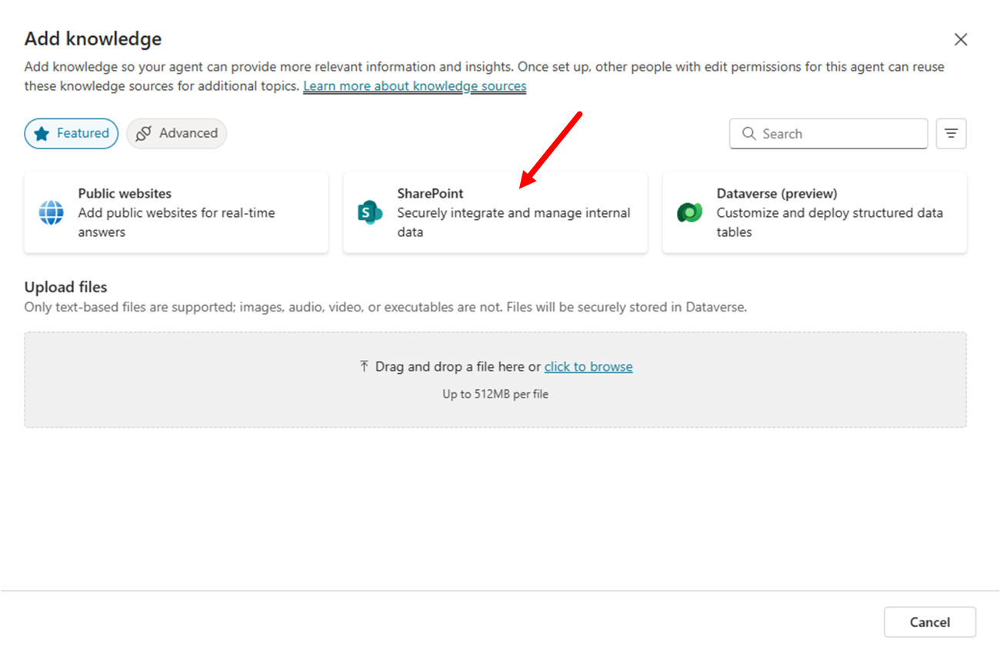

From the dialog window that pops up you can add additional knowledge sources like:

- Files: to manually upload files that will become part of the knowledge base
- Public websites: to add additional websites
- SharePoint: to configure sites or libraries in SharePoint Online
- Dataverse: to add tables in Dataverse
- Advanced: to consume enterprise data connections like Azure AI Search, Azure SQL, Microsoft Graph connectors, or third party data connections

Select **SharePoint** and, in the dialog popping up, provide the URL of the site where you uploaded the files and select **Add**.


When you configure a SharePoint data source, you also need to specify a **Name** and a **Description**. It is fundamental to provide a meaningful name and description. In fact, Copilot Studio will be able to better understand what's inside the data source and, when in the upcoming labs you will enable generative orchestration, it will be possible to identify the right data source to use when answering to users' prompts via generative AI.


Select the **Add** button in the lower part of the screen and wait for Copilot Studio to process the new knowledge base that you just added.

When the knowledge base will be updated, in the **Overview** tab you will see both the public website and the SharePoint Online site.


!!! warning "Important"
    When configuring SharePoint Online sites as the knowledge base for an agent in Copilot Studio, users will only be able to get answers and content from documents that they have access to. The security and the access control are guaranteed by the Microsoft 365 security infrastructure and Copilot Studio agents access documents on behalf of the current user.

<cc-end-step lab="mcs1" exercise="2" step="1" />

### Step 2: Testing the updated agent

Now you can test again the agent, using the right side panel. For example, let's provide the following prompt:

```txt
How can we hire new people in our company?
```

The agent will reply back to you with information about the hiring procedurs and providing references to the documents stored in the SharePoint Online knowledge base that you provided.

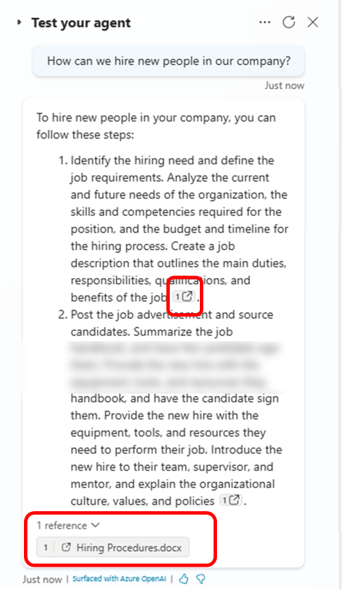

Now, for the sake of completeness, try to provide the following prompt to the agent:

```txt
How can I cook spaghetti alla carbonara?
```

You will notice that you still get back an answer from the agent, even if the request does not pertain to HR related topics. Of course, you can try to cook spaghetti alla carbonara, if you like pasta 🍝! However, what you see is not necessarily the intended behavior for your agent. In fact, an agent should be a specialized assistant focused on a specific topic or area.

<cc-end-step lab="mcs1" exercise="2" step="2" />

### Step 3: Disabling general knowledge

If you want to have your agent fully focused on your custom knowledge base only, you need to disable the **General knowledge**.
Go back to the **Overview** tab, scroll to the **Knowledge** section and disable the option "Allow the AI to use its own general knowledge.", like illustrated in the following screenshot.


When you disable that option, a confirmation dialog will pop up to let you know about what is going to happen. In fact, the agent will stop using any external data or knowledge, except what you configured explicitly.


Once you select the **Confirm** button, you will see another dialog showing the process is in progess.


When the general knowledge will be disabled, try again asking to the agent something completely out of context. 

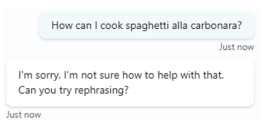

Now, you will get a proper answer, informing you that the agent cannot help you with what you are looking for.

!!! note "Additional information about general knowledge"
    You can find additional information about knowledge sources in agents made with Microsoft Copilot Studio reading the [following article](https://learn.microsoft.com/en-us/microsoft-copilot-studio/knowledge-copilot-studio){target=_blank}.

<cc-end-step lab="mcs1" exercise="2" step="3" />

## Exercise 3 : Publishing the agent

In this final exercise of this lab you are going to publish your custom agent in Microsoft Teams.

### Step 1: Publishing the agent in Microsoft Teams

To publish an agent made with Copilot Studio you need to select the **Publish** button in the upper right corner of the agent editor.


Selecting the command will prompt you for confirmation. Once confirmed, the publishing process takes a while and in the meantime you see a "Publishing ..." message. Publishing an agent registers it in the target Power Platform environment, but does not make it available in any target platform.

In order to make the agent actually available in a specific target platform (channel), you need to 1️⃣ select the **Channels** tab in the agent editor and then you can choose one or more target channels to make the agent available for. For example, to publish the agent in Microsoft Teams, as a bot, you need to 2️⃣ select **Microsoft Teams** as the target channel.

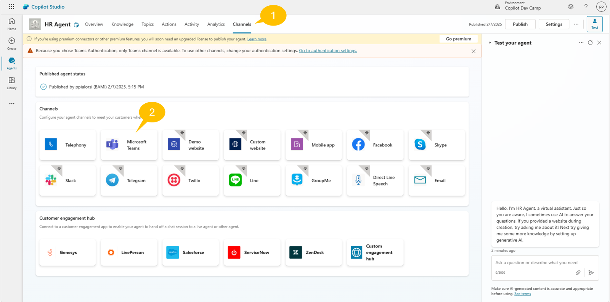

By default, when you make and agent and publish it with default settings, the agent will be configured for Microsoft authentication, which means that the agent will rely on Microsoft Entra ID authentication in Teams, Power Apps, or Microsoft 365 Copilot.
With the default authentication settings, the agent can only be published in Microsoft Teams, as you can notice from the warning message displayed at the top of the **Channels** tab in the previous screenshot. 

!!! note "Copilot Studio Authentication model"
    You can learn more about authentication of agents in Copilot Studio reading the document [Configure user authentication in Copilot Studio](https://learn.microsoft.com/en-us/microsoft-copilot-studio/configuration-end-user-authentication){target=_blank}.

!!! note "Premium license for Microsoft Copilot Studio"
    In the screenshot above, there is also an information bar about the licensing model and the potential requirement of a Premium license. In fact, when you use Copilot Studio with a trial license and you rely on premium features like premium connectors, you need to upgrade your license accordingly. Luckily, if you are just learning and testing with Microsoft Copilot Studio, you can activate a 60-days free trial period with the Premium license.

When you select the **Microsoft Teams** channel a side panel shows up and allows you to **Turn on Teams" by selecting the corresponding button.

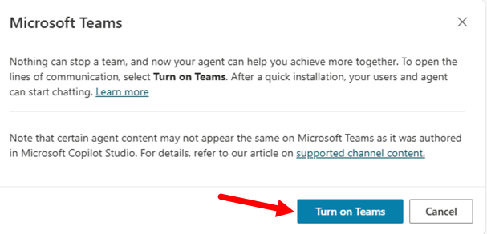

Once the agent is enabled on the Microsoft Teams channel, the side panel updates and shows a confirmation message, as well as few command to edit the agent details and to open the agent in Microsoft Teams client. There will also be a button **Availability options** that you can select to see the various options you have to access the agent in Microsoft Teams.

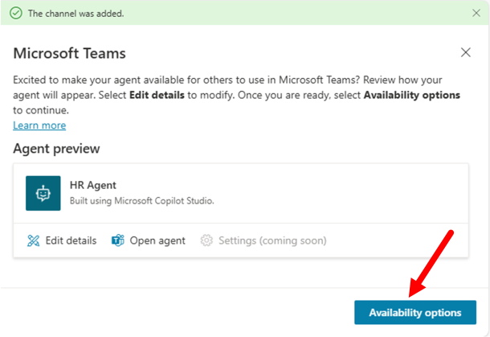

Selecting the **Availability options** button you can:

- Copy a link to use the agent in Microsoft Teams
- Make the agent available in the Teams app store, choosing if it will be available to the whole organization or just to a selected group of users
- Download a ZIP file with a package that can be used to import the agent on other tenants


Publishing of the agent in Microsoft Temas is now completed.

<cc-end-step lab="mcs1" exercise="3" step="1" />

### Step 2: Testing the agent in Microsoft Teams

You are now ready to test the agent in Microsoft Teams. In the **Availability options** panel select the **Copy link** button to copy a link to the agent. Then open a new browser tab and paste the just copied link, then press ENTER to browse to that URL.

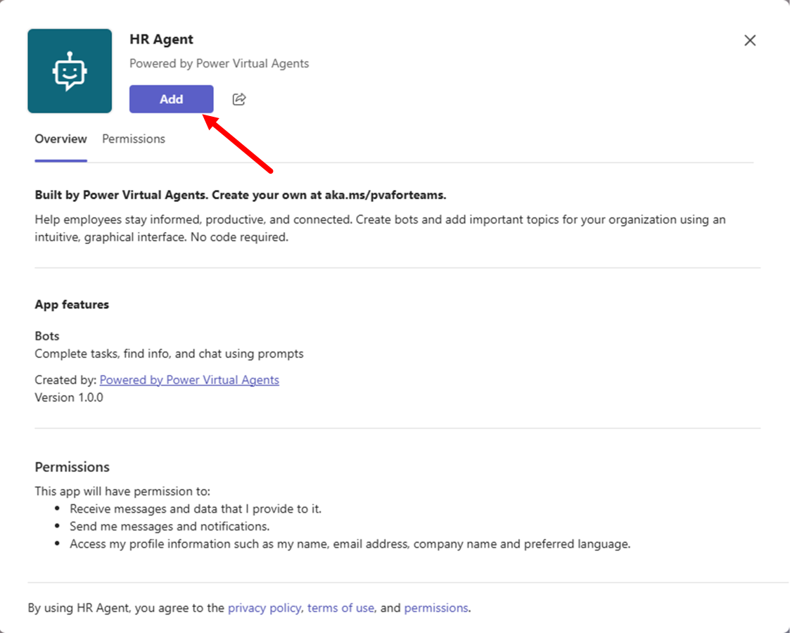

Initially you will see the Microsoft Teams client showing a new app that represents your agent. Select the **Add** button to add the app to your client and the select **Open** in the following dialog.


After a while, the Microsoft Teams client will show a chat with a bot, which is actually your agent. Provide a prompt, for example the one you already used before:

```txt
How can we hire new people in our company?
```

Wait for the answer and you will see that the agent will reply back to you with content in the context of HR and with references to the documents, which are part of its knowledge base.

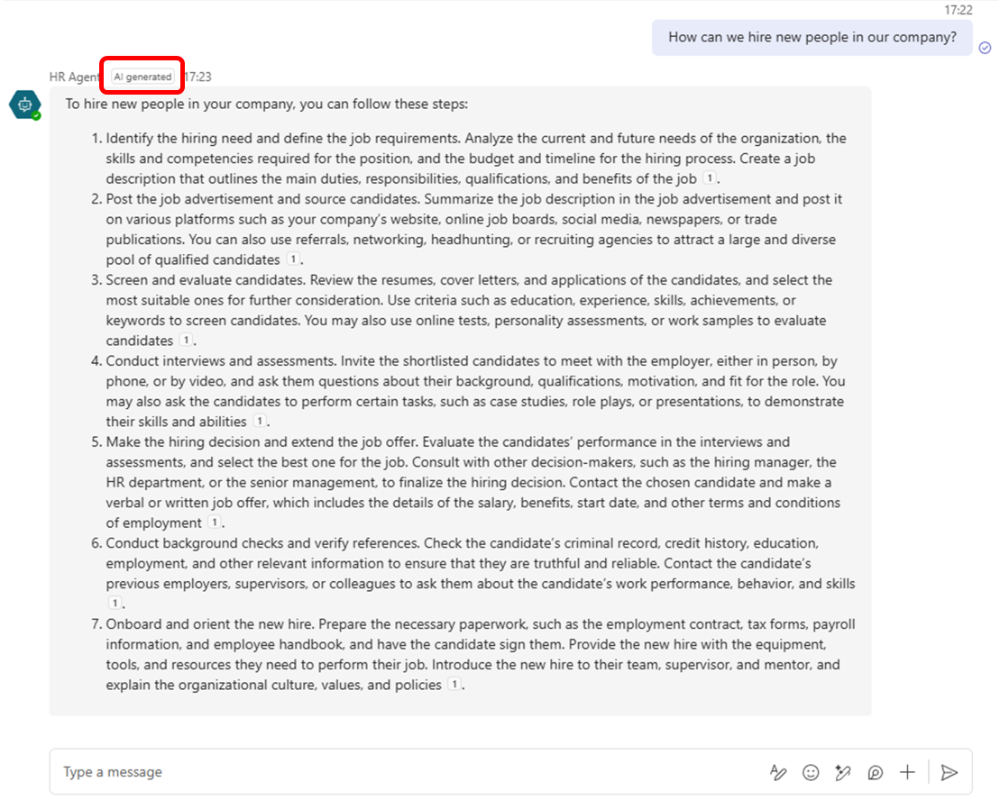

Notice also the disclaimer, at the top of the answer, about the fact that the provided content is "AI generated" to make the user aware that she/he is consuming an AI platform.

<cc-end-step lab="mcs1" exercise="3" step="2" />

---8<--- "m-congratulations.md"

Now your agent is fully functional and ready to be used in Microsoft Teams. In the next labs you will be able to customize and fine tune the behavior of the agent.

<a href="#"><button class="github-button">Coming soon ...</button></a>

