# Lab MCS2 - Defining Topics

---8<--- "mcs-labs-prelude.md"

In this lab, you'll learn how to create custom Topics in Microsoft Copilot Studio. Topics are core building blocks of an agent. With topics you can provide a conversational experience to your end users, where the conversation can be single-turn or multi-turn. Topics define how the conversation between the user and the agent can evolve, through discrete interaction paths.

!!! note
    This lab builds on the previous one, [Lab MCS1](./01-first-agent.md){target=_blank}. You should be able to continue working on the same agent, improving its functionalities with new capabilities.

Topics can be created with a graphical designer or describing the intent with natural language. Once you have create a new Topic, you can also edit its definition with a low level code editor, in case you need to apply detailed fine tuning.

There are two different flavors of Topics:

- System Topics: automatically defined by Microsoft Copilot Studio. Can be disabled, but cannot be deleted.
- Custom Topics: created by agent authors to provide custom interaction paths.

!!! note "Additional information about topics"
    You can find additional information about Topics in agents made with Microsoft Copilot Studio reading the [following article](https://learn.microsoft.com/en-us/microsoft-copilot-studio/guidance/topics-overview){target=_blank}. You can also dig into the System Topics reading the article [Use system topics](https://learn.microsoft.com/en-us/microsoft-copilot-studio/authoring-system-topics){target=_blank}.

In this lab you will learn:

- How to rely on Orchestration based on generative AI
- How to create a single-turn topic
- How to create a multi-turn topic
- How to use adaptive cards to interact with users

## Exercise 1 : Orchestration based on Generative AI

In this first exercise you are going to enable the agent that you created in [Lab MCS1](./01-first-agent.md){target=_blank} to use Orchestration based on Generative AI, which is a new feature under preview at the time of this writing.

### Step 1: Enabling Orchestration based on generative AI

One important feature of an agent made with Copilot Studio, is generative orchestration. With generative orchestration, your agent can choose the best knowledge, topics, and actions to use to interact with the user and answer to the user's queries, or to respond to event triggers. 

By default agents use classic orchestration, which means that an agent responds to users by triggering a topic whose trigger phrases match most closely the user's query. With generative orchestration, Copilot Studio understands the intent of the user processing the prompt provided by the user in natural language and determines the best process to trigger. 

!!! pied-piper "Disclaimer"
    Enabling generative orchestration can impact how billing is calculated. Learn more about [billing for generative mode](https://learn.microsoft.com/en-us/microsoft-copilot-studio/analytics-billed-sessions){target=_blank}. There are key differences between classic and generative orchestration, such as how knowledge is searched, and the supported data sources. Before turning on generative mode for an existing agent, read about the [known limitations](https://learn.microsoft.com/en-us/microsoft-copilot-studio/advanced-generative-actions#known-limitations-for-generative-orchestration){target=_blank}.

To enable generative orchestration, open a browser and, using the work account of your target Microsoft 365 tenant, go to [https://copilotstudio.microsoft.com](https://copilotstudio.microsoft.com){target=_blank} to start using Microsoft Copilot Studio.

Select to view the list of 1️⃣ **Agents** and then 2️⃣ edit the agent that you created in the previous Lab MCS1.


In the **Overview** tab enable the toggle with name **Orchestration** like illustrated in the following screenshot.

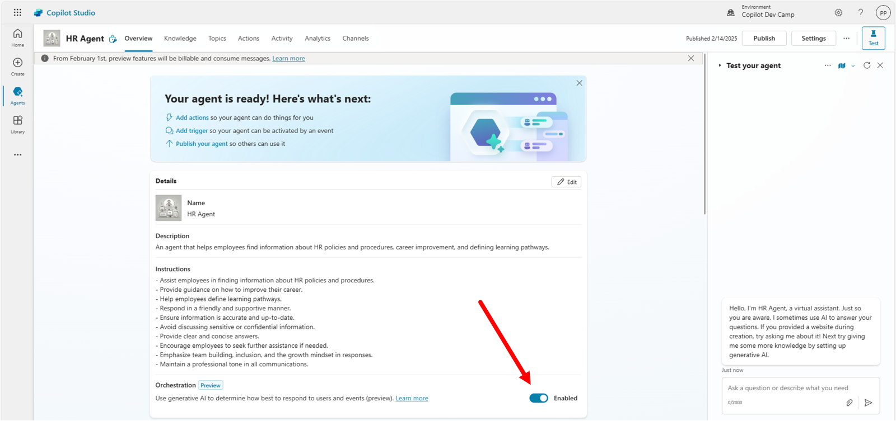

It usually takes a while to enable the generative orchestration. Once the setting is applied, publish the agent to confirm the changes.

<cc-end-step lab="mcs2" exercise="1" step="1" />

## Exercise 2 : Creating a single-turn topic

In this exercise you are going to create a new topic to collect an input from the user and to provide a feedback based on the collected input. Specifically, the topic collects information about the current user's role and gives back guidance about what to do with the agent based on the provided role.

### Step 1: Creating a new single-turn topic

To create a new topic, in the upper side of the screen select the 1️⃣ **Topics** tab, then select 2️⃣ **+ Add a topic**, and then 3️⃣ **From blank** to start creating a new custom topic.

!!! info "Creating topics with Copilot"
    Notice that you can also create a new topic simply providing a description with natural language, allowing Copilot to draft the topic for you. You will learn more about this option in the upcoming exercises.

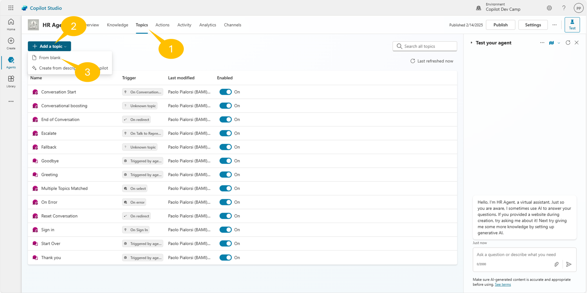

Copilot Studio will provide you the graphical designer to define the new topic. The very first building block of the topic is the **Trigger** action, which is used to describe what the topic does. When generative orchestration is enabled, in the action you can find a text area where you can define with natural language what the purpose of the topic is. You can provide the following content:

```txt
This topic can handle queries like these: collect user's role and provide feedback, 
give me a feedback based on my role, what's your feedback for my role?
```

If you use classic orchestration, you can specify between 5 and 10 triggering phrases or sentences, instead of a single text.

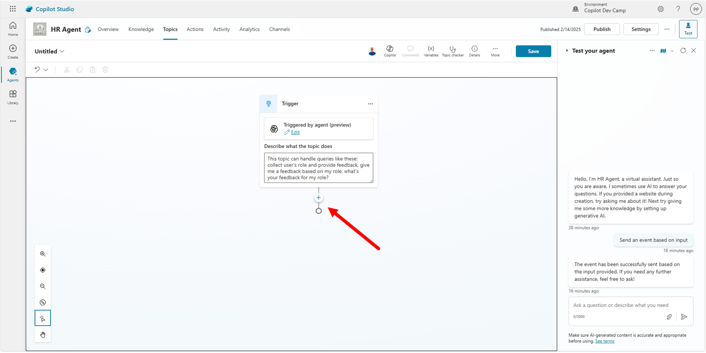

<cc-end-step lab="mcs2" exercise="2" step="1" />

### Step 2: Collecting user's input

Select the **+** button in the middle of the screen to add new actions or steps to the current topic. By selecting the **+** button, a list of all the available actions appears. The main options are:

- Send a message: to send a message to the user. The message can be text, an image, a video, an adaptive card, etc.
- Ask a question: to ask an input to the user. The input can be text, an image, a video, an attachment, an adaptive card, etc.
- Ask with adaptive card: to collect content from the user utilizing an Adaptive Card.
- Add a condition: to add branches to the topic based on comparison between variables and/or constant values.
- Variable management: to manage variables, which can be scoped at topic level, global, system, or environment.
- Topic management: to manage the lifecycle of the current topic
- Add an action: to consume external actions like Power Automate flows, custom connectors, or other agents in a multi-agent scenario.
- Advanced: to provide advanced capabilities like consuming an external HTTP REST API, using generative answers, sending events or activities, etc.

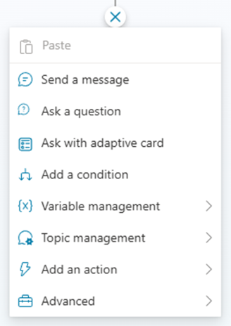

In order to collect user's input, add an **Ask a question** action. Since we want to ask the user what her/his role is, let's provide the following value for the question text.

```txt
What is your role?
```

Notice that by default Copilot Studio assigns a multiple choice options value to the collected input, as highlighted in the **Identify** configuration field.
Select the **+ New option** command just below the **Identify** configuration field and add one by one the following three values:

- Candidate
- Employee
- HR staff member

The action automatically stores the value selected by the user into a variable stored at topic scope. You can select the three dots in the upper right corner of the action and select the **Properties** command to customize the name of the variable and other settings.

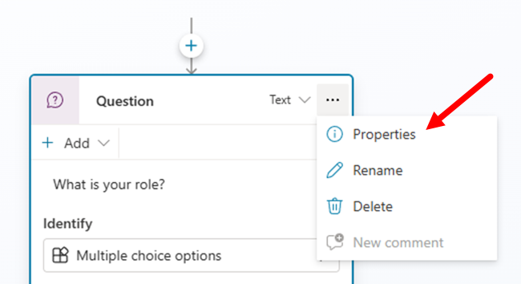

For example, you can rename the variable as `UserRole`. You can see how the action looks like once it is fully configured.

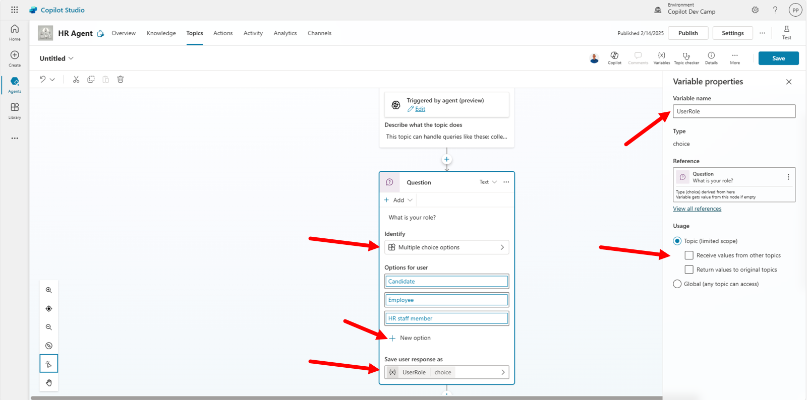

<cc-end-step lab="mcs2" exercise="2" step="2" />

### Step 3: Providing feedback to the user

You will notice that, while adding new options to the **Ask a question** action, Copilot Studio automatically creates a set of conditions for all the branches matching each of the provided options, plus one last condition for `All other conditions`.
Inside each branch, you can specify some custom logic to provide a specialized feedback to the user. To do so, select the **+** command below each of the **Condition** branches and add one action of type **Send a message**. You can eventually add more than one action to each brunch.

For the three branches, you could for example provide the following feedback messages:

- Candidate

```txt
You are a new candidate, as such you can submit your resume for evaluation.
```


- Employee

```txt
As an employee, you can ask me about how to improve your career or about 
how to learn more about your growth mindset.
```

- HR staff member

```txt
As an HR staff member, you can manage the list of candidates and all the hiring procedures
```

For the `All other conditions` branch, you can configure a **Redirect** action, available under the **Topic management** group, to fallback to the System Topic with name **Fallback**.

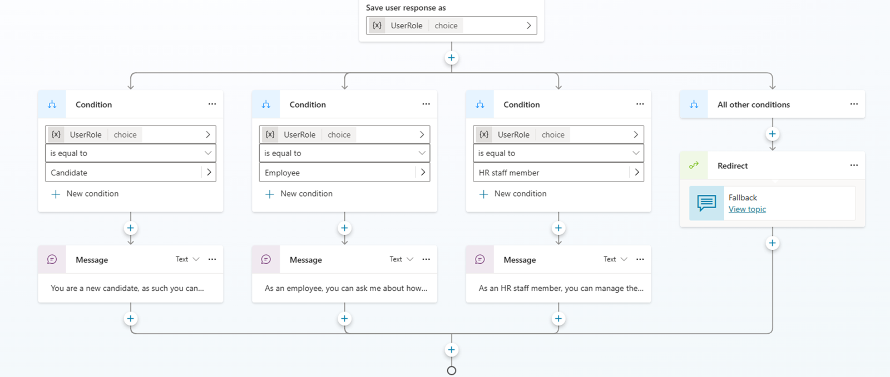

The very simple logic of the topic is now ready.

<cc-end-step lab="mcs2" exercise="2" step="3" />

### Step 4: Ending the current topic

To properly complete the flow of the custom topic, add a new action of type **End current topic**, which is available under the **Topic management** group. This last action will instruct Copilot Studio about the fact that your topic conversation is completed.

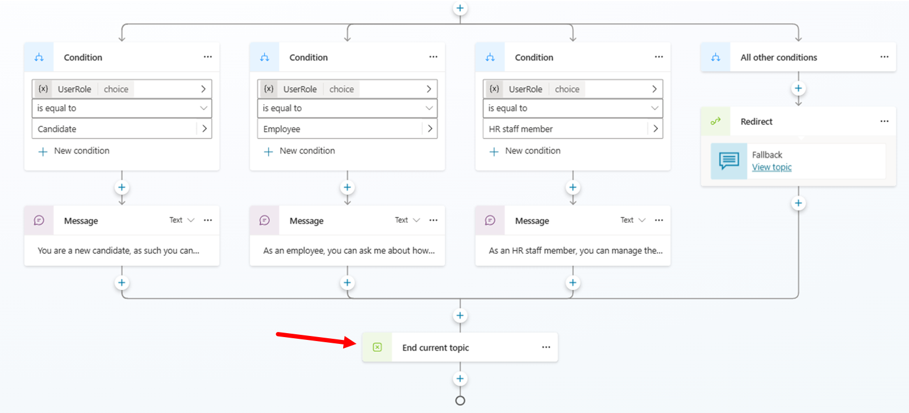

<cc-end-step lab="mcs2" exercise="2" step="4" />

### Step 5: Testing the current topic

You are now ready to save and test the topic. Select the **Save** button in the upper right corner of the designer, provide a name for the topic through the dialog window that will appear, and select the **Save** button again.

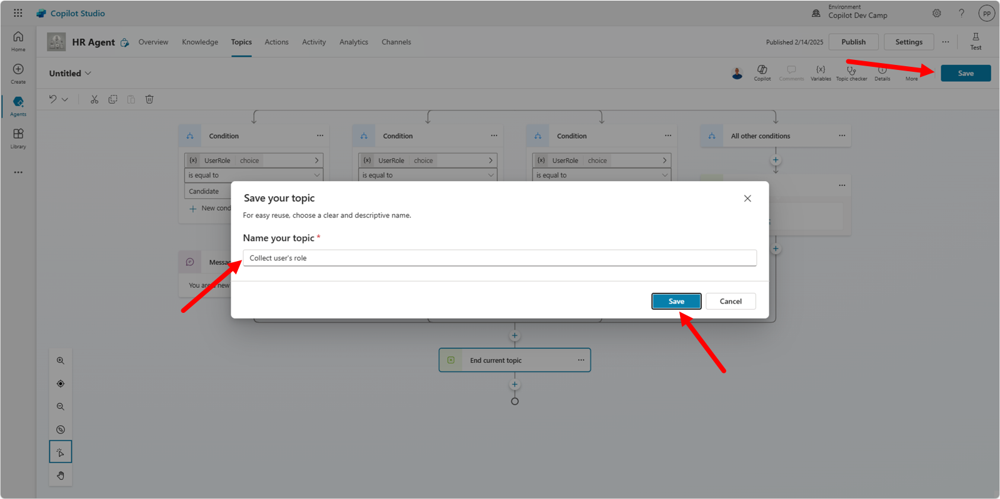

For example, name the topic as `Collect user's role`. Now open the test panel by selecting the **Test** command in the upper right corner of the designer. Type the following prompt:

```txt
What's your feedback for my role?
```

The agent will prompt you to choose a role and, based on your selection, you will get a specific feedback like illustrated in the following screenshot.

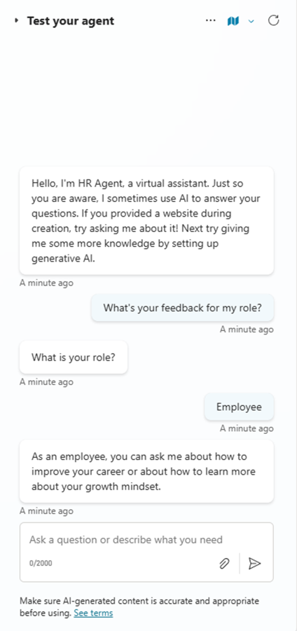

Exercise 2 is now completed, well done! You can now move to Exercise 3 to create a multi-turn topic.

<cc-end-step lab="mcs2" exercise="2" step="5" />

## Exercise 3 : Creating a multi-turn topic

For simple interactions, you create single-turn conversations with just one question and one answer. But more substantive topics require a multi-turn conversation with multiple back-and-forth interactions between the user and the agent. In this exercise, you are going to create a multi-turn topic to collect data about a potential candidate for a new role.

### Step 1: Creating a new multi-turn topic

Imagine that you want to create a topic to collect the following information about a new candidate:

- First name
- Last name
- E-mail
- Current role

To collect the above information, create a new topic following the istructions provided in Excercise 2 Step 1.
The **Trigger** description for the topic could be:

```txt
This topic helps to collect information about a new candidate to process. Trigger sentences can be: 
register a new candidate, create a new candidate, add a new candidate.
```

Then, for each of the above information fields, you need to prompt the user with an action of type **Ask a question**. However, in this exercise the value of the answer will vary depending on the requested field. For example: first name, last name, and current role will be simple text fields. The e-mail will need to be a valid e-mail.

So for the first name, last name, and current role fields you can select the **Identify** property of the **Ask a question** action and you can select **User's entier response** as the actual entity type. This will get the text value provided by the user as the actual collected value. The variable type will be automatically updated to be a `string` by Copilot Studio. Give a meaningfull name to each of the variables holding the values provided by the user.
In the following screenshot you can see how the first name input action can be defined. You can do the same for last name and current job role.


For the e-mail field, choose **Email** as the entity for the **Identify** property, so that Copilot Studio will automatically validate the user's input against the e-mail validation rules. The underlying variable will still be a `string`.


Now you are ready to collect all of the information about the candidate and you can give a feedback to the user.

<cc-end-step lab="mcs2" exercise="3" step="1" />

### Step 2: Giving a feedback to the user

Based on the collected input, you can now send a message to the user confirming the collected data. Add a new action of type **Send a message** and build the content of the message using the variables where the collected inputs where stored.
To add variables to the message, simply select the **{x}** command in the toolbar of the **Send a message** action and select the variable that you are looking for.

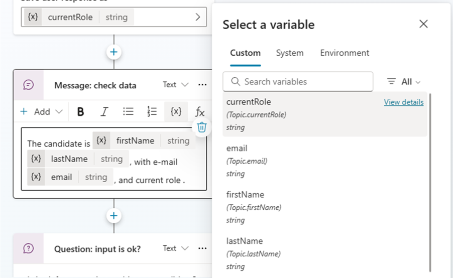

You can insert variables defined in the current topic, system variables, or environment variables.
Once you have configured the recap message with all the variables, it should like in the following screenshot.

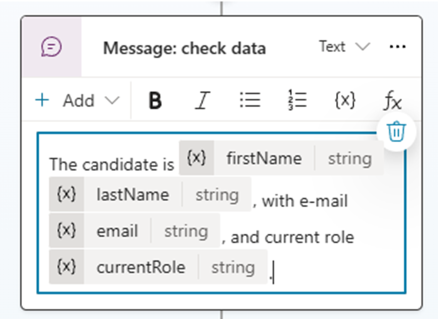

Just for the sake of having a final confirmation from the user, insert an action of type **Ask a question**, provide the following message:

```txt
Is it ok for you to insert this new candidate?
```

And configure the action to support the answers `Yes` and `No`. As like as it happened in Excercise 1 Step 3, you can now configure the various branches for each of the outcomes. For the sake of simplicity, you can simply rely on a couple of **Send a message** actions, one for each branch, and put a thumb up or a thumb down emoji as the actual content on the message, depending on the user's feedback.

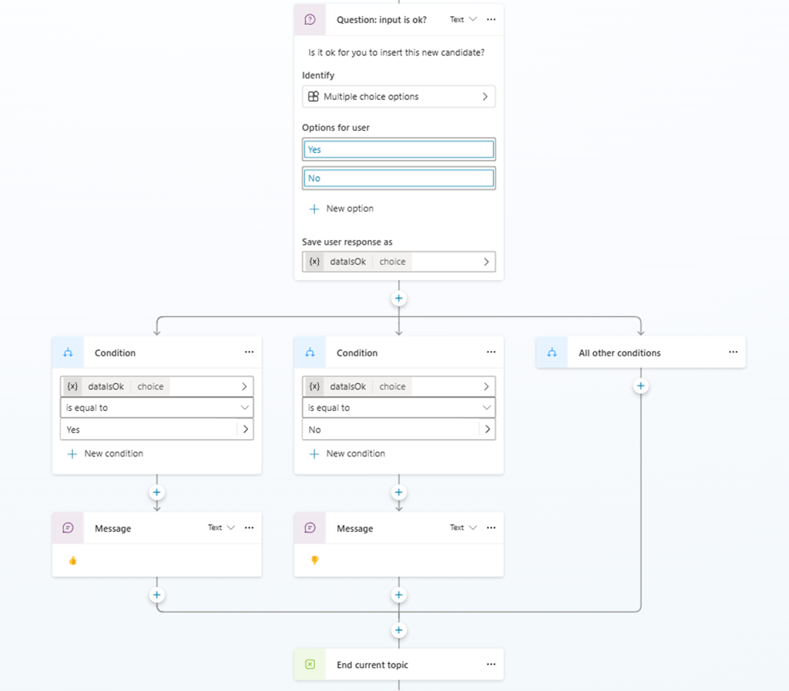

You can now save the topic, give it a name like for example `Register a new candidate` and test it in the integrated testing interface.
Here follows a screenshot of the interaction with the multi-turn topic. You can also notice that when the value provided for the e-mail field is not correct, Copilot Studio automatically re-prompts the user to provide a correct value.

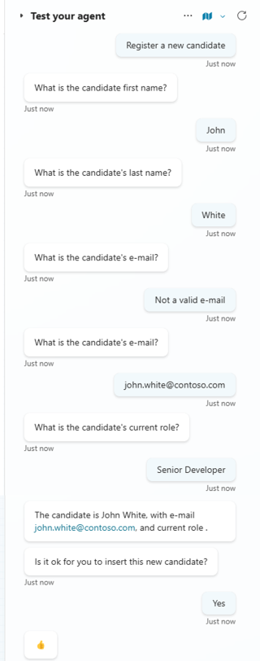


<cc-end-step lab="mcs2" exercise="3" step="2" />

## Exercise 4 : Using Adaptive Cards

Collecting inputs using multiple instances of **Ask a question** actions is definitely one option that you have. However, when you need to collect a lot of data or when you want to have a nice looking interaction with the user you can consider using an Adaptive Card.

### Step 1: Collecting input with Adaptive Cards

Imagine that you want to create yet another topic to collect the following information about a new candidate:

- First name
- Last name
- E-mail
- Current role
- Spoken languages
- Skills

Where spoken languages and skills are multi-select lists of values.
To collect the above information, create a new topic in your agent. However, this time you are going to leverage Copilot to create the topic for you. 

So open the **Topics** tab, and disable the topic that you created in Exercise 3 to avoid any overlapping of trigger conditions. Then, create a new topic following the istructions provided in Excercise 2 Step 1. The **Trigger** description for the topic could be:

```txt
This topic helps to collect information about a new candidate to process. Trigger sentences can be: 
register a new candidate, create a new candidate, add a new candidate.
```

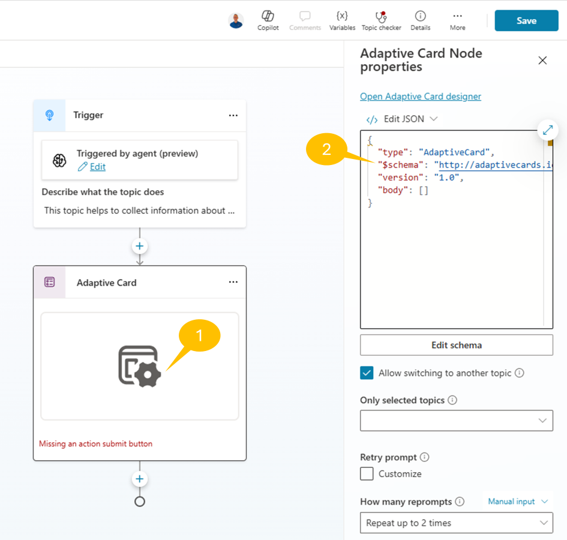

Now add a new action of type **Ask with adaptive card**, 1️⃣ select the body of the new action and 2️⃣ type the following JSON into the text area available in the property pane of the action.

```json
{
    "type": "AdaptiveCard",
    "body": [
        {
            "type": "TextBlock",
            "size": "Medium",
            "weight": "Bolder",
            "text": "New HR Candidate Information"
        },
        {
            "type": "Input.Text",
            "id": "firstname",
            "placeholder": "First Name"
        },
        {
            "type": "Input.Text",
            "id": "lastname",
            "placeholder": "Last Name"
        },
        {
            "type": "Input.Text",
            "id": "email",
            "placeholder": "Email"
        },
        {
            "type": "Input.Text",
            "id": "current_role",
            "placeholder": "Current Role"
        },
        {
            "type": "Input.ChoiceSet",
            "id": "spoken_languages",
            "placeholder": "Spoken Languages",
            "isMultiSelect": true,
            "choices": [
                {
                    "title": "English",
                    "value": "English"
                },
                {
                    "title": "French",
                    "value": "French"
                },
                {
                    "title": "German",
                    "value": "German"
                },
                {
                    "title": "Italian",
                    "value": "Italian"
                },
                {
                    "title": "Portuguese",
                    "value": "Portuguese"
                },
                {
                    "title": "Spanish",
                    "value": "Spanish"
                }
            ]
        },
        {
            "type": "Input.ChoiceSet",
            "id": "skills",
            "placeholder": "Skills",
            "isMultiSelect": true,
            "choices": [
                {
                    "title": "Computer Programming",
                    "value": "Computer Programming"
                },
                {
                    "title": "Project Management",
                    "value": "Project Management"
                },
                {
                    "title": "Team Lead",
                    "value": "Team Lead"
                }
            ]
        }
    ],
    "actions": [
        {
            "type": "Action.Submit",
            "title": "Submit"
        }
    ],
    "$schema": "http://adaptivecards.io/schemas/adaptive-card.json",
    "version": "1.5"
}
```

Once you updated the JSON of the adaptive card, Copilot Studio renders the preview of the card in the UI of the topic designer, as you can see in the following screenshot. Copilot Studio also automatically defines a set of topic-level variables to collect the values provided by the user.


<cc-end-step lab="mcs2" exercise="4" step="1" />

### Step 2: Providing feedback with Adaptive Cards

You can now use an adaptive card also to provide feedback to the user, showing a recap of the collected data. Select the **+** command to add a new action of type **Send a message**. Then select **+ Add** in the upper left corner of the new action and select **Adaptive card** to switch to a message of type adaptive card.

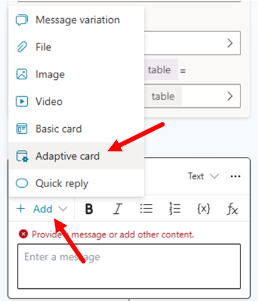

A side panel shows up allowing you to define the content of the adaptive card. Copy and paste the following JSON into the text area.

```JSON
{
  "type": "AdaptiveCard",
  "body":
    [
      {
        "type": "TextBlock",
        "size": "Medium",
        "weight": "Bolder",
        "text": "Candidate Summary"
      },
      {
        "type": "FactSet",
        "facts":
          [
            { "title": "First Name:", "value": "firstname" },
            { "title": "Last Name:", "value": "lastname" },
            { "title": "Email:", "value": "email" },
            { "title": "Current Role:", "value": "current_role" },
            { "title": "Spoken Languages:", "value": "spoken_languages" },
            { "title": "Skills:", "value": "skills" }
          ]
      }
    ],
  "$schema": "http://adaptivecards.io/schemas/adaptive-card.json",
  "version": "1.3"
}
```

It is very important that, while pasting the JSON of the adaptive card, you have the **Edit JSON** option selected (which is by the way the default one) at the top of the text area. That means that you are editing the actual JSON of the adaptive card. As soon as you will move the focus out of the text area where you copied the JSON, the **Send a message** action will start previewing the adaptive card. As you can see the adaptive card is rendering static values for all the variables (firstname, lastname, etc.).

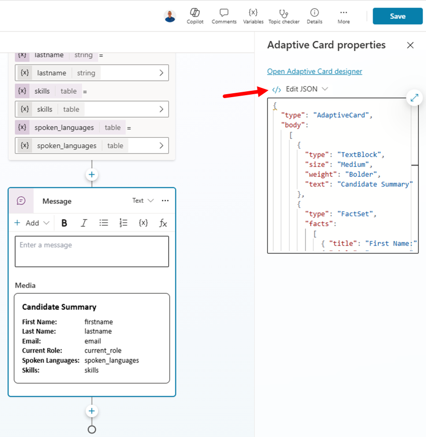

Now, select the drop down with **Edit JSON** and switch to **Edit Formula** in order to replace the static values with the actual variables defined in the current Topic.

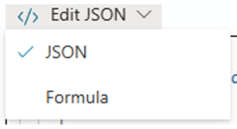

Select the button to expand the editor and you can start replacing the static values with formulas that will refer to the actual value of the topic-level variables.

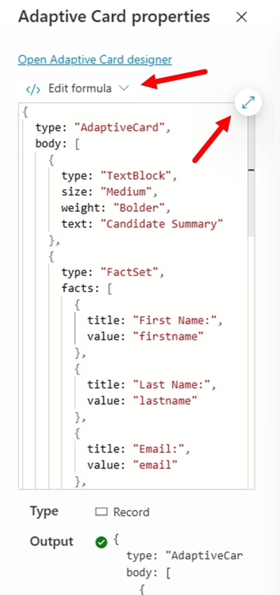

You will see a dialog popping up and providing an advanced editor with intellisense helping you to reference variables and PowerFx functions, like illustrated in the following screenshot.

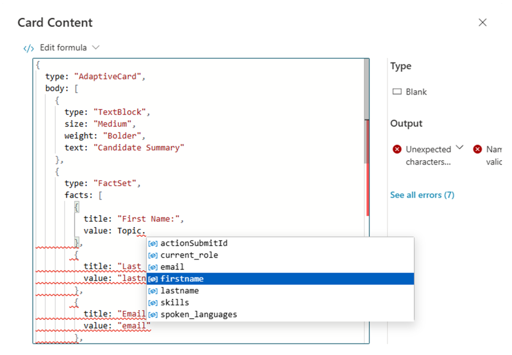

One by one you can replace all the static values with the actual variables. In particular, the spoken languages and the skills are list of values (variables of type `Table`) so, in order to render their value, you need to rely on the PowerFx `Concat` function and then on the PowerFx `Text` function to convert the result into an actual string. Here you can find the content of the adaptive card JSON when all the formulas are in place.

```JSON
{
  type: "AdaptiveCard",
  body: [
    {
      type: "TextBlock",
      size: "Medium",
      weight: "Bolder",
      text: "Candidate Summary"
    },
    {
      type: "FactSet",
      facts: [
        {
          title: "First Name:",
          value: Topic.firstname
        },
        {
          title: "Last Name:",
          value: Topic.lastname
        },
        {
          title: "E-mail:",
          value: Topic.email
        },
        {
          title: "Current Role:",
          value: Topic.current_role
        },
        {
          title: "Spoken Languages:",
          value: Text(Concat(Topic.spoken_languages, Value, ", "))
        },
        {
          title: "Skills:",
          value: Text(Concat(Topic.skills, Value, ", "))
        }
      ]
    }
  ],
  '$schema': "http://adaptivecards.io/schemas/adaptive-card.json",
  version: "1.3"
}
```

!!! note "Additional information about PowerFx functions"
    You can find additional information about the PowerFx functions reading the article [Create expressions using Power Fx](https://learn.microsoft.com/en-us/microsoft-copilot-studio/advanced-power-fx){target=_blank}

<cc-end-step lab="mcs2" exercise="4" step="2" />

### Step 3: Testing the current topic

Now add a **End current topic** action at the end of the topic, save the topic, give it a name like for example `Register new candidate with adaptive cards`, and test it in the test panel on the right side. In the following screenshot you can see how the topic interacts with a user.

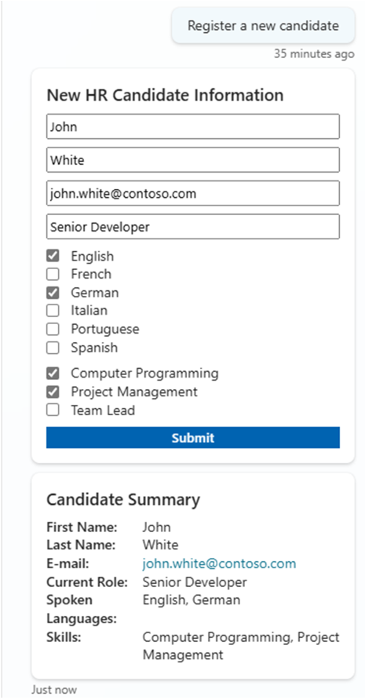

Now your topic is ready and fully functional. In the upcoming labs you will learn how to create a new candidate record for real, storing data in an external HR service.

<cc-end-step lab="mcs2" exercise="4" step="3" />

---8<--- "m-congratulations.md"

Now your agent supports multiple conversation paths through different topics. In the next labs you will learn how to work with custom Actions.

<a href="#"><button class="github-button">Coming soon ...</button></a>

