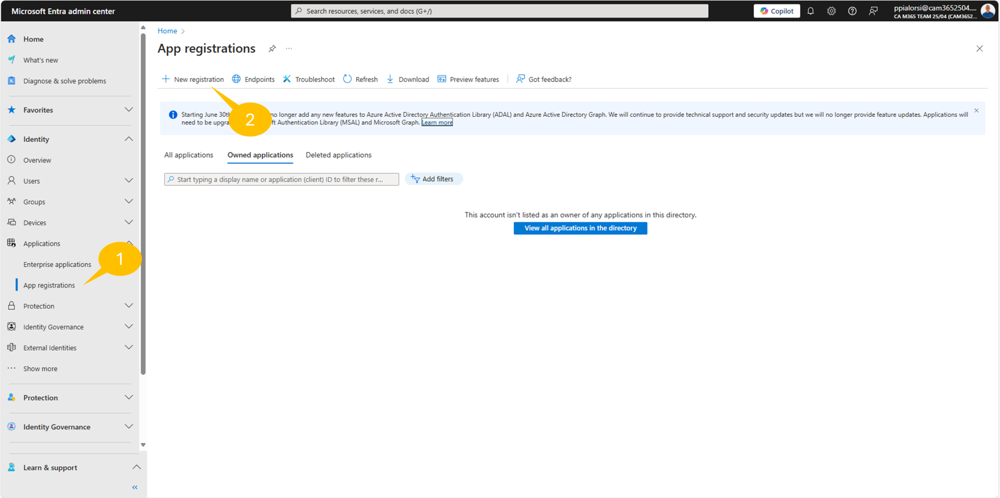
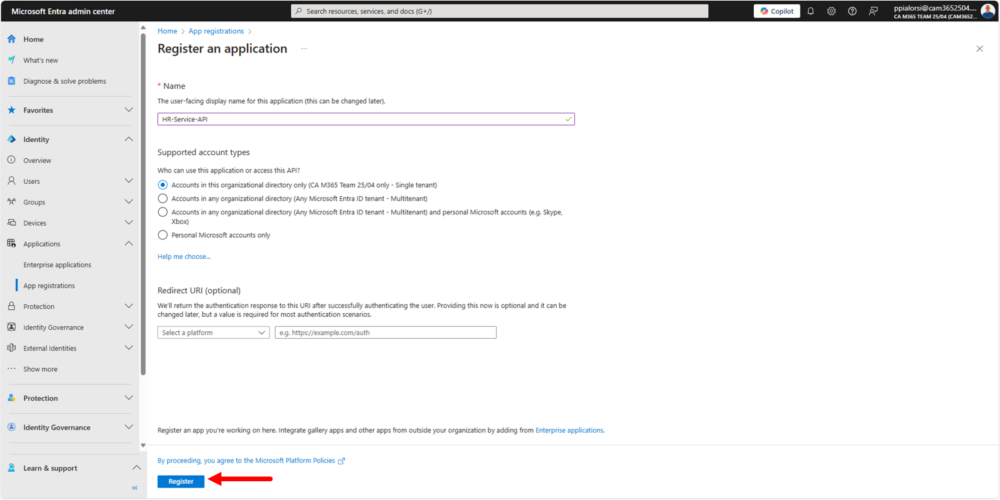
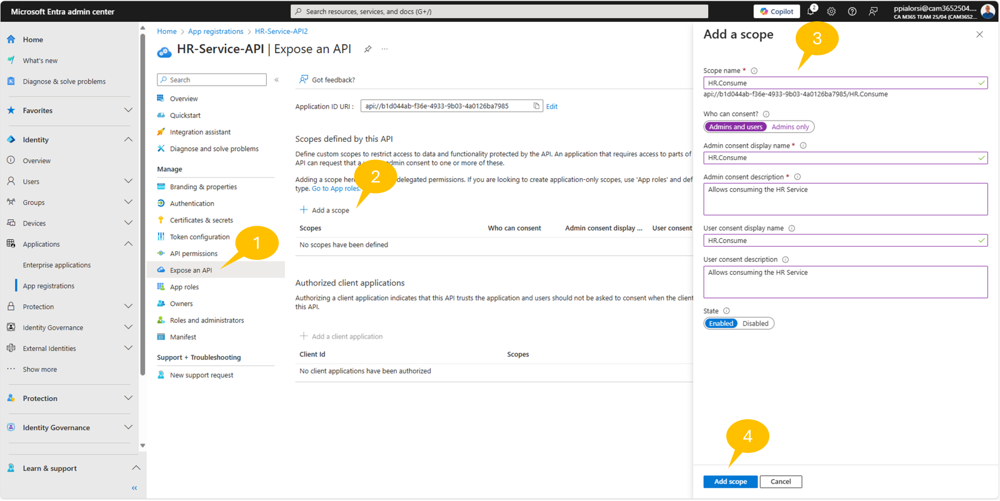
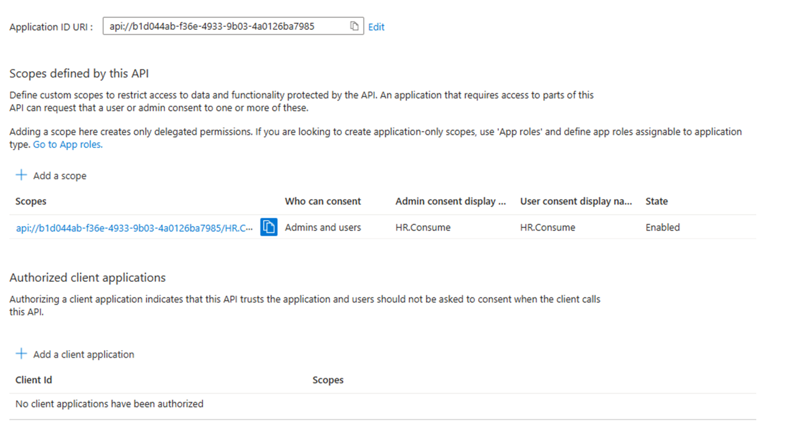
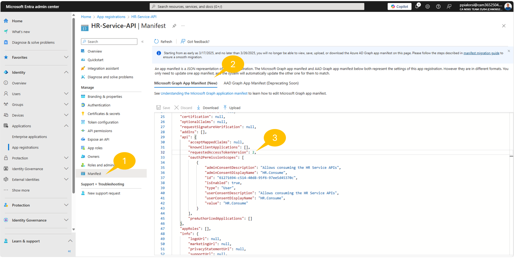

# Lab MCS5 - Power Platform custom connector

---8<--- "mcs-labs-prelude.md"

In this lab, you are going to understand how to extend an agent made with Microsoft Copilot Studio using a Power Platform custom connector. Specifically, you are going to consume a custom REST API to manage an hypotethical list of candidates for a job role. The API offers functionalities to:

- List candidates
- Get a specific candidate
- Add a new candidate
- Remove a candidate

In Microsoft 365 Copilot, within Copilot Studio you will be able to rely on these functionalities and enhance the potential of the custom agent that you created in the previous [Lab MCS4](../04-extending-m365-copilot){target=_blank}.

!!! note
    This lab builds on the previous one, [Lab MCS4](../04-extending-m365-copilot){target=_blank}. You should be able to continue working on the same agent, improving its functionalities with new capabilities.

In this lab you will learn:

- How to expose a REST API through a Power Platform custom connector
- How to secure communication to an external REST API in the Power Platform
- How to consume a custom connector from an agent

## Exercise 1 : Creating the REST API

For the sake of simplicity in this Lab you are going to use a pre-built REST API. In this exercise you are going to download and configure it, so that you can run it locally.

### Step 1: Downloading and testing the REST API

The sample REST API is an Azure Function built with TypeScript and Node.js, named `HR Service` and you can download its source code [from here](https://download-directory.github.io/?url=https://github.com/microsoft/copilot-camp/tree/main/src/make/copilot-studio/path-m-lab-mcs5-connectors/hr-service&filename=hr-service){target=_blank}.

Extract the files from the zip and open the target folder with Visual Studio Code. In the following screenshot you can have an overview of the project structure.


The main elements of the project outline are:

- `http`: in this folder you can find a couple of .http files useful for testing the REST API in Visual Studio Code.
- `src/data/candidates.json`: a JSON file with an hypothetical list of candidates, used as the initial data source for the service.
- `src/functions/candidatesFunction.ts`: the actual implementation of the Azure Function.
- `src/openapi.json`: the Open API specification file for the Azure Function, stored in JSON format.
- `src/openapi.yaml`: the Open API specification file for the Azure Function, stored in Yaml format.
- `askCandidateData.json`: the JSON of an adaptive card to request candidate's data.
- `dev-tunnel-steps.md`: brief set of instructions to build a Dev Tunnel to have a reverse proxy for the REST API running locally.
- `local.settings.json.sample`: a sample configuration file that will be used later in this lab.

Rename the file `local.settings.json.sample` into `local.settings.json` and press F5 to start the project.
In Visual Studio Code, open the file `http/ht-service.http` and trigger a new request to get the list of candidates by selecting the **Send request** command near the GET request for `http://localhost:7071/api/candidates`.
On the right side of the screen you will see the output of the request, providing you with few response headers and the JSON list of candidates.


Notice that in the **Terminal** window, in the lower part of the screen, there is the tracing of the API call that you just triggered and a message stating that `OAuth is disabled. Skipping token validation`. In fact, right now the API is accessible anonymously.

<cc-end-step lab="mcs5" exercise="1" step="1" />

### Step 2: Registering the API in Entra ID

Let's now secure access to the API. First of all, you need to open a browser and, using the work account of your target Microsoft 365 tenant, go to [https://entra.microsoft.com](https://entra.microsoft.com){target=_blank} to access the Microsoft Entra admin center. Sign in to, if asked for authentication. Then 1️⃣ select **App registrations** in the menu bar on the left, and the 2️⃣ select **+ New registration** to register a new application in the target tenant.



The `Register an application` page will show up. Provide a name for the application, for example `HR-Service-API`. Choose to support authentication only in your target tenant, and select the **Register** button in the lower part of the screen.



Microsoft Entra will register the application for you and show the **Overview** page with information about the newly registered application. Copy the value of Client ID and Tenant ID, because you will need them soon.

Select the 1️⃣ **Expose an API** menu item on the left menu, then 2️⃣ select **+ Add a scope** to add a new permission scope for consuming the custom API. The very first time you select to add a new scope, you have to configure an **Application ID URI**. By default, the value will be `api://<Client-Id>`. Select **Save and continue** to save the unique URI for the application. Then, 3️⃣ configure the scope settings using the panel that appears on the righ and 4️⃣ select **Add scope** to confirm the operation.

Creating a scope allows you to define a custom delegated permission scope for you API. Consumers of your API will need to provide OAuth 2.0 tokens with that permission scope in order to being able to consume your API.



Here you can see some suggested values for the permission scope configuration:

- Scope name: the actual name of the scope. For example: `HR.Manage`.
- Who can consent?: defines whether the scope can be consented by admins only, or both by admins and regular users. Choose `Admins and users`.
- Admin consent display name: the short display name of the scope for admin consent. For example: `HR.Consume`.
- Admin consent description: the description of the scope for admin consent: For example:  `Allows consuming the HR Service`.
- User consent display name: the short display name of the scope for user consent. For example: `HR.Consume`.
- User consent description: the description of the scope for user consent: For example:  `Allows consuming the HR Service`.
- State: defines whether the scope is **Enabled** or **Disabled**. Let's keep it enabled.

Once the permission scope is configured, you will see the new scope in the list of scopes defined for the application.



Now, 1️⃣ select the **Manifest** menu item on the left menu, 2️⃣ edit the content of the manifest file using the **Microsoft Graph App Manifest (new)**, and 3️⃣ update the `requestedAccessTokenVersion` property to the value `2`. This specifies that the API expects a JWT token of type v2.0.

!!! note
    You can find additional information about the Microsoft Graph App Manifest and the token of v2.0 in the article [Understand the app manifest (Microsoft Graph format)](https://learn.microsoft.com/en-us/entra/identity-platform/reference-microsoft-graph-app-manifest){target=_blank}.



<cc-end-step lab="mcs5" exercise="1" step="2" />

Now you can go back to Visual Studio Code and you can configure the `local.settings.json` file accordingly to the settings of the just registered application. Replace the `<Client-ID>` and the `<Tenant-ID>` placeholders with the actual values and turn the `UseOAuth` property to `true`.

```JSON
{
  "IsEncrypted": false,
  "Values": {
    "AzureWebJobsStorage": "UseDevelopmentStorage=true",
    "FUNCTIONS_WORKER_RUNTIME": "node",
    "AAD_APP_CLIENT_ID": "<Client-ID>",
    "AAD_APP_TENANT_ID": "<Tenant-ID>",
    "AAD_APP_OAUTH_AUTHORITY": "https://login.microsoftonline.com/<Tenant-ID>",
    "UseOAuth": false
  }
}
```

Restart the REST API project and now the API will be secured and will be looking for an OAuth 2.0 token in the Authorization header. If the token will not be provided, or if a not valid token will be provided, the API will respond with a HTTP status 401 (Unauthorized).

### Step 2: Registering the Consumer in Entra ID


## Exercise 1 : Creating the REST API

In this excercise you are going to create an agent with Microsoft Copilot Studio and hosting it in Microsoft 365 Copilot Chat.

### Step 1: Creating an agent for Copilot Chat


<cc-end-step lab="mcs5" exercise="1" step="1" />
